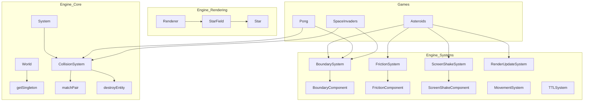

# Informe de Análisis de Refactorización: TinyAsterEngine

Este informe documenta la promoción de componentes, sistemas y utilidades desde los juegos específicos hacia el núcleo del motor (`src/engine/`) para maximizar la reutilización de código y adherirse a los principios SOLID.

---

### [getSingleton<T>]

**Ubicación actual:** `src/games/asteroids/GameUtils.ts` (y otros) — `getGameState(world)`

**Ubicación propuesta en el engine:** `src/engine/core/World.ts` — `World.getSingleton<T>(type)`

**Justificación:**
- **Genericidad:** Cualquier juego ECS necesita acceder a estados globales (puntuación, configuración) que residen en una entidad única.
- **Reusabilidad:** Útil para cualquier juego que maneje un estado global singleton.
- **Cohesión:** La gestión de acceso a componentes es responsabilidad directa del `World`.
- **Dependencias:** Solo depende del sistema de tipos base del motor.
- **Inversión de control:** Permite a los sistemas pedir el estado sin saber cómo se almacena o busca.

**Cambios necesarios para el desacoplamiento:**
- Implementar búsqueda por tipo de componente en `World`.
- Manejar inmutabilidad clonando automáticamente componentes congelados (`Object.isFrozen`).

**Impacto en los juegos existentes:**
- Eliminación de archivos `GameUtils.ts` redundantes en Asteroids, Pong, Space Invaders y Flappy Bird.
- Reducción de "boilerplate" en los sistemas.

**Nivel de prioridad:** ALTA
**Complejidad del refactor:** BAJA

---

### [MATCHPAIR & DESTROYENTITY]

**Ubicación actual:** `src/games/asteroids/systems/AsteroidCollisionSystem.ts`

**Ubicación propuesta en el engine:** `src/engine/systems/CollisionSystem.ts` (Métodos protegidos)

**Justificación:**
- **Genericidad:** La identificación de pares de entidades por tipo es una tarea puramente mecánica del motor ECS.
- **Reusabilidad:** Todos los juegos con colisiones (Pong, Asteroids, etc.) usan este patrón.
- **Cohesión:** Pertenece a la infraestructura de resolución de colisiones del motor.
- **Dependencias:** Solo depende de `Entity` y `World`.

**Cambios necesarios para el desacoplamiento:**
- Mover la lógica de `matchPair` con soporte para genéricos de TypeScript para mantener la seguridad de tipos.
- `destroyEntity` debe integrar el contrato con `ReclaimableComponent` para soporte nativo de pooling.

**Impacto en los juegos existentes:**
- `SpaceInvadersCollisionSystem` y `AsteroidCollisionSystem` eliminan docenas de líneas de código repetitivo.

**Nivel de prioridad:** ALTA
**Complejidad del refactor:** BAJA

---

### [BOUNDARYSYSTEM UNIVERSAL]

**Ubicación actual:** `src/engine/systems/BoundarySystem.ts` (Anteriormente hardcodeado a 'wrap')

**Ubicación propuesta en el engine:** `src/engine/systems/BoundarySystem.ts` (Extendido)

**Justificación:**
- **Genericidad:** El manejo de límites (pantalla) es común a todo juego 2D.
- **Reusabilidad:** Soporta "wrap" (Asteroids), "bounce" (Pong) y "destroy" (Balas/UFOs).
- **Inversión de control:** Los juegos declaran el comportamiento mediante el `BoundaryComponent` en lugar de programar la lógica.

**Cambios necesarios para el desacoplamiento:**
- Extender `BoundaryComponent` con la propiedad `mode`.
- Implementar lógica de rebote (bounceX, bounceY) y teletransporte.

**Impacto en los juegos existentes:**
- Pong utiliza el sistema del motor para el rebote en paredes en lugar de lógica manual en el sistema de colisiones.
- Asteroids utiliza "destroy" para UFOs de forma declarativa.

**Nivel de prioridad:** ALTA
**Complejidad del refactor:** MEDIA

---

### [FRICTIONSYSTEM]

**Ubicación actual:** `src/games/asteroids/systems/AsteroidInputSystem.ts` — `applyFriction`

**Ubicación propuesta en el engine:** `src/engine/systems/FrictionSystem.ts`

**Justificación:**
- **Genericidad:** La fricción es una fuerza física desacoplada de la entrada del usuario.
- **Cohesión:** Separa la física del procesamiento de inputs.
- **Reusabilidad:** Aplicable a juegos de naves, coches o plataformas.

**Cambios necesarios para el desacoplamiento:**
- Crear `FrictionComponent` en `EngineTypes.ts`.
- Mover la lógica de decremento de velocidad basada en un coeficiente.

**Impacto en los juegos existentes:**
- `AsteroidInputSystem` se simplifica drásticamente.

**Nivel de prioridad:** MEDIA
**Complejidad del refactor:** BAJA

---

### [SCREENSHAKESYSTEM]

**Ubicación actual:** `src/games/asteroids/systems/AsteroidRenderSystem.ts`

**Ubicación propuesta en el engine:** `src/engine/systems/ScreenShakeSystem.ts`

**Justificación:**
- **Genericidad:** El feedback visual de impacto es un estándar en juegos modernos.
- **Cohesión:** El motor de render ya soporta la aplicación del temblor; solo falta el sistema que gestione el ciclo de vida del efecto.

**Cambios necesarios para el desacoplamiento:**
- Definir `ScreenShakeComponent` como singleton en el motor.
- El sistema decrementa el tiempo y el `CanvasRenderer` lee el estado actual.

**Impacto en los juegos existentes:**
- Estandarización del feedback visual en Asteroids y Space Invaders.

**Nivel de prioridad:** MEDIA
**Complejidad del refactor:** MEDIA

---

### [GENERIC TRAILS]

**Ubicación actual:** `src/games/asteroids/systems/AsteroidRenderSystem.ts` — `updateShipTrails`

**Ubicación propuesta en el engine:** `src/engine/systems/RenderUpdateSystem.ts`

**Justificación:**
- **Genericidad:** Cualquier entidad en movimiento puede beneficiarse de una estela visual.
- **Reusabilidad:** Proyectiles, naves o partículas pueden activar estelas simplemente definiendo `trailPositions` en su `RenderComponent`.

**Cambios necesarios para el desacoplamiento:**
- Mover la gestión del array de posiciones al sistema base de actualización de render.
- Parametrizar la longitud máxima de la estela.

**Impacto en los juegos existentes:**
- Eliminación de lógica manual en `AsteroidRenderSystem`.

**Nivel de prioridad:** MEDIA
**Complejidad del refactor:** BAJA

---

### [UNIFICACIÓN: TRANSFORMCOMPONENT]

**Ubicación actual:** `src/engine/types/EngineTypes.ts` (Redundancia con `PositionComponent`)

**Ubicación propuesta en el engine:** `src/engine/types/EngineTypes.ts` — `TransformComponent`

**Justificación:**
- **Cohesión:** Sigue el estándar de la industria (Unity/Godot) al agrupar posición, rotación y escala.
- **Dependencias:** Mejora la integración con el `HierarchySystem` que ya requiere este formato.

**Cambios necesarios:**
- Consolidar interfaces. Mantener alias `PositionComponent` para compatibilidad hacia atrás.

**Impacto:**
- Mayor claridad arquitectónica y consistencia en todo el motor.

**Nivel de prioridad:** ALTA
**Complejidad del refactor:** BAJA

---

## 1. TABLA DE RESUMEN DE CANDIDATOS

| Candidato | Prioridad | Complejidad | Propósito |
|---|---|---|---|
| **TransformComponent** | ALTA | BAJA | Unificar posición/rotación en el ECS. |
| **getSingleton<T>** | ALTA | BAJA | Acceso estandarizado a estados globales. |
| **MatchPair / Destroy** | ALTA | BAJA | Utilidades genéricas de colisión y pooling. |
| **BoundarySystem** | ALTA | MEDIA | Unificar Wrap/Bounce/Destroy de bordes. |
| **FrictionSystem** | MEDIA | BAJA | Física de rozamiento desacoplada de Input. |
| **ScreenShakeSystem** | MEDIA | MEDIA | Feedback visual estándar de impactos. |
| **Generic Trails** | MEDIA | BAJA | Estelas de movimiento integradas en el motor. |

---

## 2. DIAGRAMA DE DEPENDENCIAS (ESTADO PROPUESTO)

---

## 3. ORDEN DE REFACTORIZACIÓN RECOMENDADO

1. **Infraestructura Base:** Unificar `Position` -> `Transform` y promover `getSingleton` en `World`.
2. **Utilidades ECS:** Promover `matchPair` y `destroyEntity` a la clase base `CollisionSystem`.
3. **Sistemas Físicos:** Implementar `BoundarySystem` universal y `FrictionSystem`.
4. **Sistemas de Feedback y Render:** Migrar `ScreenShakeSystem` y generalizar estelas en `RenderUpdateSystem`.
5. **Refactorización de Juegos:** Limpiar los sistemas específicos de los juegos para utilizar las nuevas capacidades promovidas.

---

## 4. NUEVOS TIPOS E INTERFACES EN `EngineTypes.ts`

- **TransformComponent**: `{ x, y, rotation, scaleX, scaleY, parent?, worldX?, worldY?, ... }`
- **Star**: `{ x, y, size, brightness, twinklePhase, twinkleSpeed, layer }`
- **ScreenShake**: `{ intensity, duration }`
- **BoundaryComponent**: `{ width, height, mode: "wrap" | "bounce" | "destroy", bounceX?, bounceY? }`
- **FrictionComponent**: `{ value }`
- **ReclaimableComponent**: `{ onReclaim: (world, entity) => void }`
