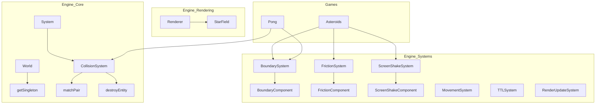

# Informe de Refactorización: TinyAsterEngine

## 1. Resumen de Candidatos Promovidos

| Candidato | Prioridad | Complejidad | Impacto |
|---|---|---|---|
| **getSingleton<T>** | ALTA | BAJA | Estandariza la recuperación de estados globales y manejo de inmutabilidad. |
| **MatchPair / DestroyEntity** | ALTA | BAJA | Simplifica la lógica de colisiones en todos los juegos. |
| **BoundarySystem** | ALTA | MEDIA | Unifica 'wrap', 'bounce' y 'destroy' en un solo sistema universal. |
| **FrictionSystem** | MEDIA | BAJA | Desacopla la fricción física de la lógica de entrada (Input). |
| **ScreenShakeSystem** | MEDIA | MEDIA | Provee un mecanismo estándar de feedback visual de impactos. |
| **StarField Effect** | BAJA | BAJA | Organiza efectos visuales genéricos en el motor. |

---

## 2. Diagrama de Dependencias (Estado Propuesto)

---

## 3. Orden de Refactorización Recomendado

1. **Infraestructura Base:** Implementar `getSingleton` en `World.ts` para habilitar el acceso a estados globales de forma segura.
2. **Utilidades de Colisión:** Extender `CollisionSystem` con `matchPair` y `destroyEntity`.
3. **Sistemas Físicos Universales:** Crear `BoundarySystem` y `FrictionSystem` para manejar el movimiento y límites de forma declarativa mediante componentes.
4. **Sistemas de Feedback:** Implementar `ScreenShakeSystem` para estandarizar efectos de cámara.
5. **Limpieza de Dominio:** Refactorizar los juegos (`Asteroids`, `Pong`) para eliminar lógica duplicada y utilizar los nuevos sistemas del motor.

---

## 4. Nuevos Tipos e Interfaces en `EngineTypes.ts`

Se han agregado los siguientes tipos para soportar el desacoplamiento:

- **BoundaryMode:** `"wrap" | "bounce" | "destroy"`.
- **BoundaryComponent:** Define límites de pantalla y modo de comportamiento.
- **FrictionComponent:** Define el coeficiente de rozamiento para la entidad.
- **ScreenShake:** Estructura de datos para intensidad y duración del temblor.
- **ScreenShakeComponent:** Singleton para controlar el efecto de cámara global.

---
*Este informe documenta la transición de TinyAsterEngine hacia una arquitectura más robusta, modular y reutilizable.*
