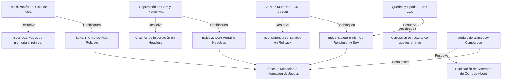

# 📊 Grafo de Dependencias (DEPENDENCY_GRAPH.md)

Este documento describe el mapa de dependencias arquitectónicas del motor, ilustrando cómo la resolución de los problemas raíz (Root Causes) desbloquea y soluciona múltiples bugs y limitaciones derivados de forma paralela.

---

## 🗺️ Mapa Visual de Dependencias (Mermaid)

---

## ⛓️ Análisis de Relaciones e Impactos

### 1. **Ciclo de Vida de BaseGame ➔ BUG-001 y Épica de Estabilidad**
* **Dependencia**: La estabilización del ciclo de vida (`init`, `start`, `stop`, `restart`, `destroy`) es un pre-requisito absoluto para que cualquier juego pueda ejecutarse continuamente sin degradar el dispositivo.
* **Impacto**: Corregir el método `destroy()` para liberar sistemas e invalidar listeners del `EventBus` elimina instantáneamente el bug de acumulación de handlers de `AsteroidComboSystem` y de cualquier futuro sistema que use el bus de eventos global.

### 2. **Desacoplamiento de UI/Plataforma ➔ Servidor Colyseus**
* **Dependencia**: Para ejecutar simulaciones de red autoritativas en el backend (Colyseus), el `@tiny-aster/core` no debe importar React Native, Reanimated ni Skia.
* **Impacto**: La limpieza de fronteras y subpath exports permite compilar el core de manera ligera y modular. Esto elimina la necesidad de mockear librerías de UI en los tests automatizados y en el servidor headless.

### 3. **API de Mutación e Inmutabilidad ➔ Determinismo en Re-simulación**
* **Dependencia**: El rollback netcode requiere tomar snapshots deterministas del mundo y restaurar estados previos sin efectos secundarios.
* **Impacto**: Forzar que las escrituras se realicen mediante `world.mutateComponent` y que las mutaciones estructurales se canalicen únicamente a través de `world.commands` (CommandBuffer estructural) garantiza que las referencias de los componentes nunca se desalineen ni queden corruptas durante pasos de predicción o reconciliación de red.

### 4. **Abstracción de Gameplay Común ➔ Paridad de Características de Juegos**
* **Dependencia**: Al unificar la lógica de loot y combos bajo un espacio común, evitamos que las correcciones aplicadas a un juego queden desactualizadas en otros.
* **Impacto**: La creación de un `@tiny-aster/gameplay` permite migrar con seguridad Space Invaders, Asteroids y Pong para usar sistemas compartidos de puntuación, control táctil unificado y buffers de entrada sin reescribir código repetitivo.
