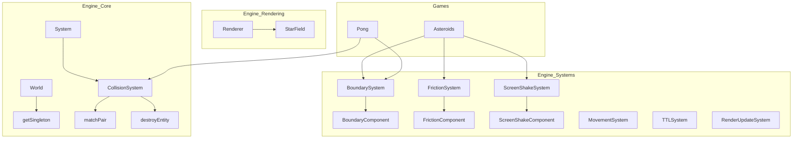

# Análisis de Candidatos para Promoción al Motor (TinyAsterEngine)

Este documento detalla los componentes, sistemas y utilidades identificados en los juegos actuales (*Asteroids*, *Pong*, *Space Invaders*, *Flappy Bird*) que son genéricos y deberían promoverse al núcleo del motor en `src/engine/`.

---

## 1. Candidatos Identificados

### [UNIFICACIÓN: TRANSFORMCOMPONENT]
**Ubicación actual:** `src/engine/types/EngineTypes.ts` (como `PositionComponent`) y `src/engine/core/types/CoreTypes.ts` (como `TransformComponent`).
**Ubicación propuesta:** `src/engine/types/EngineTypes.ts` — `TransformComponent`.
**Justificación:** Existe redundancia crítica. La industria utiliza "Transform" para englobar posición, rotación y escala. Los sistemas de física (Matter.js) ya usan `Transform`.
**Cambios:** Renombrar `PositionComponent` a `TransformComponent`. Mantener alias por compatibilidad.
**Prioridad:** ALTA | **Complejidad:** MEDIA

### [MATCHPAIR & DESTROYENTITY]
**Ubicación actual:** `src/games/asteroids/systems/AsteroidCollisionSystem.ts`.
**Ubicación propuesta:** `src/engine/systems/CollisionSystem.ts`.
**Justificación:** Lógica mecánica de ECS para gestionar colisiones entre dos tipos de componentes. Se repite en todos los juegos.
**Cambios:** Mover a la clase base `CollisionSystem`. `destroyEntity` debe manejar `ReclaimableComponent`.
**Prioridad:** ALTA | **Complejidad:** BAJA

### [BOUNDARYSYSTEM UNIVERSAL]
**Ubicación actual:** `src/engine/systems/BoundarySystem.ts` (infrautilizado).
**Justificación:** Asteroids usa "wrap", Pong usa "bounce", UFOs usan "destroy". Un solo sistema puede manejar los tres comportamientos mediante un `BoundaryComponent` parametrizado.
**Cambios:** El `BoundaryComponent` debe incluir: `width`, `height`, `mode: 'wrap' | 'bounce' | 'destroy'`, y flags `bounceX`/`bounceY`.
**Prioridad:** ALTA | **Complejidad:** MEDIA

### [GETSINGLETON<T>]
**Ubicación actual:** `src/games/asteroids/GameUtils.ts`.
**Ubicación propuesta:** `src/engine/core/World.ts`.
**Justificación:** Acceder al estado global (vidas, puntos) es universal. Evita búsquedas manuales de entidades.
**Prioridad:** ALTA | **Complejidad:** BAJA

### [SCREENSHAKESYSTEM]
**Ubicación actual:** `src/games/asteroids/systems/AsteroidRenderSystem.ts`.
**Ubicación propuesta:** `src/engine/systems/ScreenShakeSystem.ts`.
**Justificación:** El feedback visual de impacto es genérico. `CanvasRenderer` ya tiene soporte para leer un `ScreenShakeComponent`.
**Prioridad:** MEDIA | **Complejidad:** MEDIA

### [FRICTIONSYSTEM]
**Ubicación actual:** `src/games/asteroids/systems/AsteroidInputSystem.ts`.
**Ubicación propuesta:** `src/engine/systems/FrictionSystem.ts`.
**Justificación:** La fricción física es independiente del Input. Pong o juegos de carreras se beneficiarían.
**Prioridad:** MEDIA | **Complejidad:** BAJA

---

## 2. Resumen de Candidatos

| Candidato | Prioridad | Complejidad | Propósito |
|---|---|---|---|
| **TransformComponent** | ALTA | MEDIA | Unificar posición/rotación en el ECS. |
| **MatchPair / Destroy** | ALTA | BAJA | Utilidades genéricas de colisión y pooling. |
| **BoundarySystem** | ALTA | MEDIA | Unificar Wrap/Bounce/Destroy de bordes. |
| **getSingleton<T>** | ALTA | BAJA | Acceso estandarizado a estados globales. |
| **FrictionSystem** | MEDIA | BAJA | Física de rozamiento desacoplada de Input. |
| **ScreenShakeSystem** | MEDIA | MEDIA | Feedback visual estándar de impactos. |

---

## 3. Diagrama de Dependencias (Propuesto)

---

## 4. Orden de Refactorización Recomendado

1. **Infraestructura Base:** Unificar `Position` -> `Transform`.
2. **Utilidades ECS:** Promover `matchPair` y `destroyEntity` a `CollisionSystem`.
3. **Sistemas Físicos:** Implementar `BoundarySystem` universal.
4. **Sistemas de Feedback:** Migrar `ScreenShakeSystem` y `FrictionSystem`.

---

## 5. Nuevos Tipos (EngineTypes.ts)

- **TransformComponent**: `{ x, y, rotation, scaleX, scaleY }`
- **BoundaryComponent**: `{ width, height, mode, bounceX?, bounceY? }`
- **FrictionComponent**: `{ value }`
- **ScreenShakeComponent**: `{ config: { intensity, duration } | null }`
