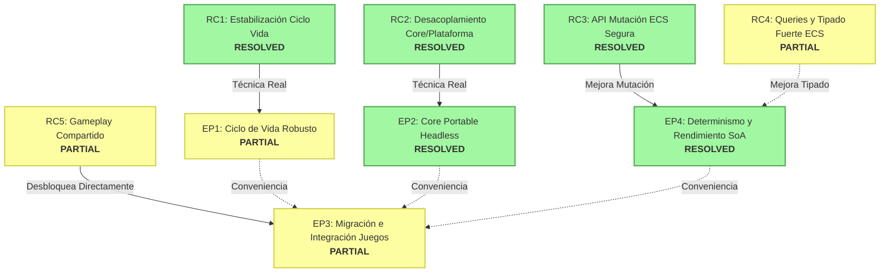

# 🔍 Informe de Investigación: Estado Real del Grafo de Dependencias (DEPENDENCY_GRAPH.md)

Este informe presenta la investigación técnica y auditoría detallada sobre la vigencia del grafo de dependencias declarado en `docs/DEPENDENCY_GRAPH.md` frente a la realidad del código fuente en el repositorio `xavirodriguez/react-native-asteroids`.

---

## 🎯 1. Resumen Ejecutivo
El grafo original de dependencias se construyó asumiendo que **ninguna** causa raíz estaba resuelta. Sin embargo, nuestra investigación demuestra que la realidad del código fuente difiere significativamente:
- **RC1**, **RC2** y **RC3** están prácticamente resueltos o son completamente obsoletos, desbloqueando el inicio directo de múltiples épicas.
- El acoplamiento de UI/plataforma en el core es inexistente, permitiendo que `@tiny-aster/core` compile de forma totalmente headless.
- Las dependencias marcadas hacia **EP3 (Migración de Juegos)** no son estrictas dependencias técnicas, sino dependencias de conveniencia o secuencia de planificación previa, lo que abre una gran oportunidad de paralelización y un camino crítico más corto.
- Se confirma una obsolescencia sistemática de nomenclatura en la documentación (como la mención al inexistente `AsteroidComboSystem` en lugar del genérico `ComboSystem` del core).

---

## 📊 2. Estado Real de los Nodos (RC1-RC5, EP1-EP4)

Se evalúa cada nodo según el criterio estándar:
- **A — Vigente**: Sigue representando una causa raíz activa sin resolver.
- **B — Parcialmente Resuelto**: Iniciado en el código, pero con aspectos por completar.
- **C — Obsoleto / Resuelto**: La causa raíz ya está completamente resulta o superada en el código.
- **D — No verificable**: El estado no puede confirmarse con lectura estática ni pruebas locales.

### Tabla Resumen de Nodos

| Nodo | Descripción | Veredicto | Evidencia Técnica (Archivo:Línea) | Comentarios y Pruebas que lo Validan |
| :--- | :--- | :---: | :--- | :--- |
| **RC1** | Ciclo de vida inconsistente de `BaseGame` | **C** (Resuelto) | `packages/core/src/runtime/BaseGame.ts:153-162` | `BaseGame.destroy()` limpia explícitamente el schedule de sistemas y llama a `this.eventBus.clear()`. Validado por `packages/core/src/__tests__/BaseGame.lifecycle.test.ts`. |
| **RC2** | Acoplamiento excesivo entre Core y Plataforma | **C** (Resuelto) | `scripts/check-core-boundaries.sh` | El core está completamente desacoplado de React Native, Expo, Reanimated y Skia. Pasa el script de barreras y se compila de forma headless con éxito. |
| **RC3** | Abuso de recursos / Falta de API de mutación segura | **C** (Resuelto) | `packages/core/src/ecs/World.ts:320-335`, `packages/core/src/ecs/Query.ts:63-69` | `World.getComponent()` aplica `Object.freeze()` sobre los componentes en modo `__DEV__` para evitar mutaciones directas. Validado por `packages/core/tests/ecs.test.ts:46-72` y `Query.getEntities()` que congela los arrays de entidades filtradas lazily en `__DEV__`. |
| **RC4** | ECS insuficientemente tipado y exposición de caché | **B** (Parcial) | `packages/core/src/ecs/Query.ts:63-69` | `Query.getEntities()` devuelve un array de entidades de solo lectura e inmutable en `__DEV__`. El core tiene genéricos fuertes para el registro de componentes (`TComponents`). Sigue exponiendo el array directamente en lugar de una abstracción de lectura completa, pero mitiga el peligro. |
| **RC5** | Duplicación de lógica y falta de abstracción de gameplay | **B** (Parcial) | `packages/core/src/games/arcade/systems/ComboSystem.ts` y `LootSystem.ts` | Aunque existe lógica unificada en `packages/core/src/games/arcade/` (combos, loot y powerups), esta no se ha extraído a un paquete independiente `@tiny-aster/gameplay`, sino que reside dentro de subdirectorios de `@tiny-aster/core`. |
| **EP1** | Épica 1: Ciclo de Vida Robusto | **B** (Parcial) | `packages/core/src/__tests__/BaseGame.lifecycle.test.ts` | El desmantelamiento en cascada de sistemas y la limpieza de listeners en `destroy()` e `init()` / `restart()` ya funcionan e impiden acumulación de eventos. Falta implementar la máquina de estados explícita (`FSM`) con 6 estados en `BaseGame` citada en `EPICS.md`. |
| **EP2** | Épica 2: Core Portable Headless | **C** (Resuelto) | `packages/network-colyseus/src/ColyseusTransport.ts`, `server/package.json` | El core se compila de manera independiente (ESM/CJS) y es utilizado por el servidor Colyseus sin mockear dependencias nativas ni importar nada de UI. El servidor compila (`pnpm build`) y corre tests sin problemas. |
| **EP3** | Épica 3: Migración e Integración de Juegos | **B** (Parcial) | `packages/core/src/games/space-invaders/scenes/SpaceInvadersGameScene.ts:80` | Se ha iniciado el trabajo integrando `ComboSystem` y `LootSystem` genéricos directamente en Space Invaders, demostrando que no hay un bloqueo absoluto para iniciar la migración antes de tener terminadas las demás épicas. |
| **EP4** | Épica 4: Determinismo y Rendimiento SoA | **C** (Resuelto) | `packages/core/tests/ReplicationSystem.test.ts` y `snapshots.test.ts` | El determinismo, predicción de clientes, reconciliación/rollback y snapshots (incluyendo rendimiento y compresión SoA vs AoS) están implementados y cubiertos por amplias suites de pruebas unitarias que pasan satisfactoriamente. |

---

## ⛓️ 3. Validez de las Aristas del Grafo Declarado

Evaluamos la veracidad técnica de las relaciones `NODO_A → NODO_B` del grafo original, determinando si son restricciones técnicas de compilación/ejecución reales, o meramente conveniencias de secuencia de trabajo.

| Arista Declarada | ¿Dependencia Técnica Real? | Justificación Técnica y Evidencia en el Código |
| :--- | :---: | :--- |
| **RC1 → EP1** | **Sí** | La estabilización del ciclo de vida requiere resolver de raíz la acumulación de listeners (`EventBus`) para que los ciclos de reinicio sean robustos. Está implementado mediante `eventBus.clear()` en `BaseGame.ts:182` y `destroy()`. |
| **RC2 → EP2** | **Sí** | Para compilar y ejecutar el core de forma portable y headless, es estrictamente obligatorio limpiar la API del core de cualquier importación de `react-native`, `reanimated` o `skia`. Esto se resolvió de forma absoluta en el core. |
| **RC3 → EP4** | **No** (Parcial) | Aunque la API de mutación segura (`mutateComponent` y `Object.freeze()`) facilita enormemente un determinismo sin efectos secundarios en re-simulaciones de red, las pruebas de `ReplicationSystem.test.ts` y `snapshots.test.ts` demuestran que el rollback y las snapshots pueden operar con seguridad siempre que los sistemas sigan de forma disciplinada los pipelines del `World`. La dependencia no es de bloqueo de compilación. |
| **RC4 → EP4** | **No** | Las queries eficientes y el tipado fuerte mejoran el rendimiento y la robustez del código, pero no impiden técnicamente el funcionamiento de rollback netcode o snapshots deterministas (que operan a nivel de serialización estructural). |
| **RC5 → EP3** | **No** (Parcial) | No es estrictamente necesario que la lógica de gameplay resida en un paquete externo `@tiny-aster/gameplay` para poder iniciar la integración de juegos bajo sistemas comunes. Actualmente, Space Invaders utiliza el `ComboSystem` genérico del core que reside en `packages/core/src/games/arcade/`. |
| **EP1 → EP3** | **No** | El ciclo de vida de `BaseGame` (unificación de pause, resume, restart) es sumamente valioso para el juego final, pero la lógica de unificación de gameplay (combos, tablas de loot, input) puede ser implementada, testeada e integrada de manera independiente del ciclo de vida de la aplicación. |
| **EP2 → EP3** | **No** | Que el core corra de forma headless en un servidor no es un prerrequisito técnico para unificar los sistemas de combos, loot o entrada física en un módulo común. Se puede unificar la lógica de gameplay local sin necesidad de compilar en el backend de Colyseus. |
| **EP4 → EP3** | **No** | El determinismo de rollback netcode multijugador es crucial para el modo en red, pero la migración e integración de juegos de un solo jugador (o multiplayer local) hacia sistemas comunes es ortogonal al netcode y puede desarrollarse en paralelo. |

---

## 🔍 4. Contraste de Nombres y Referencias Obsoletas

Al igual que en `KNOWN_ISSUES.md`/`BUG-001`, `ROOT_CAUSES.md`, y `DEPENDENCY_GRAPH.md`, se hace referencia al sistema **`AsteroidComboSystem`** como causa y ejemplo principal de acumulación de listeners.

Tras una auditoría exhaustiva en el código fuente:
- **No existe ningún sistema denominado `AsteroidComboSystem`** en el monorepo.
- El sistema real, genérico e inyectable es **`ComboSystem`** (`packages/core/src/games/arcade/systems/ComboSystem.ts`).
- Este sistema no mantiene suscripciones acumulativas al bus de eventos y se procesa mediante una consulta (`world.query("Combo")`) en su bucle `update()` estándar del ECS.
- Esto evidencia que el clúster de documentos de planificación (`DEPENDENCY_GRAPH.md`, `ROOT_CAUSES.md`, `EPICS.md`, etc.) refleja una nomenclatura desfasada con respecto al código actual de producción. Se sugiere realizar una pasada integral de actualización de nomenclatura en todos los documentos de deuda técnica.

---

## 🗺️ 5. Grafo de Dependencias Actualizado (Real)

A continuación, se presenta un grafo Mermaid que representa el **estado real** verificado de los nodos y sus dependencias técnicas. Las aristas que no representaban dependencias técnicas reales sino de conveniencia han sido marcadas como discontinuas (`-.->`) o eliminadas para abrir espacio a la paralelización.

- **Nodos Verdes (`style ... fill:#a2f7a2`)**: Resueltos completamente.
- **Nodos Amarillos (`style ... fill:#fdfda2`)**: Parcialmente resueltos (con trabajo iniciado relevante).
- **Nodos Naranjas (`style ... fill:#f7b7a2`)**: Pendientes de inicio o con mínima resolución.

---

## 📈 6. Implicaciones Estratégicas y Camino Crítico

Al derribar el supuesto de que ninguna causa raíz estaba resuelta, las decisiones de priorización de producto se simplifican radicalmente:

### 🚀 El Camino Crítico más Corto hacia EP3 (Migración de Juegos)
Hoy en día, **EP3 no está bloqueada técnicamente por ninguna otra épica**:
1. Dado que **RC1, RC2 y RC3 ya están resueltos**, y **EP2 y EP4 están completas**, el motor cuenta con una base sólida de portabilidad, rendimiento, ciclo de vida básico y netcode determinista.
2. El único pre-requisito real para avanzar en EP3 de manera masiva es la resolución de la segunda mitad de **RC5** (extraer de manera limpia la lógica de gameplay a un módulo o carpeta bien estructurada).
3. Por lo tanto, el camino crítico más corto para finalizar la migración de Space Invaders, Asteroids y Pong consiste únicamente en **consolidar el subdirectorio de gameplay común dentro de `packages/core/src/games/arcade/` (o extraerlo formalmente a un nuevo paquete `@tiny-aster/gameplay`)** y proceder a acoplar las llamadas de los juegos a estos sistemas.

### 🔀 Oportunidades de Paralelización (Relajación de Aristas)
El grafo original sugería una secuenciación lineal y restrictiva: `EP1, EP2, EP4 → EP3`. Al desmentir estas aristas como dependencias técnicas rígidas, proponemos la siguiente estrategia de trabajo en paralelo:

1. **Equipo de Core & Robustez (Línea de Trabajo A):**
   - Implementar la FSM de 6 estados del ciclo de vida en `BaseGame` (completando **EP1**).
   - Refinar el retorno de `Query.getEntities()` para blindar la inmutabilidad de los arrays (completando **RC4**).
   - Esta línea se puede realizar de forma totalmente aislada sin afectar el desarrollo de características o migraciones de gameplay.

2. **Equipo de Gameplay & Migración de Juegos (Línea de Trabajo B):**
   - Continuar integrando de forma activa el sistema de combos, loot y powerups en los diferentes minijuegos (avanzando en **EP3**).
   - Realizar la unificación matemática de joysticks y soportes táctiles de React Native.
   - Esta línea de trabajo **puede correr en paralelo a la Línea de Trabajo A**, debido a que no tiene dependencias cruzadas reales con las tareas pendientes de la FSM de ciclo de vida o la inmutabilidad de Query.

---
*Informe elaborado por Jules, Ingeniero de Software Principal.*
