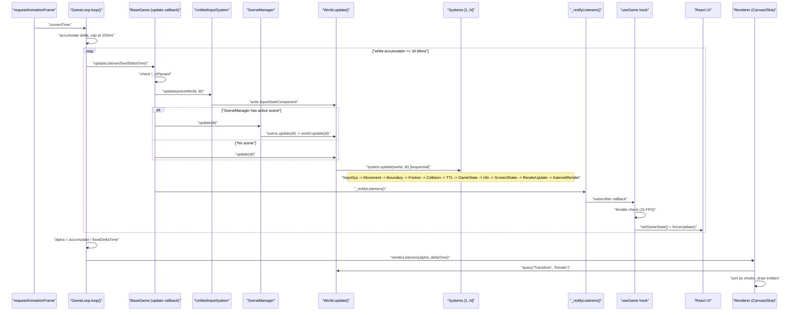
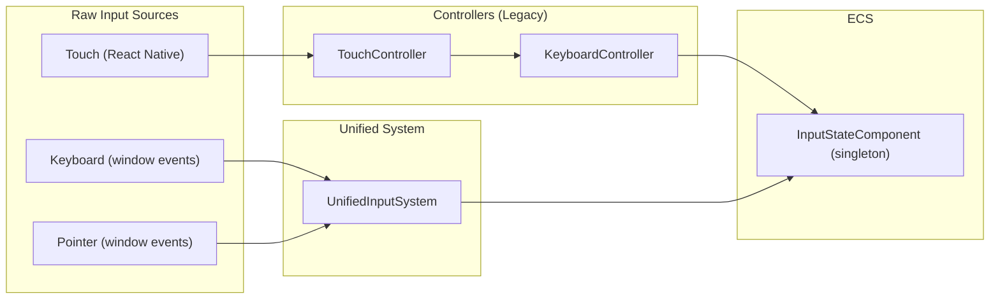
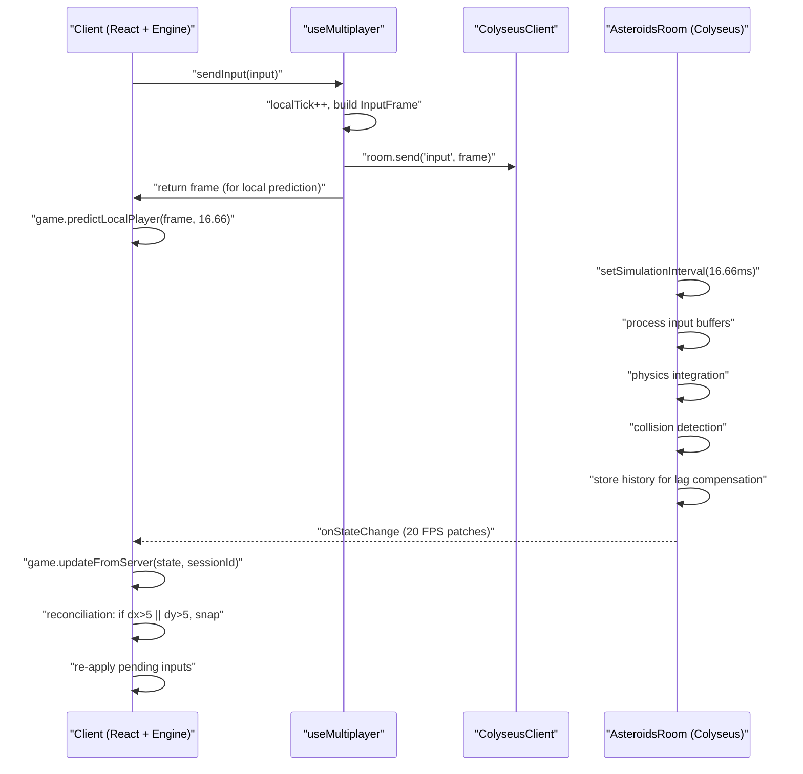

# Documentación Técnica Profunda: TinyAsterEngine — Retro Arcade Framework

---

## 1. Resumen Ejecutivo

El repositorio `react-native-asteroids` implementa un **framework arcade multi-juego** construido sobre un motor ECS puro en TypeScript, desplegable en iOS, Android y Web mediante Expo + React Native. El motor (`TinyAsterEngine`) reside en `src/engine/` y es consumido por cuatro juegos: Asteroids, Space Invaders, Flappy Bird y Pong.

**Hallazgos clave:**

- **Arquitectura ECS madura**: `World` con entity recycling, query caching por versión, component index para O(1) lookups, y spatial hashing para colisiones.
- **Game loop robusto**: Fixed timestep a 60 Hz con acumulador y protección contra spiral of death (`maxDeltaTime = 100ms`).
- **Sincronización engine↔React**: Patrón push-pull con throttling a 15 FPS en `useGame` para evitar saturación del bridge.
- **Rendering multi-backend**: Canvas 2D (web), Skia (nativo), SVG (fallback), con sistema extensible de shape drawers.
- **Multiplayer**: Colyseus con client-side prediction, interpolación de entidades remotas, lag compensation y replay.
- **Determinismo**: `RandomService` basado en Mulberry32 con seed, pero con **riesgos críticos** de `Math.random()` y `Date.now()` en paths de gameplay/render.

**Archivos analizados**: ~50 archivos core del motor, sistemas, rendering, input, multiplayer, hooks y juegos.

---

## 2. Mapa de Arquitectura

```mermaid
graph TD
    subgraph "React Native / Expo UI"
        AppLayout["_layout.tsx"]
        IndexScreen["index.tsx (Arcade Menu)"]
        GameScreens["Game Screens (asteroids/, pong/, etc.)"]
        CanvasComp["CanvasRenderer.tsx"]
        GameRendComp["GameRenderer.tsx (Skia)"]
        GameUI["GameUI.tsx"]
        GameControls["GameControls.tsx"]
    end

    subgraph "Hooks Layer"
        useGame["useGame.ts"]
        useAsteroidsGame["useAsteroidsGame.ts"]
        useMultiplayer["useMultiplayer.ts"]
        useHighScore["useHighScore.ts"]
    end

    subgraph "Engine Core (src/engine/core/)"
        IGame["IGame.ts"]
        BaseGame["BaseGame.ts"]
        GameLoop["GameLoop.ts"]
        World["World.ts"]
        System["System.ts"]
        EventBus["EventBus.ts"]
        SceneManager["SceneManager.ts"]
        StateMachine["StateMachine.ts"]
        EntityPool["EntityPool.ts"]
    end

    subgraph "Engine Systems (src/engine/systems/)"
        MovementSystem["MovementSystem"]
        BoundarySystem["BoundarySystem"]
        FrictionSystem["FrictionSystem"]
        CollisionSystem["CollisionSystem (abstract)"]
        TTLSystem["TTLSystem"]
        ScreenShakeSystem["ScreenShakeSystem"]
        RenderUpdateSystem["RenderUpdateSystem"]
        HierarchySystem["HierarchySystem"]
        AnimationSystem["AnimationSystem"]
        ParticleSystem["ParticleSystem"]
    end

    subgraph "Engine Rendering (src/engine/rendering/)"
        Renderer["Renderer (interface)"]
        CanvasRenderer["CanvasRenderer.ts"]
        SkiaRenderer["SkiaRenderer.ts"]
        SvgRenderer["SvgRenderer.tsx"]
    end

    subgraph "Engine Input (src/engine/input/)"
        InputController["InputController (abstract)"]
        KeyboardController["KeyboardController"]
        TouchController["TouchController"]
        UnifiedInputSystem["UnifiedInputSystem"]
    end

    subgraph "Engine Utils"
        RandomService["RandomService.ts"]
        SpatialHash["SpatialHash.ts"]
        LifecycleUtils["LifecycleUtils.ts"]
        PrefabPool["PrefabPool.ts"]
    end

    subgraph "Games (src/games/)"
        AsteroidsGame["AsteroidsGame"]
        SpaceInvadersGame["SpaceInvadersGame"]
        FlappyBirdGame["FlappyBirdGame"]
        PongGame["PongGame"]
    end

    subgraph "Multiplayer (src/multiplayer/)"
        ColyseusClient["ColyseusClient.ts"]
        InterpolationBuffer["InterpolationSystem.ts"]
        PredictionBuffer["PredictionBuffer.ts"]
        ReplayManager["ReplayManager.ts"]
    end

    subgraph "Server (server/)"
        AsteroidsRoom["AsteroidsRoom.ts"]
    end

    GameScreens --> useGame
    useGame --> BaseGame
    BaseGame --> GameLoop
    BaseGame --> World
    BaseGame --> UnifiedInputSystem
    BaseGame --> EventBus
    BaseGame --> SceneManager
    AsteroidsGame --> BaseGame
    GameLoop --> World
    World --> System
    CollisionSystem --> SpatialHash
    CanvasComp --> CanvasRenderer
    GameRendComp --> SkiaRenderer
    useMultiplayer --> ColyseusClient
    ColyseusClient --> AsteroidsRoom
```



### Módulos y responsabilidades

| Módulo | Responsabilidad |
|--------|----------------|
| `src/engine/core/` | ECS World, game loop, BaseGame, lifecycle, EventBus, FSM |
| `src/engine/systems/` | Sistemas genéricos reutilizables (movimiento, colisión, TTL, etc.) |
| `src/engine/rendering/` | Abstracción de renderer + implementaciones Canvas/Skia/SVG |
| `src/engine/input/` | Abstracción de input con controllers y UnifiedInputSystem |
| `src/engine/collision/` | SpatialHash para broadphase |
| `src/engine/utils/` | RandomService, ObjectPool, PrefabPool, LifecycleUtils |
| `src/engine/scenes/` | Scene y SceneManager para gestión de estados de juego |
| `src/games/*/` | Implementaciones concretas de juegos |
| `src/hooks/` | Puente React↔Engine |
| `src/multiplayer/` | Cliente Colyseus, prediction, interpolación, replay |
| `server/` | Servidor Colyseus autoritativo | [1](#0-0) 

---

## 3. Modelo ECS

### Entity
Un `Entity` es un alias de `number`. Los IDs se generan auto-incrementalmente y se reciclan mediante `freeEntities` en `World`. [2](#0-1) 

### Component
Interfaz base con un discriminador `type: string`. Los componentes son objetos de datos puros mutados por referencia. [3](#0-2) 

### Componentes core del motor

| Componente | Tipo | Responsabilidad |
|-----------|------|-----------------|
| `TransformComponent` | `"Transform"` | Posición (x,y), rotación, escala, parent opcional, cache world-space |
| `VelocityComponent` | `"Velocity"` | Velocidad lineal (dx, dy) |
| `FrictionComponent` | `"Friction"` | Factor de amortiguación 0-1 |
| `BoundaryComponent` | `"Boundary"` | Límites de pantalla + comportamiento (wrap/bounce/destroy) |
| `ColliderComponent` | `"Collider"` | Radio de colisión circular |
| `RenderComponent` | `"Render"` | Shape, size, color, rotation, vertices, zIndex, trails, hitFlash |
| `TTLComponent` | `"TTL"` | Tiempo de vida restante y total |
| `HealthComponent` | `"Health"` | HP actual/máximo + invulnerabilidad temporal |
| `TagComponent` | `"Tag"` | Array de tags semánticos (e.g., "LocalPlayer", "Ship") |
| `InputStateComponent` | `"InputState"` | Mapa de acciones semánticas → boolean + ejes |
| `EventBusComponent` | `"EventBus"` | Singleton que contiene la instancia de EventBus |
| `ScreenShakeComponent` | `"ScreenShake"` | Intensidad y duración del shake |
| `ReclaimableComponent` | `"Reclaimable"` | Callback para devolver entidad a pool |
| `AnimatorComponent` | `"Animator"` | Animaciones frame-based |
| `StateMachineComponent` | `"StateMachine"` | FSM embebida en componente |
| `Camera2DComponent` | `"Camera2D"` | Cámara con zoom, shake, smoothing, bounds |
| `TilemapComponent` | `"Tilemap"` | Datos de tilemap con layers |
| `ParticleEmitterComponent` | `"ParticleEmitter"` | Configuración de emisor de partículas | [4](#0-3) [5](#0-4) [6](#0-5) 

### System
Clase abstracta con un único método `update(world: World, deltaTime: number): void`. Los sistemas se ejecutan secuencialmente en el orden en que se registran con `world.addSystem()`. [7](#0-6) 

### World
Registro central del ECS. Almacena:
- `activeEntities: Set<Entity>` — entidades vivas
- `componentMaps: Map<string, Map<Entity, Component>>` — almacenamiento primario O(1)
- `componentIndex: Map<string, Set<Entity>>` — índice invertido para queries eficientes
- `cachedQueryResults` — caché de queries invalidada por `version`
- `freeEntities: Entity[]` — pool de IDs reciclados
- `version: number` — contador estructural, incrementado en cada mutación

**Query optimization**: Selecciona automáticamente el tipo de componente más raro como candidato inicial, luego filtra por los demás. [8](#0-7) [9](#0-8) [10](#0-9) [11](#0-10) 

**Invariante de jerarquía**: `addComponent` valida que un `TransformComponent` con `parent` no sea auto-referencial y que el parent exista en el world. [12](#0-11) 

**Singleton pattern**: `getSingleton<T>(type)` busca la primera entidad con ese componente. Si está frozen, lo reemplaza con una copia mutable. [13](#0-12) 

---

## 4. Game Loop — Fixed Timestep

`GameLoop` implementa un patrón acumulador clásico:

```
loop(currentTime):
  deltaTime = currentTime - lastTime  (capped a maxDeltaTime=100ms)
  accumulator += deltaTime
  while accumulator >= fixedDeltaTime (16.66ms):
    updateListeners(fixedDeltaTime)   // lógica a 60 Hz
    accumulator -= fixedDeltaTime
  alpha = accumulator / fixedDeltaTime
  renderListeners(alpha, deltaTime)   // render a framerate variable
``` [14](#0-13) 

**Contratos:**
- `fixedDeltaTime` = `1000 / fixedHz` (default 60 Hz = 16.66ms)
- `maxDeltaTime` = 100ms → previene spiral of death
- Update listeners reciben siempre `fixedDeltaTime` constante (determinista)
- Render listeners reciben `alpha` (0-1) para interpolación visual

**Subscripciones:**
- `subscribeUpdate()` → fase lógica (fixed timestep)
- `subscribeRender()` → fase visual (variable framerate)
- `subscribe()` → alias legacy de `subscribeRender()` [15](#0-14) [16](#0-15) 

---

## 5. Flujo del Frame



### Orden detallado dentro de un tick lógico (Asteroids):

| # | Sistema | Queries | Muta | Dependencias |
|---|---------|---------|------|-------------|
| 0 | `UnifiedInputSystem` | `InputState` | `InputStateComponent` (singleton) | Ejecutado por BaseGame antes de world.update() |
| 1 | `AsteroidInputSystem` | `Ship`, `Input`, `Transform`, `Velocity`, `Render` | Velocity, Render.rotation, crea bullets/particles | Depende de InputState |
| 2 | `MovementSystem` | `Transform`, `Velocity` | Transform.x, Transform.y | Depende de velocidades actualizadas |
| 3 | `BoundarySystem` | `Transform`, `Boundary` | Transform.x/y, Velocity.dx/dy, o destruye entidad | Depende de posiciones actualizadas |
| 4 | `FrictionSystem` | `Velocity`, `Friction` | Velocity.dx, Velocity.dy | Independiente del orden post-movimiento |
| 5 | `AsteroidCollisionSystem` | `Transform`, `Collider` | Health, crea partículas, destruye entidades | Depende de posiciones finales |
| 6 | `TTLSystem` | `TTL` | TTL.remaining, destruye entidades | Independiente |
| 7 | `AsteroidGameStateSystem` | `GameState`, `Health`, `Asteroid` | GameState (score, level, lives, waves) | Depende de colisiones resueltas |
| 8 | `UfoSystem` | `Ufo`, `Transform` | Crea/destruye UFOs | Depende de GameState |
| 9 | `ScreenShakeSystem` | `ScreenShake` | ScreenShake.config.duration | Independiente |
| 10 | `RenderUpdateSystem` | `Transform`, `Render`, `Ship` | Render.trailPositions, rotation, hitFlashFrames, world.version | Debe ser último antes del render |
| 11 | `AsteroidRenderSystem` | Game-specific render data | Render data | Último sistema | [17](#0-16) [18](#0-17) 

---

## 6. Integración con Expo y React Native

### Patrón Push-Pull

1. **Push (Engine → React)**: `BaseGame._notifyListeners()` invoca callbacks registrados por `useGame`. El hook aplica throttling a 15 FPS (`UI_UPDATE_INTERVAL = 1000/15`) para evitar saturar el bridge de React Native. [19](#0-18) 

2. **Pull (React → Engine)**: Los componentes React leen `game.getWorld()` para obtener el estado actual. `CanvasRenderer` ejecuta su propio `requestAnimationFrame` loop para renderizar a framerate nativo. [20](#0-19) 

### Lifecycle del hook `useGame`

```
useEffect:
  game = new GameClass({ isMultiplayer })
  game.start()                          // inicia GameLoop
  unsubscribe = game.subscribe(...)     // registra listener
  return () => {
    unsubscribe()
    game.destroy()                      // stop + cleanup listeners
  }
``` [21](#0-20) 

### Estado: qué vive dónde

| Estado | Ubicación | Tipo |
|--------|-----------|------|
| Entidades, componentes, sistemas | `World` (engine) | Efímero por sesión |
| Score, lives, level, isGameOver | `GameStateComponent` (ECS singleton) | Efímero |
| High score | `useHighScore` (AsyncStorage + Zod) | Persistente |
| isPaused | `BaseGame._isPaused` | Efímero |
| Input state | `InputStateComponent` (ECS singleton) | Efímero por frame |
| Multiplayer room state | `useMultiplayer` (React state) | Efímero |

### `@conceptualRisk [COUPLING][MEDIUM]`
El `GameConstructor` type en `useGame` asume un constructor sin argumentos (`new () => TGame`), pero luego usa `@ts-ignore` para pasar `{ isMultiplayer }`. Esto rompe type safety. [22](#0-21) [23](#0-22) 

---

## 7. Rendering Pipeline

### Backends disponibles

| Backend | Archivo | Plataforma | Mecanismo |
|---------|---------|-----------|-----------|
| Canvas 2D | `CanvasRenderer.ts` | Web | `<canvas>` HTML5 + `requestAnimationFrame` propio |
| Skia (procedural) | `SkiaRenderer.ts` | iOS/Android | `@shopify/react-native-skia` SkCanvas |
| Skia (declarativo) | `GameCanvas.tsx` | iOS/Android | Componentes Skia + SharedValues |
| SVG | `SvgRenderer.tsx` | Fallback | react-native-svg | [24](#0-23) 

### Pipeline de render (Canvas 2D)

```
render(world):
  1. clear() → fillRect negro
  2. Query GameState → calcular screenShake offset
  3. ctx.save() + translate(shakeX, shakeY)
  4. backgroundEffects (starfield)
  5. Query("Transform", "Render") → build renderCommands
  6. preRenderHooks (game-specific starfield)
  7. Sort renderCommands by zIndex
  8. forEach: drawEntity(entity, components, world)
     - ctx.save() → translate(worldX||x, worldY||y) → rotate
     - lookup shapeDrawer by render.shape → execute
     - ctx.restore()
     - postEntityDrawer (trails)
  9. foregroundEffects (CRT)
  10. ctx.restore() (undo shake)
  11. renderUI() (engine UI framework)
  12. debugInfo (if DebugConfig present)
  13. postRenderHooks
``` [25](#0-24) 

### Extensibilidad
Los juegos registran shape drawers personalizados mediante `initializeAsteroidsRenderer(renderer)`, que detecta `renderer.type` ("canvas" o "skia") y registra drawers específicos. [26](#0-25) 

### `@conceptualRisk [DETERMINISM][HIGH]`
`SkiaRenderer.render()` usa `Math.random()` para screen shake en líneas 125-126. Esto rompe determinismo y puede causar desincronización en multiplayer. [27](#0-26) 

### `@conceptualRisk [GC_PRESSURE][MEDIUM]`
`renderCommands` se reconstruye como array nuevo cada frame con `.map()` y `.sort()`. En escenas con muchas entidades, esto genera presión de GC. [28](#0-27) 

### `@conceptualRisk [DETERMINISM][HIGH]`
`drawSkiaShip` en `AsteroidsSkiaVisuals.ts` usa `Date.now()` para calcular blink de invulnerabilidad (línea 34). Esto es no-determinista. [29](#0-28) 

---

## 8. Input Architecture

### Capas de input



### `UnifiedInputSystem`
Sistema que mapea raw inputs (keycodes, pointer events) a acciones semánticas (`"jump"`, `"thrust"`) mediante `bind(action, inputs[])` y `bindAxis(axis, pos[], neg[])`. Escribe un `InputStateComponent` singleton en el World. [30](#0-29) 

### `InputController` (legacy)
Clase abstracta con `setup()`, `cleanup()`, `getCurrentInputs()`. Implementada por `KeyboardController` (mapea keycodes a boolean flags) y `TouchController` (detecta tap/swipe/hold). [31](#0-30) [32](#0-31) 

### `@conceptualRisk [LIFECYCLE][MEDIUM]`
`TouchController.emitGesture()` usa `setTimeout` de 50ms para desactivar gestos. Si el controller se destruye antes de que expire el timeout, el callback ejecutará sobre estado stale. [33](#0-32) 

### `@conceptualRisk [COUPLING][LOW]`
`UnifiedInputSystem` registra listeners en `window` en su constructor. En entornos sin `window` (SSR, tests), esto se guarda silenciosamente, pero el sistema queda inerte sin notificación explícita. [34](#0-33) 

---

## 9. Multiplayer y Client-Side Prediction

### Arquitectura



### Servidor (`AsteroidsRoom`)
- Fixed timestep a 16.66ms (60 FPS)
- Patch rate: 50ms (20 FPS de red)
- Input buffering por sesión
- Lag compensation: historial de 60 ticks de snapshots
- Replay: almacena hasta 18000 frames (5 min) [35](#0-34) [36](#0-35) 

### Cliente
- `useMultiplayer`: gestiona conexión, tick sync (RTT/2 + 2 ticks de buffer), input buffer con max 120 frames
- `predictLocalPlayer()`: aplica la misma lógica de movimiento que el servidor localmente
- `updateFromServer()`: reconciliación con threshold de 5px, interpolación de entidades remotas con buffer de 100ms de delay [37](#0-36) [38](#0-37) [39](#0-38) 

### `InterpolationBuffer`
Buffer circular de snapshots ordenados por timestamp. `getAt(targetTime)` busca el par de snapshots que bracketan el tiempo objetivo y calcula alpha de interpolación. [40](#0-39) 

### `@conceptualRisk [DETERMINISM][CRITICAL]`
`predictLocalPlayer()` duplica lógica de física (friction, wrapping) que ya existe en `MovementSystem`, `FrictionSystem` y `BoundarySystem`. Si alguno de estos sistemas cambia, la predicción se desincronizará del servidor. [38](#0-37)

### Citations

**File:** src/engine/index.ts (L1-41)
```typescript
// Core
export * from './core/World';
export * from './core/EntityPool';
export * from './core/GameLoop';
export * from './core/System';
export * from './core/SceneGraph';

// Types
export * from './types/EngineTypes';

// Collision & Physics
export * from './collision/SpatialHash';
export * from './systems/CollisionSystem';
export * from './physics/shapes/ShapeTypes';
export * from './physics/shapes/ShapeFactory';
export * from './physics/collision/CollisionSystem2D';
export * from './physics/collision/CollisionLayers';
export * from './physics/collision/NarrowPhase';
export * from './physics/collision/BroadPhase';
export * from './physics/collision/ContinuousCollision';
export * from './physics/query/PhysicsQuery';
export * from './physics/query/QueryTypes';
export * from './physics/dynamics/PhysicsSystem2D';
export * from './physics/debug/PhysicsDebugSystem';

// Rendering
export * from './rendering/RenderTypes';
export * from './rendering/RenderSystem';

// Input
export * from './input/InputTypes';
export * from './input/InputSystem';
export * from './input/UnifiedInputSystem';

// Scenes
export * from './scenes/Scene';
export * from './scenes/SceneManager';

// Assets
export * from './assets/AssetTypes';
export * from './assets/AssetLoader';
```

**File:** src/engine/core/Entity.ts (L1-4)
```typescript
/**
 * Unique identifier for an entity in the world.
 */
export type Entity = number;
```

**File:** src/engine/core/Component.ts (L1-8)
```typescript
/**
 * Base interface for all components.
 * Every component must have a type discriminator.
 */
export interface Component {
  /** Discriminator for the component type */
  type: string;
}
```

**File:** src/engine/core/CoreComponents.ts (L21-35)
```typescript
export interface TransformComponent extends Component {
  type: "Transform";
  x: number;
  y: number;
  rotation: number;
  scaleX: number;
  scaleY: number;
  parent?: Entity;
  // World space cache (managed by HierarchySystem)
  worldX?: number;
  worldY?: number;
  worldRotation?: number;
  worldScaleX?: number;
  worldScaleY?: number;
}
```

**File:** src/engine/core/CoreComponents.ts (L100-113)
```typescript
export interface RenderComponent extends Component {
  type: "Render";
  shape: string;
  size: number;
  color: string;
  rotation: number;
  angularVelocity?: number;
  vertices?: { x: number; y: number }[];
  zIndex?: number;
  trailPositions?: { x: number; y: number }[];
  hitFlashFrames?: number;
  /** Custom data for game-specific drawers */
  data?: Record<string, any>;
}
```

**File:** src/engine/core/CoreComponents.ts (L118-123)
```typescript
export interface HealthComponent extends Component {
  type: "Health";
  current: number;
  max: number;
  invulnerableRemaining: number;
}
```

**File:** src/engine/core/System.ts (L1-15)
```typescript
import { World } from "./World";

/**
 * Base class for all game systems in the ECS architecture.
 * Systems implement the game logic by processing entities that possess specific sets of components.
 */
export abstract class System {
  /**
   * Updates the system logic for a single frame.
   *
   * @param world - The ECS world containing entities and components.
   * @param deltaTime - The time elapsed since the last frame in milliseconds.
   */
  abstract update(world: World, deltaTime: number): void;
}
```

**File:** src/engine/core/World.ts (L7-24)
```typescript
export class World {
  private activeEntities = new Set<Entity>();
  private componentMaps = new Map<string, Map<Entity, Component>>();
  private componentIndex = new Map<string, Set<Entity>>();
  private systems: System[] = [];
  private nextEntityId = 1;
  private freeEntities: Entity[] = [];

  /**
   * Cache for query results to avoid redundant computations and GC pressure.
   */
  private cachedQueryResults = new Map<string, { version: number; entities: Entity[] }>();

  /**
   * Current version of the world structure.
   * Incremented whenever an entity or component is added or removed.
   */
  public version = 0;
```

**File:** src/engine/core/World.ts (L56-69)
```typescript
    // Principle 2: Strong Invariants - Normalizar en addNode (addComponent en ECS)
    if (type === "Transform") {
      const transform = component as any;
      if (transform.parent !== undefined) {
        if (!this.activeEntities.has(transform.parent)) {
          if (__DEV__) {
            console.warn(`Hierarchy Invariant Violation: Entity ${entity} has parent ${transform.parent} but parent does not exist in world.`);
          }
          transform.parent = undefined; // Normalizar SIEMPRE
        } else if (transform.parent === entity) {
          throw new Error(`Hierarchy Invariant Violation: Entity ${entity} cannot be its own parent.`);
        }
      }
    }
```

**File:** src/engine/core/World.ts (L128-141)
```typescript
  query(...componentTypes: string[]): Entity[] {
    if (componentTypes.length === 0) return [];

    const cacheKey = [...componentTypes].sort().join(",");
    const cachedEntities = this.getCachedEntities(cacheKey);

    if (cachedEntities) {
      return cachedEntities;
    }

    const result = this.performFiltering(componentTypes);
    this.cachedQueryResults.set(cacheKey, { version: this.version, entities: result });
    return result;
  }
```

**File:** src/engine/core/World.ts (L214-222)
```typescript
  private performFiltering(componentTypes: string[]): Entity[] {
    const sortedTypes = this.getSortedTypes(componentTypes);
    const candidates = this.componentIndex.get(sortedTypes[0]);

    if (!candidates || candidates.size === 0) {
      return [];
    }

    return this.filterByComponents(candidates, sortedTypes.slice(1));
```

**File:** src/engine/core/World.ts (L232-246)
```typescript
  getSingleton<T extends Component>(type: string): T | undefined {
    const [entity] = this.query(type);
    if (entity === undefined) return undefined;

    const component = this.getComponent<T>(entity, type);
    if (!component) return undefined;

    if (Object.isFrozen(component)) {
      const mutableCopy = { ...component };
      this.addComponent(entity, mutableCopy);
      return mutableCopy;
    }

    return component;
  }
```

**File:** src/engine/core/World.ts (L254-260)
```typescript
  private getSortedTypes(types: string[]): string[] {
    return [...types].sort((a, b) => {
      const countA = this.componentIndex.get(a)?.size ?? 0;
      const countB = this.componentIndex.get(b)?.size ?? 0;
      return countA - countB;
    });
  }
```

**File:** src/engine/core/GameLoop.ts (L9-33)
```typescript
export interface LoopConfig {
  fixedHz?: number; // default: 60
  maxDeltaMs?: number; // default: 100 (evita spiral of death)
}

export class GameLoop {
  private isRunning: boolean = false;
  private lastTime: number = 0;
  private gameLoopId?: number;
  private accumulator: number = 0;

  /** Fixed timestep for logic updates (60 FPS = 16.66ms) */
  private fixedDeltaTime: number = 1000 / 60;
  /** Maximum elapsed time allowed in a single frame to prevent "spiral of death" */
  private maxDeltaTime: number = 100;

  private updateListeners: Set<(deltaTime: number) => void> = new Set();
  private renderListeners: Set<(alpha: number, deltaTime: number) => void> = new Set();

  constructor(config: LoopConfig = {}) {
    // Principle 8: Defensive constructor with destructuring and defaults
    const { fixedHz = 60, maxDeltaMs = 100 } = config;
    this.fixedDeltaTime = 1000 / fixedHz;
    this.maxDeltaTime = maxDeltaMs;
  }
```

**File:** src/engine/core/GameLoop.ts (L63-85)
```typescript
  public subscribeUpdate(listener: (deltaTime: number) => void): () => void {
    this.updateListeners.add(listener);
    return () => this.updateListeners.delete(listener);
  }

  /**
   * Subscribes a listener to the render phase (variable framerate).
   *
   * @param listener - Callback function receiving alpha (0-1) and deltaTime.
   * @returns Unsubscribe function.
   */
  public subscribeRender(listener: (alpha: number, deltaTime: number) => void): () => void {
    this.renderListeners.add(listener);
    return () => this.renderListeners.delete(listener);
  }

  /**
   * Legacy subscribe method for backward compatibility.
   * Maps to render subscription.
   */
  public subscribe(listener: (alpha: number, deltaTime: number) => void): () => void {
    return this.subscribeRender(listener);
  }
```

**File:** src/engine/core/GameLoop.ts (L90-114)
```typescript
  private loop = (currentTime: number): void => {
    if (!this.isRunning) return;

    let deltaTime = currentTime - this.lastTime;
    this.lastTime = currentTime;

    // Cap delta time to prevent spiral of death
    if (deltaTime > this.maxDeltaTime) {
      deltaTime = this.maxDeltaTime;
    }

    this.accumulator += deltaTime;

    // Fixed timestep updates
    while (this.accumulator >= this.fixedDeltaTime) {
      this.updateListeners.forEach((listener) => listener(this.fixedDeltaTime));
      this.accumulator -= this.fixedDeltaTime;
    }

    // Render phase with alpha interpolation
    const alpha = this.accumulator / this.fixedDeltaTime;
    this.renderListeners.forEach((listener) => listener(alpha, deltaTime));

    this.gameLoopId = requestAnimationFrame(this.loop);
  };
```

**File:** src/games/asteroids/AsteroidsGame.ts (L54-93)
```typescript
  public predictLocalPlayer(input: InputFrame, deltaTime: number) {
    const dt = deltaTime / 1000;
    const ships = this.world.query("Ship", "Transform", "Velocity", "Render");

    ships.forEach((entity) => {
        const tag = this.world.getComponent<TagComponent>(entity, "Tag");
        if (tag && tag.tags.includes("LocalPlayer")) {
            const pos = this.world.getComponent<TransformComponent>(entity, "Transform");
            const vel = this.world.getComponent<VelocityComponent>(entity, "Velocity");
            const render = this.world.getComponent<RenderComponent>(entity, "Render");

            if (pos && vel && render) {
                // Apply same logic as server
                const rotateLeft = input.actions.includes("rotateLeft") || input.axes.rotate_left > 0;
                const rotateRight = input.actions.includes("rotateRight") || input.axes.rotate_right > 0;
                const thrust = input.actions.includes("thrust") || input.axes.thrust > 0;

                if (rotateLeft) render.rotation -= GAME_CONFIG.SHIP_ROTATION_SPEED * dt;
                if (rotateRight) render.rotation += GAME_CONFIG.SHIP_ROTATION_SPEED * dt;
                if (thrust) {
                    vel.dx += Math.cos(render.rotation) * GAME_CONFIG.SHIP_THRUST * dt;
                    vel.dy += Math.sin(render.rotation) * GAME_CONFIG.SHIP_THRUST * dt;
                }

                // Physics integration
                const friction = this.world.getComponent<FrictionComponent>(entity, "Friction")?.value ?? GAME_CONFIG.SHIP_FRICTION;
                vel.dx *= friction;
                vel.dy *= friction;
                pos.x += vel.dx * dt;
                pos.y += vel.dy * dt;

                // Wrapping
                if (pos.x < 0) pos.x = GAME_CONFIG.SCREEN_WIDTH;
                if (pos.x > GAME_CONFIG.SCREEN_WIDTH) pos.x = 0;
                if (pos.y < 0) pos.y = GAME_CONFIG.SCREEN_HEIGHT;
                if (pos.y > GAME_CONFIG.SCREEN_HEIGHT) pos.y = 0;
            }
        }
    });
  }
```

**File:** src/games/asteroids/AsteroidsGame.ts (L95-231)
```typescript
  public updateFromServer(state: any, localSessionId?: string) {
    if (!this.isMultiplayer || !state) return;

    const currentServerIds = new Set<string>();

    // 1. Buffering snapshots for remote entities
    if (state.players) {
        state.players.forEach((player: any, sessionId: string) => {
            currentServerIds.add(sessionId);
            if (sessionId !== localSessionId) {
                let buffer = this.entityInterpolationBuffers.get(sessionId);
                if (!buffer) {
                    buffer = new InterpolationBuffer(10);
                    this.entityInterpolationBuffers.set(sessionId, buffer);
                }
                buffer.push({
                    tick: state.serverTick,
                    x: player.x,
                    y: player.y,
                    angle: player.angle,
                    timestamp: Date.now()
                });
            }

            let entity = this.serverEntities.get(sessionId);
            if (entity === undefined) {
                entity = this.world.createEntity();
                this.serverEntities.set(sessionId, entity);
                this.world.addComponent(entity, { type: "Transform", x: player.x, y: player.y, rotation: player.angle, scaleX: 1, scaleY: 1 } as TransformComponent);
                this.world.addComponent(entity, {
                    type: "Render",
                    shape: "triangle",
                    size: 10,
                    color: "white",
                    rotation: player.angle,
                    trailPositions: []
                } as RenderComponent);
                this.world.addComponent(entity, { type: "Ship", hyperspaceTimer: 0, hyperspaceCooldownRemaining: 0 } as any);
                const tags = ["Ship"];
                if (sessionId === localSessionId) tags.push("LocalPlayer");
                this.world.addComponent(entity, { type: "Tag", tags } as TagComponent);
                this.world.addComponent(entity, { type: "Health", current: player.lives, max: 3, invulnerableRemaining: 0 } as HealthComponent);
                if (sessionId === localSessionId) {
                    this.world.addComponent(entity, { type: "Velocity", dx: player.velocityX, dy: player.velocityY } as VelocityComponent);
                }
            }

            const pos = this.world.getComponent<any>(entity, "Transform");
            const render = this.world.getComponent<any>(entity, "Render");
            const health = this.world.getComponent<any>(entity, "Health");
            const vel = this.world.getComponent<any>(entity, "Velocity");

            if (sessionId === localSessionId) {
                // Reconciliation logic
                const dx = Math.abs(pos.x - player.x);
                const dy = Math.abs(pos.y - player.y);
                const THRESHOLD = 5;

                if (dx > THRESHOLD || dy > THRESHOLD) {
                    pos.x = player.x;
                    pos.y = player.y;
                }
                if (vel) {
                    vel.dx = player.velocityX;
                    vel.dy = player.velocityY;
                }
                render.rotation = player.angle;
            } else {
                // Interpolation logic
                const buffer = this.entityInterpolationBuffers.get(sessionId);
                const snapshot = buffer?.getAt(Date.now() - 100);
                if (snapshot) {
                    pos.x = snapshot.prev.x + (snapshot.next.x - snapshot.prev.x) * snapshot.alpha;
                    pos.y = snapshot.prev.y + (snapshot.next.y - snapshot.prev.y) * snapshot.alpha;
                    render.rotation = snapshot.prev.angle !== undefined && snapshot.next.angle !== undefined ?
                        snapshot.prev.angle + (snapshot.next.angle - snapshot.prev.angle) * snapshot.alpha : player.angle;
                } else {
                    pos.x = player.x;
                    pos.y = player.y;
                    render.rotation = player.angle;
                }
            }
            if (health) health.current = player.lives;
            render.color = player.alive ? "white" : "rgba(255,0,0,0.5)";
        });
    }

    // 2. Asteroids
    if (state.asteroids) {
        state.asteroids.forEach((asteroid: any, id: string) => {
            currentServerIds.add(id);
            let entity = this.serverEntities.get(id);
            if (entity === undefined) {
                entity = this.world.createEntity();
                this.serverEntities.set(id, entity);
                this.world.addComponent(entity, { type: "Transform", x: asteroid.x, y: asteroid.y, rotation: 0, scaleX: 1, scaleY: 1 } as TransformComponent);
                this.world.addComponent(entity, { type: "Render", shape: "polygon", size: 30, color: "white", rotation: 0 } as RenderComponent);
                this.world.addComponent(entity, { type: "Asteroid", size: "large" } as any);
                this.world.addComponent(entity, { type: "Tag", tags: ["Asteroid"] } as TagComponent);
            }
            const pos = this.world.getComponent<TransformComponent>(entity, "Transform");
            if (pos) {
                pos.x = asteroid.x;
                pos.y = asteroid.y;
            }
        });
    }

    // 3. Bullets
    if (state.bullets) {
        state.bullets.forEach((bullet: any, id: string) => {
            currentServerIds.add(id);
            let entity = this.serverEntities.get(id);
            if (entity === undefined) {
                entity = this.world.createEntity();
                this.serverEntities.set(id, entity);
                this.world.addComponent(entity, { type: "Transform", x: bullet.x, y: bullet.y, rotation: 0, scaleX: 1, scaleY: 1 } as TransformComponent);
                this.world.addComponent(entity, { type: "Render", shape: "bullet_shape", size: 2, color: "white", rotation: 0 } as RenderComponent);
                this.world.addComponent(entity, { type: "Bullet" } as any);
                this.world.addComponent(entity, { type: "Tag", tags: ["Bullet"] } as TagComponent);
            }
            const pos = this.world.getComponent<TransformComponent>(entity, "Transform");
            if (pos) {
                pos.x = bullet.x;
                pos.y = bullet.y;
            }
        });
    }

    // 4. Cleanup stale entities
    this.serverEntities.forEach((entity, id) => {
        if (!currentServerIds.has(id)) {
            this.world.removeEntity(entity);
            this.serverEntities.delete(id);
            this.entityInterpolationBuffers.delete(id);
        }
    });
```

**File:** src/games/asteroids/AsteroidsGame.ts (L234-271)
```typescript
  protected registerSystems(): void {
    // Initialize pools here because super() calls this before the constructor finishes
    if (!this.bulletPool) this.bulletPool = new BulletPool();
    if (!this.particlePool) this.particlePool = new ParticlePool();
    if (!this.assetLoader) this.assetLoader = new AssetLoader();

    const DEFAULT_INPUT: InputState = {
      thrust: false, rotateLeft: false, rotateRight: false,
      shoot: false, hyperspace: false
    };

    const ASTEROID_KEYMAP = {
      [GAME_CONFIG.KEYS.THRUST]: "thrust" as const,
      [GAME_CONFIG.KEYS.ROTATE_LEFT]: "rotateLeft" as const,
      [GAME_CONFIG.KEYS.ROTATE_RIGHT]: "rotateRight" as const,
      [GAME_CONFIG.KEYS.SHOOT]: "shoot" as const,
      [GAME_CONFIG.KEYS.HYPERSPACE]: "hyperspace" as const,
    };

    this.inputManager.addController(new KeyboardController<InputState>(ASTEROID_KEYMAP, DEFAULT_INPUT));
    this.inputManager.addController(new TouchController<InputState>());

    const inputSys = new AsteroidInputSystem(this.inputManager, this.bulletPool, this.particlePool);
    if (this.isMultiplayer) inputSys.setMultiplayerMode(true);
    this.gameStateSystem = new AsteroidGameStateSystem(this);

    this.world.addSystem(inputSys);
    this.world.addSystem(new MovementSystem());
    this.world.addSystem(new BoundarySystem());
    this.world.addSystem(new FrictionSystem());
    this.world.addSystem(new AsteroidCollisionSystem(this.particlePool));
    this.world.addSystem(new TTLSystem());
    this.world.addSystem(this.gameStateSystem);
    this.world.addSystem(new UfoSystem());
    this.world.addSystem(new ScreenShakeSystem());
    this.world.addSystem(new RenderUpdateSystem()); // Handle rotation/hit flash
    this.world.addSystem(new AsteroidRenderSystem()); // Handle trails
  }
```

**File:** src/engine/core/BaseGame.ts (L55-70)
```typescript
    // Notify React on each logical update frame
    this.gameLoop.subscribeUpdate((deltaTime) => {
      if (!this._isPaused) {
        // Update input system first
        const activeWorld = this.getWorld();
        this.unifiedInput.update(activeWorld, deltaTime);

        // Simple games update this.world, advanced games update via sceneManager
        if (this.sceneManager.getCurrentScene()) {
          this.sceneManager.update(deltaTime);
        } else {
          this.world.update(deltaTime);
        }
        this._notifyListeners();
      }
    });
```

**File:** src/hooks/useGame.ts (L6-8)
```typescript
type GameConstructor<TGame extends BaseGame<TState, TInput>, TState, TInput extends Record<string, boolean>> =
  new () => TGame;

```

**File:** src/hooks/useGame.ts (L46-75)
```typescript
  useEffect(() => {
    // @ts-ignore - Constructor argument handling
    const game = new GameClass({ isMultiplayer });
    gameRef.current = game;
    game.start();

    let lastUpdateTime = 0;
    const UI_UPDATE_INTERVAL = 1000 / 15; // Throttled to 15 FPS for UI components

    const unsubscribe = game.subscribe((updatedGame) => {
      const state = updatedGame.getGameState() as TState;
      gameStateRef.current = state;

      const now = performance.now();
      const isPausedNow = updatedGame.isPausedState();
      if (isPausedNow !== isPaused || now - lastUpdateTime >= UI_UPDATE_INTERVAL) {
        setGameState(state);
        setIsPaused(isPausedNow);
        forceUpdate((v) => v + 1);
        lastUpdateTime = now;
      }
    });

    return () => {
      unsubscribe();
      if (timeoutRef.current) clearTimeout(timeoutRef.current);
      game.destroy();
    };
  // Re-initialize if multiplayer mode or game class changes
  }, [GameClass, isMultiplayer]);
```

**File:** components/CanvasRenderer.tsx (L41-54)
```typescript
    let animationFrameId: number;

    const render = () => {
      if (rendererRef.current) {
        rendererRef.current.render(world);
      }
      animationFrameId = requestAnimationFrame(render);
    };

    render();

    return () => {
      cancelAnimationFrame(animationFrameId);
    };
```

**File:** src/engine/rendering/Renderer.ts (L28-79)
```typescript
export interface Renderer {
  /**
   * The type identifier for the renderer (e.g., 'canvas', 'skia').
   */
  readonly type: string;

  /**
   * Clears the drawing surface.
   */
  clear(): void;

  /**
   * Renders the current world state.
   *
   * @param world - The ECS world.
   */
  render(world: World): void;

  /**
   * Draws a single entity using its components.
   *
   * @param entity - The entity ID.
   * @param components - A map of component types to component instances.
   * @param world - The ECS world for context.
   */
  drawEntity(entity: Entity, components: Record<string, Component>, world: World): void;

  /**
   * Draws particles separately for efficiency.
   */
  drawParticles(world: World): void;

  /**
   * Sets the viewport size.
   */
  setSize(width: number, height: number): void;

  /**
   * Registers a custom shape drawer.
   */
  registerShape(name: string, drawer: ShapeDrawer<any>): void;

  /**
   * Registers a background effect.
   */
  registerBackgroundEffect(name: string, drawer: EffectDrawer<any>): void;

  /**
   * Registers a foreground effect.
   */
  registerForegroundEffect(name: string, drawer: EffectDrawer<any>): void;
}
```

**File:** src/engine/rendering/CanvasRenderer.ts (L152-209)
```typescript
  public render(world: World): void {
    if (!this.ctx) return;
    const ctx = this.ctx;

    this.clear();

    const gameStateEntity = world.query("GameState")[0];
    const gameState = gameStateEntity
      ? (world.getComponent<any>(gameStateEntity, "GameState"))
      : null;

    let shakeX = 0;
    let shakeY = 0;
    if (gameState?.screenShake && gameState.screenShake.remaining > 0) {
      shakeX = (Math.random() - 0.5) * gameState.screenShake.intensity;
      shakeY = (Math.random() - 0.5) * gameState.screenShake.intensity;
    }

    ctx.save();
    ctx.translate(shakeX, shakeY);

    this.backgroundEffects.forEach((drawer) => drawer(ctx, world, this.width, this.height));

    const entities = world.query("Transform", "Render");

    const renderCommands = entities.map(entity => {
      const pos = world.getComponent<TransformComponent>(entity, "Transform")!;
      const render = world.getComponent<RenderComponent>(entity, "Render")!;
      return {
        entity,
        pos,
        render,
        zIndex: (render as any).zIndex ?? 0
      };
    });

    this.preRenderHooks.forEach(hook => hook(ctx, world));

    renderCommands.sort((a, b) => a.zIndex - b.zIndex);
    renderCommands.forEach((cmd) => {
      this.drawEntity(cmd.entity, { Transform: cmd.pos, Render: cmd.render }, world);
    });

    ctx.save();
    this.foregroundEffects.forEach((drawer) => drawer(ctx, world, this.width, this.height));
    ctx.restore();

    ctx.restore(); // Balanced restore for shake - UI should NOT shake usually

    renderUI(ctx, world);

    const debugConfigEntity = world.query("DebugConfig")[0];
    if (debugConfigEntity !== undefined) {
        this.renderDebugInfo(ctx, world);
    }

    this.postRenderHooks.forEach(hook => hook(ctx, world));
  }
```

**File:** src/games/asteroids/rendering/AsteroidsRendererManager.ts (L9-56)
```typescript
export function initializeAsteroidsRenderer(renderer: Renderer): void {
  if (renderer.type === "canvas") {
    const canvasRenderer = renderer as any;

    // Register Asteroids-specific shape drawers
    canvasRenderer.registerShapeDrawer("triangle", drawShip);
    canvasRenderer.registerShapeDrawer("ufo", drawUfo);
    canvasRenderer.registerShapeDrawer("flash", drawFlash);

    // Register post-entity drawers (drawn after ctx.restore())
    canvasRenderer.registerPostEntityDrawer("triangle", drawAsteroidShipTrailDrawer);

    // Register custom hooks for Asteroids
    canvasRenderer.addPreRenderHook((ctx: any, world: any) => {
      const gameStateEntity = world.query("GameState")[0];
      const gameState = gameStateEntity ? (world.getComponent(gameStateEntity, "GameState")) : null;
      if (gameState?.stars) {
        drawAsteroidStarField(ctx, gameState.stars, GAME_CONFIG.SCREEN_WIDTH, GAME_CONFIG.SCREEN_HEIGHT, world);
      }
    });

    canvasRenderer.addPostRenderHook((ctx: any, world: any) => {
      const gameStateEntity = world.query("GameState")[0];
      const gameState = gameStateEntity ? (world.getComponent(gameStateEntity, "GameState")) : null;
      if (gameState?.debugCRT !== false) {
        drawAsteroidCRTEffect(ctx, GAME_CONFIG.SCREEN_WIDTH, GAME_CONFIG.SCREEN_HEIGHT);
      }
    });

    renderer.registerShape("bullet_shape", drawAsteroidsBullet);
    renderer.registerShape("particle", drawAsteroidsParticle);
    renderer.registerShape("polygon", drawAsteroidsAsteroid);
    // These might be redundant now but I'll keep them if they are used elsewhere
    // renderer.registerBackgroundEffect("starfield", asteroidsStarfieldEffect);
    // renderer.registerForegroundEffect("crt", asteroidsCRTEffect);
  } else if (renderer.type === "skia") {
    try {
      const { drawSkiaShip, drawSkiaUfo, skiaStarfieldEffect, skiaScreenShakeEffect, drawSkiaBullet, drawSkiaParticle } = require("./AsteroidsSkiaVisuals");
      renderer.registerShape("triangle", drawSkiaShip);
      renderer.registerShape("ufo", drawSkiaUfo);
      renderer.registerShape("bullet_shape", drawSkiaBullet);
      renderer.registerShape("particle", drawSkiaParticle);
      renderer.registerBackgroundEffect("starfield", skiaStarfieldEffect);
      renderer.registerBackgroundEffect("screenshake", skiaScreenShakeEffect);
    } catch (e) {
      console.warn("Failed to load Skia visuals", e);
    }
  }
```

**File:** src/engine/rendering/SkiaRenderer.ts (L122-127)
```typescript
    let shakeX = 0;
    let shakeY = 0;
    if (gameState?.screenShake && gameState.screenShake.framesLeft > 0) {
      shakeX = (Math.random() - 0.5) * gameState.screenShake.intensity;
      shakeY = (Math.random() - 0.5) * gameState.screenShake.intensity;
    }
```

**File:** src/games/asteroids/rendering/AsteroidsSkiaVisuals.ts (L32-35)
```typescript
        const isInvulnerable = health && health.invulnerableRemaining > 0;
        const blinkOpacity = isInvulnerable
            ? Math.floor(Date.now() / 150) % 2 === 0 ? 0.3 : 1.0
            : 1.0;
```

**File:** src/engine/input/UnifiedInputSystem.ts (L9-86)
```typescript
export class UnifiedInputSystem extends System {
  private bindings = new Map<InputAction, string[]>();
  private axisBindings = new Map<string, { pos: string[]; neg: string[] }>();
  private activeKeys = new Set<string>();
  private activeTouches = new Set<string>();

  private _onKeyDown = (e: KeyboardEvent) => this.activeKeys.add(e.code);
  private _onKeyUp = (e: KeyboardEvent) => this.activeKeys.delete(e.code);
  private _onPointerDown = () => this.activeTouches.add("TouchTap");
  private _onPointerUp = () => this.activeTouches.delete("TouchTap");

  constructor() {
    super();
    this.setupListeners();
  }

  /**
   * Binds a semantic action to one or more raw input keys or gestures.
   * @param action Semantic action name (e.g., "jump")
   * @param inputs Array of raw input strings (e.g., ["Space", "ArrowUp", "TouchTap"])
   */
  public bind(action: InputAction, inputs: string[]): void {
    this.bindings.set(action, inputs);
  }

  /**
   * Binds an axis to raw inputs for positive and negative directions.
   */
  public bindAxis(axis: string, pos: string[], neg: string[]): void {
    this.axisBindings.set(axis, { pos, neg });
  }

  private setupListeners(): void {
    if (typeof window === "undefined" || typeof window.addEventListener !== "function") return;

    window.addEventListener("keydown", this._onKeyDown);
    window.addEventListener("keyup", this._onKeyUp);

    // Simple touch/click to action mapping for demo/basic usage
    window.addEventListener("pointerdown", this._onPointerDown);
    window.addEventListener("pointerup", this._onPointerUp);
  }

  public update(world: World, _deltaTime: number): void {
    let inputState = world.getSingleton<InputStateComponent>("InputState");

    if (!inputState) {
      const entity = world.createEntity();
      inputState = {
        type: "InputState",
        actions: new Map(),
        axes: new Map(),
        isPressed: function(action: InputAction) {
          return this.actions.get(action) || false;
        },
        getAxis: function(axis: string) {
          return this.axes.get(axis) || 0;
        }
      };
      world.addComponent(entity, inputState);
    }

    // Update semantic actions based on bindings and active raw inputs
    this.bindings.forEach((inputs, action) => {
      const isPressed = inputs.some(input =>
        this.activeKeys.has(input) || this.activeTouches.has(input)
      );
      inputState!.actions.set(action, isPressed);
    });

    // Update axes based on bindings
    this.axisBindings.forEach((config, axis) => {
      let value = 0;
      if (config.pos.some(k => this.activeKeys.has(k))) value += 1;
      if (config.neg.some(k => this.activeKeys.has(k))) value -= 1;
      inputState!.axes.set(axis, value);
    });
  }
```

**File:** src/engine/input/InputController.ts (L1-35)
```typescript
/**
 * Abstract base class for handling user inputs.
 *
 * @remarks
 * Input controllers decouple the source of input (keyboard, touch, gamepad) from the game logic.
 * TInputState is a Record of boolean flags representing different input actions.
 */
export abstract class InputController<TInputState extends Record<string, boolean> = { [key: string]: boolean }> {
  /** The current state of inputs. */
  protected inputs: TInputState = {} as TInputState;

  /**
   * Sets up any necessary listeners or initialization for the input source.
   */
  abstract setup(): void;

  /**
   * Cleans up any resources or listeners when the controller is no longer needed.
   */
  abstract cleanup(): void;

  /**
   * Returns a read-only snapshot of the current input state.
   */
  getCurrentInputs(): Readonly<TInputState> {
    return { ...this.inputs };
  }

  /**
   * Manually updates the input state.
   */
  setInputs(inputs: Partial<TInputState>): void {
    this.inputs = { ...this.inputs, ...inputs };
  }
}
```

**File:** src/engine/input/KeyboardController.ts (L13-76)
```typescript
export class KeyboardController<TInputState extends Record<string, boolean>>
  extends InputController<TInputState> {

  /** Set of currently pressed keyboard keys by their `code`. */
  private keys = new Set<string>();
  private keyMap: KeyMap<TInputState>;
  private defaultState: TInputState;

  constructor(keyMap: KeyMap<TInputState>, defaultState: TInputState) {
    super();
    this.keyMap = keyMap;
    this.defaultState = defaultState;
    this.inputs = { ...defaultState };
  }

  /**
   * Attaches keydown and keyup listeners to the global window object.
   */
  setup(): void {
    if (typeof window === "undefined" || typeof window.addEventListener !== "function") return;

    window.addEventListener("keydown", this.handleKeyDown);
    window.addEventListener("keyup", this.handleKeyUp);
  }

  /**
   * Removes keyboard event listeners from the global window object.
   */
  cleanup(): void {
    if (typeof window === "undefined" || typeof window.removeEventListener !== "function") return;

    window.removeEventListener("keydown", this.handleKeyDown);
    window.removeEventListener("keyup", this.handleKeyUp);
  }

  /**
   * Internal handler for keydown events.
   */
  private handleKeyDown = (e: KeyboardEvent): void => {
    this.keys.add(e.code);
    this.updateInputs();
  };

  /**
   * Internal handler for keyup events.
   */
  private handleKeyUp = (e: KeyboardEvent): void => {
    this.keys.delete(e.code);
    this.updateInputs();
  };

  /**
   * Maps current key states to TInputState.
   */
  private updateInputs(): void {
    const next = { ...this.defaultState };
    this.keys.forEach(code => {
      const action = this.keyMap[code];
      if (action !== undefined) {
        (next as Record<string, boolean>)[action as string] = true;
      }
    });
    this.inputs = next;
  }
```

**File:** src/engine/input/TouchController.ts (L104-110)
```typescript
  private emitGesture(gesture: string): void {
    // Briefly activate gesture input
    this.setInputs({ [gesture]: true } as unknown as Partial<TInputState>);
    setTimeout(() => {
      this.setInputs({ [gesture]: false } as unknown as Partial<TInputState>);
    }, 50);
  }
```

**File:** server/src/AsteroidsRoom.ts (L5-27)
```typescript
export class AsteroidsRoom extends Room<AsteroidsState> {
  maxClients = 4;
  private fixedTimeStep = 16.66; // 60 FPS
  private inputBuffers = new Map<string, InputFrame[]>();
  private stateHistory = new Map<number, Map<string, EntitySnapshot>>();
  private replayFrames: ReplayFrame[] = [];

  onCreate(options: any) {
    this.state = new AsteroidsState();
    this.state.gameWidth = 800;
    this.state.gameHeight = 600;
    this.state.gameStarted = false;
    this.state.gameOver = false;
    this.state.serverTick = 0;

    this.setPatchRate(50); // 20 FPS network patches
    this.setSimulationInterval((dt) => this.update(dt), this.fixedTimeStep);

    this.onMessage("input", (client, frame: InputFrame) => {
      const buffer = this.inputBuffers.get(client.sessionId) || [];
      buffer.push(frame);
      this.inputBuffers.set(client.sessionId, buffer);
    });
```

**File:** server/src/AsteroidsRoom.ts (L112-190)
```typescript
  update(dt: number) {
    if (!this.state.gameStarted) return;
    this.state.serverTick++;
    this.state.lastProcessedTick = this.state.serverTick;

    const dtSec = dt / 1000;

    // 1. Process Inputs
    this.state.players.forEach((player: Player, sessionId: string) => {
      if (!player.alive) return;

      const buffer = this.inputBuffers.get(sessionId);
      if (buffer) {
        // Process frames that match current server tick or older (late frames)
        const framesToProcess = buffer.filter(f => f.tick <= this.state.serverTick);
        framesToProcess.forEach(frame => {
          this.applyPlayerInput(player, frame, dtSec);
        });
        // Keep only future frames
        this.inputBuffers.set(sessionId, buffer.filter(f => f.tick > this.state.serverTick));
      }

      // Global physics integration (Friction and movement outside of input block)
      player.velocityX *= 0.99;
      player.velocityY *= 0.99;
      this.integratePosition(player, dtSec);
      this.applyWrapping(player);
    });

    // 2. Move asteroids
    this.state.asteroids.forEach((asteroid: Asteroid) => {
      this.integratePosition(asteroid, dtSec);
      this.applyWrapping(asteroid);
    });

    // 3. Move bullets
    this.state.bullets.forEach((bullet: Bullet, id: string) => {
      this.integratePosition(bullet, dtSec);
      if (bullet.x < 0 || bullet.x > this.state.gameWidth || bullet.y < 0 || bullet.y > this.state.gameHeight) {
        this.state.bullets.delete(id);
      }
    });

    // 4. Collision detection (Authoritative)
    this.checkCollisions();

    // 5. Record for Replay
    const currentInputs: Record<string, InputFrame[]> = {};
    this.state.players.forEach((_player: Player, sessionId: string) => {
        const buffer = this.inputBuffers.get(sessionId);
        if (buffer) {
            currentInputs[sessionId] = buffer.filter(f => f.tick === this.state.serverTick);
        }
    });

    this.replayFrames.push({
        tick: this.state.serverTick,
        inputs: currentInputs,
        events: [] // We could add events here (e.g. game start, collisions)
    });

    // Limit replay to 5 minutes (5 * 60 * 60 = 18000 ticks)
    if (this.replayFrames.length > 18000) {
        this.replayFrames.shift();
    }

    // 6. Store history for lag compensation
    const snapshot = new Map<string, EntitySnapshot>();
    this.state.players.forEach((p: Player, id: string) => {
        snapshot.set(id, { tick: this.state.serverTick, x: p.x, y: p.y, angle: p.angle, timestamp: Date.now() });
    });
    this.state.asteroids.forEach((a: Asteroid, id: string) => {
        snapshot.set(id, { tick: this.state.serverTick, x: a.x, y: a.y, timestamp: Date.now() });
    });
    this.stateHistory.set(this.state.serverTick, snapshot);
    if (this.stateHistory.size > 60) {
        const oldestTick = this.state.serverTick - 60;
        this.stateHistory.delete(oldestTick);
    }
```

**File:** src/multiplayer/useMultiplayer.ts (L78-109)
```typescript
  const sendInput = useCallback((input: any) => {
    if (!room || !connected) return null;

    localTickRef.current++;
    const actions: string[] = [];
    if (input.thrust) actions.push("thrust");
    if (input.rotateLeft) actions.push("rotateLeft");
    if (input.rotateRight) actions.push("rotateRight");
    if (input.shoot) actions.push("shoot");
    if (input.hyperspace) actions.push("hyperspace");

    const frame: InputFrame = {
        tick: localTickRef.current,
        timestamp: Date.now(),
        actions,
        axes: {
            thrust: input.thrust ? 1 : 0,
            rotate_left: input.rotateLeft ? 1 : 0,
            rotate_right: input.rotateRight ? 1 : 0,
            rotate_x: input.rotateLeft ? -1 : (input.rotateRight ? 1 : 0)
        }
    };

    room.send("input", frame);

    // Store in local buffer for reconciliation later
    inputBufferRef.current.push(frame);
    if (inputBufferRef.current.length > 120) {
        inputBufferRef.current.shift();
    }
    return frame;
  }, [room, connected]);
```

**File:** src/multiplayer/InterpolationSystem.ts (L3-42)
```typescript
export class InterpolationBuffer {
  private snapshots: EntitySnapshot[] = [];
  private maxSize: number;

  constructor(maxSize: number = 20) {
    this.maxSize = maxSize;
  }

  public push(snapshot: EntitySnapshot): void {
    this.snapshots.push(snapshot);
    if (this.snapshots.length > this.maxSize) {
      this.snapshots.shift();
    }
    // Sort by timestamp to be safe
    this.snapshots.sort((a, b) => a.timestamp - b.timestamp);
  }

  public getAt(targetTime: number): { prev: EntitySnapshot; next: EntitySnapshot; alpha: number } | null {
    if (this.snapshots.length < 2) return null;

    // Find the two snapshots that bracket the target time
    for (let i = 0; i < this.snapshots.length - 1; i++) {
      const prev = this.snapshots[i];
      const next = this.snapshots[i + 1];

      if (targetTime >= prev.timestamp && targetTime <= next.timestamp) {
        const alpha = (targetTime - prev.timestamp) / (next.timestamp - prev.timestamp);
        return { prev, next, alpha };
      }
    }

    // Extrapolation (if targetTime is beyond our latest snapshot)
    const latest = this.snapshots[this.snapshots.length - 1];
    if (targetTime > latest.timestamp) {
       // Just return the latest for now, or implement extrapolation logic
       return { prev: latest, next: latest, alpha: 1 };
    }

    return null;
  }
```
