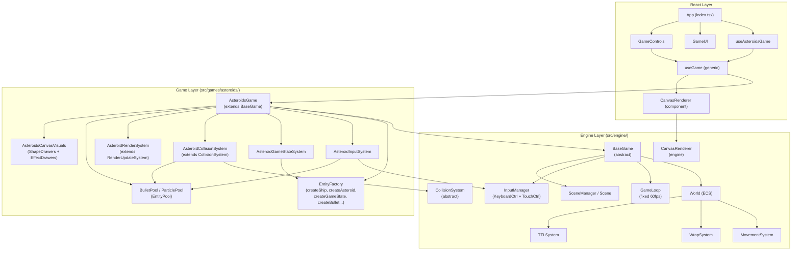

# Complete Asteroids Game Architecture

Here is the full map of every layer — from engine primitives to React UI — so you can replicate the exact same patterns for Space Invaders.

---

## 1. Complete File Tree

```
xavirodriguez/react-native-asteroids/
├── components/
│   ├── CanvasRenderer.tsx        ← React canvas host component
│   ├── GameControls.tsx          ← Touch/keyboard overlay UI
│   └── GameUI.tsx                ← HUD, GameOver, LevelUp overlays
├── src/
│   ├── app/
│   │   ├── index.tsx             ← Root React entry point
│   │   └── GameEngine.tsx        ← React wrapper for World+GameLoop
│   ├── engine/                   ← Reusable engine (game-agnostic)
│   │   ├── core/
│   │   │   ├── BaseGame.ts       ← Abstract base class for all games
│   │   │   ├── IGame.ts          ← IGame interface + UpdateListener type
│   │   │   ├── World.ts          ← ECS World (entities, components, systems)
│   │   │   ├── Entity.ts         ← type Entity = number
│   │   │   ├── Component.ts      ← Base Component interface
│   │   │   ├── GameLoop.ts       ← Fixed-timestep game loop (60 FPS)
│   │   │   └── System.ts         ← Abstract System base class
│   │   ├── types/
│   │   │   └── EngineTypes.ts    ← Engine-level component interfaces
│   │   ├── systems/
│   │   │   ├── CollisionSystem.ts      ← Abstract circle-circle collision
│   │   │   ├── MovementSystem.ts       ← Position += Velocity * dt
│   │   │   ├── WrapSystem.ts           ← Screen-edge wrapping
│   │   │   ├── TTLSystem.ts            ← Entity lifetime management
│   │   │   └── RenderUpdateSystem.ts   ← Rotation, trails, hit-flash
│   │   ├── input/
│   │   │   ├── InputController.ts      ← Abstract input source
│   │   │   ├── InputManager.ts         ← Aggregates multiple controllers
│   │   │   ├── KeyboardController.ts   ← Keyboard → TInputState
│   │   │   └── TouchController.ts      ← Touch → TInputState
│   │   ├── rendering/
│   │   │   ├── Renderer.ts       ← Renderer interface + ShapeDrawer/EffectDrawer types
│   │   │   └── CanvasRenderer.ts ← Canvas2D implementation
│   │   ├── scenes/
│   │   │   ├── Scene.ts          ← Abstract Scene (onEnter/onExit/update/render)
│   │   │   └── SceneManager.ts   ← Scene lifecycle transitions
│   │   └── utils/
│   │       ├── ObjectPool.ts     ← Generic object pool (GC optimization)
│   │       └── EntityPool.ts     ← ECS-aware pool of component sets
│   ├── types/
│   │   └── GameTypes.ts          ← Re-exports EngineTypes + AsteroidTypes
│   ├── game/
│   │   └── StarField.ts          ← Star generation utility
│   ├── hooks/
│   │   ├── useGame.ts            ← Generic hook: instantiate+subscribe any BaseGame
│   │   ├── useAsteroidsGame.ts   ← Asteroids-specific hook (wraps useGame)
│   │   └── useHighScore.ts       ← AsyncStorage high score persistence
│   └── games/
│       └── asteroids/
│           ├── AsteroidsGame.ts      ← Concrete game class (extends BaseGame)
│           ├── EntityFactory.ts      ← createShip, createAsteroid, createBullet, etc.
│           ├── EntityPool.ts         ← BulletPool + ParticlePool
│           ├── GameUtils.ts          ← getGameState() helper
│           ├── types/
│           │   ├── AsteroidTypes.ts  ← All component interfaces + GAME_CONFIG
│           │   └── GameInterfaces.ts ← IAsteroidsGame, IGameStateSystem
│           ├── systems/
│           │   ├── AsteroidInputSystem.ts      ← Input → ship movement/shooting
│           │   ├── AsteroidGameStateSystem.ts  ← Waves, lives, game over
│           │   ├── AsteroidCollisionSystem.ts  ← Collision resolution
│           │   └── AsteroidRenderSystem.ts     ← Trails + screen shake
│           ├── scenes/
│           │   └── AsteroidsGameScene.ts  ← Scene wiring (optional path)
│           └── rendering/
│               └── AsteroidsCanvasVisuals.ts  ← All ShapeDrawer/EffectDrawer fns
```

---

## 2. Engine Core Layer

### `Entity` and `Component`
An entity is just a `number`. Every component carries a `type` string discriminator. [1](#1-0) [2](#1-1) 

### Engine-level component interfaces (`EngineTypes.ts`)
The engine defines reusable primitives: `PositionComponent`, `VelocityComponent`, `ColliderComponent`, `HealthComponent`, `RenderComponent`, `TTLComponent`, `ReclaimableComponent`. [3](#1-2) 

### `World` — ECS container
The `World` holds all entities, stores components in a `Map<type, Map<entity, component>>`, maintains a `componentIndex` for fast querying, and runs `systems` in registration order. The `version` counter is incremented on any structural change so React can detect when to re-render. [4](#1-3) 

### `System` — base class
Every system must implement exactly one method: `update(world, deltaTime)`. [5](#1-4) 

### `GameLoop` — fixed timestep
Uses an **accumulator pattern** at a hard-coded `1000/60 ms` step. Has separate `subscribeUpdate` (fixed logic) and `subscribeRender` (variable framerate) channels. [6](#1-5) 

---

## 3. `BaseGame` — The Abstract Template

`BaseGame<TState, TInput>` is the key abstract class every game extends. It owns the `World`, `GameLoop`, `InputManager`, and `SceneManager`, wires the game loop to `world.update()`, and exposes the subscriber pattern to React.

**The 4 required abstract methods a concrete game MUST implement:** [7](#1-6) 

**Constructor flow** — calls `registerSystems()` then `initializeEntities()` before starting: [8](#1-7) 

**Lifecycle methods** (`start`, `stop`, `pause`, `resume`, `restart`, `destroy`): [9](#1-8) 

**Optional override hook `_onBeforeRestart()`** (used to reset `gameOverLogged`): [10](#1-9) 

**`IGame` interface** that `BaseGame` implements: [11](#1-10) 

---

## 4. Input Layer

### `InputController` — abstract source [12](#1-11) 

### `KeyboardController` — maps key codes to TInputState booleans [13](#1-12) 

### `TouchController` — accepts manual `setInputs()` calls (from React buttons) [14](#1-13) 

### `InputManager` — aggregates multiple controllers with OR logic [15](#1-14) 

---

## 5. Generic Engine Systems

### `MovementSystem` — integrates velocity into position [16](#1-15) 

### `WrapSystem` — screen-edge wrapping (Asteroids-style) [17](#1-16) 

### `TTLSystem` — destroys entities when their timer expires, notifying pools first [18](#1-17) 

### `RenderUpdateSystem` — handles angular velocity rotation, trail history, and hit-flash decrement [19](#1-18) 

### `CollisionSystem` — abstract circle-circle detection, calls `onCollision()` hook [20](#1-19) 

---

## 6. Object / Entity Pools

### `ObjectPool<T>` — generic GC-pressure reducer [21](#1-20) 

### `EntityPool<T>` — ECS-aware pool; auto-wires `Reclaimable.onReclaim` callback [22](#1-21) 

### `BulletPool` and `ParticlePool` (game-specific) [23](#1-22) [24](#1-23) 

---

## 7. Rendering Layer

### `Renderer` interface — `ShapeDrawer<TContext>` and `EffectDrawer<TContext>` types [25](#1-24) 

### `CanvasRenderer` — default shapes registered, render pipeline: clear → background effects → entities → foreground effects [26](#1-25) 

---

## 8. Scene Layer

### `Scene` — lifecycle hooks `onEnter/onExit/onPause/onResume/update/render` [27](#1-26) 

### `SceneManager` — drives transitions and delegates to active scene [28](#1-27) 

---

## 9. Game-Specific Types & Configuration

### All Asteroids component interfaces (`InputComponent`, `ShipComponent`, `AsteroidComponent`, `UfoComponent`, `BulletComponent`, `GameStateComponent`, `Star`, `ScreenShake`) [29](#1-28) 

### `GAME_CONFIG` — all tuning constants in one object (screen size, speeds, cooldowns, radii, particle counts, key bindings) [30](#1-29) 

### `IAsteroidsGame` and `IGameStateSystem` interfaces [31](#1-30) 

### `GameTypes.ts` — central re-export hub (engine + game types) [32](#1-31) 

---

## 10. `EntityFactory.ts` — All Entity Creation Functions

Every entity is built by calling `world.createEntity()` then `world.addComponent(entity, {type: "...", ...})`. Factory functions are pure — they take a `World` parameter and return the `Entity` id.

- `createShip` → `Position`, `Velocity`, `Render` (triangle), `Ship`, `Collider`, `Health`, `Input`
- `createAsteroid` → `Position`, `Velocity`, `Render` (polygon with random vertices), `Collider`, `Asteroid`
- `createBullet` → delegates to `BulletPool.acquire()`, gives `Position`, `Velocity`, `Render`, `Collider`, `TTL`, `Reclaimable`, `Bullet`
- `createParticle` → delegates to `ParticlePool.acquire()`
- `createGameState` → single entity with `GameState` component (lives, score, level, stars, screenShake)
- `createUfo` → `Position`, `Velocity`, `Render` (ufo shape), `Collider`, `Ufo`
- `spawnAsteroidWave` → loops `createAsteroid` in a circle around the center [33](#1-32) 

---

## 11. The Three Core Game Systems

### `AsteroidInputSystem` — polls `InputManager`, applies rotation/thrust/friction to ship, fires bullets
- Queries `world.query("Ship", "Input", "Position", "Velocity", "Render")`
- Reads `inputManager.getCombinedInputs()` into the `InputComponent`
- Applies `SHIP_THRUST`, `SHIP_ROTATION_SPEED`, `SHIP_FRICTION` from `GAME_CONFIG`
- Spawns thrust particles via `createParticle()`
- Fires bullets via `createBullet()` when shoot cooldown allows [34](#1-33) 

### `AsteroidGameStateSystem` — manages waves, lives sync, game-over, UFO spawning
- Queries `"Asteroid"` count → updates `gameState.asteroidsRemaining`
- If `asteroidsRemaining === 0` → increments level, calls `spawnAsteroidWave()`
- Queries `"Ship", "Health", "Input"` → syncs `health.invulnerableRemaining` and `gameState.lives`
- Game over when `lives <= 0` → calls `gameInstance.pause()`
- Holds a `gameOverLogged` flag, exposed via `isGameOver()` / `resetGameOverState()` [35](#1-34) 

### `AsteroidCollisionSystem` — extends `CollisionSystem`, handles 4 pair types
- `Bullet ↔ Asteroid`: splits asteroid, awards score, spawns particles, hit-flash
- `Ship ↔ Asteroid`: decrements health, sets screen shake, triggers invulnerability
- `Bullet ↔ Ufo`: destroys UFO, awards 100 pts
- `Ship ↔ Ufo`: damages ship, destroys UFO
- Uses the generic `matchPair()` helper to identify which entity has which component type
- Calls `reclaimable.onReclaim()` before `world.removeEntity()` to return pooled entities [36](#1-35) 

### `AsteroidRenderSystem` — extends `RenderUpdateSystem`, adds ship trails + screen shake [37](#1-36) 

---

## 12. `AsteroidsGame.ts` — The Concrete `BaseGame` Subclass

This is the central integration point. It:
1. Calls `super({ pauseKey, restartKey })` — wires P/R keyboard shortcuts
2. Implements `registerSystems()` — creates pools, creates controllers, instantiates and wires all systems in exact update order
3. Implements `initializeEntities()` — left empty (entities are created in the Scene)
4. Implements `initializeRenderer()` — registers all `ShapeDrawer`s and `EffectDrawer`s against the renderer
5. Overrides `_onBeforeRestart()` — resets `gameStateSystem.resetGameOverState()`
6. Implements `getGameState()` via `getGameState(world)` utility
7. Implements `isGameOver()` via `gameStateSystem.isGameOver()`

**System registration order (critical):**
`AsteroidInputSystem` → `MovementSystem` → `WrapSystem` → `AsteroidCollisionSystem` → `TTLSystem` → `AsteroidGameStateSystem` → `RenderUpdateSystem` → `AsteroidRenderSystem` [38](#1-37) 

A **`NullAsteroidsGame`** no-op implementation is also exported for safe initialization before the real game mounts: [39](#1-38) 

---

## 13. `AsteroidsGameScene.ts` — Scene-based wiring (alternative path)

When using `SceneManager`, the scene's `onEnter()` performs the same system registration and entity initialization that `registerSystems()`/`initializeEntities()` does in the simpler path. [40](#1-39) 

---

## 14. `GameUtils.ts` — `getGameState()` helper

A single utility that queries the single `"GameState"` entity from the world and returns it (or a safe `INITIAL_GAME_STATE` null-object if not found). Used by every system that needs to read or mutate global state. [41](#1-40) 

---

## 15. Visual / Rendering Functions (`AsteroidsCanvasVisuals.ts`)

Each function matches the `ShapeDrawer<CanvasRenderingContext2D>` or `EffectDrawer<CanvasRenderingContext2D>` signature and is registered on the renderer by name in `initializeRenderer()`.

| Registered name | Function | Type |
|---|---|---|
| `"triangle"` | `drawAsteroidsShip` | ShapeDrawer |
| `"ufo"` | `drawAsteroidsUfo` | ShapeDrawer |
| `"bullet_shape"` | `drawAsteroidsBullet` | ShapeDrawer |
| `"particle"` | `drawAsteroidsParticle` | ShapeDrawer |
| `"starfield"` | `asteroidsStarfieldEffect` | EffectDrawer (background) |
| `"screenshake"` | `asteroidsScreenShakeEffect` | EffectDrawer (background) |
| `"crt"` | `asteroidsCRTEffect` | EffectDrawer (foreground) | [42](#1-41) 

---

## 16. React Integration Layer

### `useGame<TGame, TState, TInput>` — generic hook (the glue between engine and React)
- Creates the game instance once via `useRef`
- Calls `game.start()`
- Subscribes with `game.subscribe()` → calls `setGameState` + `setIsPaused` + `forceUpdate`
- Returns `{ game, gameState, isPaused, handleInput, togglePause }` [43](#1-42) 

### `useAsteroidsGame` — thin wrapper that adds high-score logic [44](#1-43) 

### `CanvasRenderer` React component — owns the `<canvas>` element, creates `EngineCanvasRenderer`, calls `onInitialize(renderer)` once, runs its own `requestAnimationFrame` loop calling `renderer.render(world)` [45](#1-44) 

### `GameControls` — platform-adaptive; web shows keyboard hint, native renders `TouchableOpacity` buttons with `onPressIn/onPressOut` → `handleInput({ shoot: true/false })` [46](#1-45) 

### `GameUI` — HUD (lives/score/level/highscore), pause button, level-up flash overlay, game-over overlay with restart button. All powered by `react-native-reanimated` animations. [47](#1-46) 

### Root `App` component (`src/app/index.tsx`) [48](#1-47) 

---

## Architecture Diagram



---

## Notes

1. **The exact system registration order in `registerSystems()` matters**: Input must run before Movement so the ship's rotation is updated before its position is integrated. Collision must run after Movement so positions are current. `TTLSystem` runs after Collision so bullets destroyed by collision aren't also TTL-expired in the same frame. `GameStateSystem` runs after Collision so it sees the updated `health.current`.

2. **Two paths for initialization**: Simpler games use `registerSystems()` + `initializeEntities()` directly on `this.world`. The `AsteroidsGameScene` path is the more advanced route using `SceneManager.transitionTo()` — `BaseGame.restart()` supports both transparently. [49](#1-48) 

3. **`Reclaimable` component is the pool-return contract**: Any entity that belongs to a pool (bullets, particles) gets a `Reclaimable` component whose `onReclaim` callback is auto-wired by `EntityPool.acquire()` to call `pool.release()`. Both `TTLSystem` and `AsteroidCollisionSystem.destroyEntity()` check for it before calling `world.removeEntity()`. [50](#1-49) 

4. **`GameState` is itself an ECS entity**, not a class field. The single entity with a `GameState` component holds `lives`, `score`, `level`, `stars`, `screenShake` — and `getGameState(world)` is the canonical way to access it from any system. [41](#1-40) 

5. **For Space Invaders**, you would NOT use `WrapSystem` (enemies don't wrap), would need a `BoundarySystem` instead. The `AsteroidCollisionSystem` pattern of `matchPair(type1, type2)` is directly reusable for `Bullet ↔ Invader`, `Bullet ↔ Shield`, `Invader ↔ Player`, etc. The `InputState` interface would change to `{ moveLeft, moveRight, shoot }`.

### Citations

**File:** src/engine/core/Entity.ts (L1-3)
```typescript
/**
 * Unique identifier for an entity in the world.
 */
```

**File:** src/engine/core/Component.ts (L1-6)
```typescript
/**
 * Base interface for all components.
 * Every component must have a type discriminator.
 */
export interface Component {
  /** Discriminator for the component type */
```

**File:** src/engine/types/EngineTypes.ts (L1-69)
```typescript
/**
 * Types that are part of the engine and apply to ANY game.
 */

export interface Component {
  type: string;  // Open string - each game defines its own types
}

export type Entity = number;

/**
 * Components provided by the engine as reusable primitives.
 */
export interface PositionComponent extends Component {
  type: "Position";
  x: number;
  y: number;
}

export interface VelocityComponent extends Component {
  type: "Velocity";
  dx: number;
  dy: number;
}

export interface TTLComponent extends Component {
  type: "TTL";
  remaining: number;
  total: number;
}

export interface ColliderComponent extends Component {
  type: "Collider";
  radius: number;
}

/**
 * Tracks the health or durability of an entity.
 */
export interface HealthComponent extends Component {
  type: "Health";
  current: number;
  max: number;
  invulnerableRemaining: number;
}

/**
 * RenderComponent remains here because SvgRenderer uses it directly.
 */
export interface RenderComponent extends Component {
  type: "Render";
  shape: string;  // Open string - each game defines its shapes
  size: number;
  color: string;
  rotation: number;
  trailPositions?: { x: number; y: number }[];
  vertices?: { x: number; y: number }[];
  internalLines?: { x1: number; y1: number; x2: number; y2: number }[];
  angularVelocity?: number;
  hitFlashFrames?: number;
}

/**
 * Reclaimable component for entities that should be returned to a pool.
 */
export interface ReclaimableComponent extends Component {
  type: "Reclaimable";
  onReclaim: (world: any, entity: any) => void;
}
```

**File:** src/engine/core/World.ts (L7-188)
```typescript
export class World {
  private entities = new Set<Entity>();
  private components = new Map<string, Map<Entity, Component>>();
  private componentIndex = new Map<string, Set<Entity>>();
  private systems: System[] = [];
  private nextEntityId = 1;
  private freeEntities: Entity[] = [];
  /**
   * Current version of the world structure.
   * Incremented whenever an entity or component is added or removed.
   */
  public version = 0;

  /**
   * Creates a new unique entity in the world.
   *
   * @returns The newly created {@link Entity} ID.
   */
  createEntity(): Entity {
    const id = this.freeEntities.length > 0 ? this.freeEntities.pop()! : this.nextEntityId++;
    this.entities.add(id);
    this.version++;
    return id;
  }

  /**
   * Removes all registered systems from the world.
   */
  clearSystems(): void {
    this.systems = [];
    this.version++;
  }

  /**
   * Attaches a component to an entity.
   * If the entity already has a component of this type, it will be overwritten.
   *
   * @param entity - The entity to attach the component to.
   * @param component - The component instance to attach.
   */
  addComponent<T extends Component>(entity: Entity, component: T): void {
    const type = component.type;

    this.ensureComponentStorage(type);

    this.components.get(type)?.set(entity, component);
    this.componentIndex.get(type)?.add(entity);
    this.version++;
  }

  /**
   * Retrieves a component of a specific type from an entity.
   *
   * @param entity - The entity to get the component from.
   * @param type - The type of the component to retrieve.
   * @returns The component instance if found, otherwise `undefined`.
   */
  getComponent<T extends Component>(entity: Entity, type: string): T | undefined {
    return this.components.get(type)?.get(entity) as T;
  }

  /**
   * Checks if an entity has a component of a specific type.
   *
   * @param entity - The entity to check.
   * @param type - The component type to look for.
   * @returns `true` if the entity has the component, otherwise `false`.
   */
  hasComponent(entity: Entity, type: string): boolean {
    return this.componentIndex.get(type)?.has(entity) ?? false;
  }

  /**
   * Removes a component of a specific type from an entity.
   *
   * @param entity - The entity to remove the component from.
   * @param type - The type of the component to remove.
   */
  removeComponent(entity: Entity, type: string): void {
    const componentMap = this.components.get(type);
    if (componentMap && componentMap.delete(entity)) {
      this.componentIndex.get(type)?.delete(entity)
      this.version++;
    }
  }

  /**
   * Queries entities that possess all of the specified component types.
   *
   * @param componentTypes - One or more component types to filter by.
   * @returns An array of {@link Entity} IDs that have all the required components.
   */
  query(...componentTypes: string[]): Entity[] {
    if (componentTypes.length === 0) return [];

    const sortedTypes = this.getSortedTypes(componentTypes);
    const candidates = this.componentIndex.get(sortedTypes[0]);

    if (!candidates || candidates.size === 0) {
      return [];
    }

    return this.filterByComponents(candidates, sortedTypes.slice(1));
  }

  /**
   * Removes an entity and all of its attached components from the world.
   *
   * @param entity - The entity to remove.
   */
  removeEntity(entity: Entity): void {
    this.components.forEach((componentMap, type) => {
      if (componentMap.delete(entity)) {
        this.componentIndex.get(type)?.delete(entity);
      }
    });

    if (this.entities.delete(entity)) {
      this.freeEntities.push(entity);
      this.version++;
    }
  }

  /**
   * Resets the entire world, removing all entities and components.
   * Systems remain registered.
   */
  clear(): void {
    this.entities.clear();
    this.components.clear();
    this.componentIndex.clear();
    this.version++;
  }

  /**
   * Registers a system to be updated by the world.
   *
   * @param system - The {@link System} instance to add.
   */
  addSystem(system: System): void {
    this.systems.push(system);
  }

  /**
   * Updates all registered systems in the order they were added.
   *
   * @param deltaTime - Time elapsed since the last update in milliseconds.
   */
  update(deltaTime: number): void {
    this.systems.forEach((system) => system.update(this, deltaTime));
  }

  /**
   * Returns a list of all active entities currently in the world.
   *
   * @returns An array of all {@link Entity} IDs.
   */
  getAllEntities(): Entity[] {
    return Array.from(this.entities);
  }

  private filterByComponents(entities: Set<Entity>, types: string[]): Entity[] {
    return Array.from(entities).filter((entity) =>
      types.every((type) => this.componentIndex.get(type)?.has(entity)),
    );
  }

  private getSortedTypes(types: string[]): string[] {
    return [...types].sort((a, b) => {
      const countA = this.componentIndex.get(a)?.size ?? 0;
      const countB = this.componentIndex.get(b)?.size ?? 0;
      return countA - countB;
    });
  }

  private ensureComponentStorage(type: string): void {
    if (!this.components.has(type)) {
      this.components.set(type, new Map());
      this.componentIndex.set(type, new Set());
    }
  }
}
```

**File:** src/engine/core/System.ts (L7-15)
```typescript
export abstract class System {
  /**
   * Updates the system logic for a single frame.
   *
   * @param world - The ECS world containing entities and components.
   * @param deltaTime - The time elapsed since the last frame in milliseconds.
   */
  abstract update(world: World, deltaTime: number): void;
}
```

**File:** src/engine/core/GameLoop.ts (L8-102)
```typescript
export class GameLoop {
  private isRunning: boolean = false;
  private lastTime: number = 0;
  private gameLoopId?: number;
  private accumulator: number = 0;

  /** Fixed timestep for logic updates (60 FPS = 16.66ms) */
  private readonly fixedDeltaTime: number = 1000 / 60;
  /** Maximum elapsed time allowed in a single frame to prevent "spiral of death" */
  private readonly maxDeltaTime: number = 100;

  private updateListeners: Set<(deltaTime: number) => void> = new Set();
  private renderListeners: Set<(deltaTime: number) => void> = new Set();

  constructor() {}

  /**
   * Starts the game loop.
   */
  public start(): void {
    if (this.isRunning) return;
    this.isRunning = true;
    this.lastTime = performance.now();
    this.accumulator = 0;
    this.gameLoopId = requestAnimationFrame(this.loop);
  }

  /**
   * Stops the game loop.
   */
  public stop(): void {
    if (this.gameLoopId !== undefined) {
      cancelAnimationFrame(this.gameLoopId);
      this.gameLoopId = undefined;
    }
    this.isRunning = false;
  }

  /**
   * Subscribes a listener to the update phase (fixed timestep).
   *
   * @param listener - Callback function.
   * @returns Unsubscribe function.
   */
  public subscribeUpdate(listener: (deltaTime: number) => void): () => void {
    this.updateListeners.add(listener);
    return () => this.updateListeners.delete(listener);
  }

  /**
   * Subscribes a listener to the render phase (variable framerate).
   *
   * @param listener - Callback function.
   * @returns Unsubscribe function.
   */
  public subscribeRender(listener: (deltaTime: number) => void): () => void {
    this.renderListeners.add(listener);
    return () => this.renderListeners.delete(listener);
  }

  /**
   * Legacy subscribe method for backward compatibility.
   * Maps to render subscription.
   */
  public subscribe(listener: (deltaTime: number) => void): () => void {
    return this.subscribeRender(listener);
  }

  /**
   * The main loop execution.
   */
  private loop = (currentTime: number): void => {
    if (!this.isRunning) return;

    let deltaTime = currentTime - this.lastTime;
    this.lastTime = currentTime;

    // Cap delta time to prevent spiral of death
    if (deltaTime > this.maxDeltaTime) {
      deltaTime = this.maxDeltaTime;
    }

    this.accumulator += deltaTime;

    // Fixed timestep updates
    while (this.accumulator >= this.fixedDeltaTime) {
      this.updateListeners.forEach((listener) => listener(this.fixedDeltaTime));
      this.accumulator -= this.fixedDeltaTime;
    }

    // Render phase
    this.renderListeners.forEach((listener) => listener(deltaTime));

    this.gameLoopId = requestAnimationFrame(this.loop);
  };
```

**File:** src/engine/core/BaseGame.ts (L29-55)
```typescript
  constructor(config: BaseGameConfig = {}) {
    this.world = new World();
    this.gameLoop = new GameLoop();
    this.inputManager = new InputManager<TInput>();
    this.sceneManager = new SceneManager();

    this._config = config;

    // Register systems and initial entities - responsibility of the concrete game
    this.registerSystems();
    this.initializeEntities();

    // Notify React on each logical update frame
    this.gameLoop.subscribeUpdate((deltaTime) => {
      if (!this._isPaused) {
        // Simple games update this.world, advanced games update via sceneManager
        if (this.sceneManager.getCurrentScene()) {
          this.sceneManager.update(deltaTime);
        } else {
          this.world.update(deltaTime);
        }
        this._notifyListeners();
      }
    });

    this._registerKeyboardListeners();
  }
```

**File:** src/engine/core/BaseGame.ts (L57-70)
```typescript
  // ─── Abstract methods — REQUIRED for each game ───────────────────────────

  /** Registers the game's ECS systems in this.world */
  protected abstract registerSystems(): void;

  /** Creates the initial game entities in this.world */
  protected abstract initializeEntities(): void;

  /** Returns the current game state (score, lives, level, etc.) */
  public abstract getGameState(): TState;

  /** Returns whether the game is in a game over state */
  public abstract isGameOver(): boolean;

```

**File:** src/engine/core/BaseGame.ts (L73-113)
```typescript
  public start(): void {
    this.gameLoop.start();
  }

  public stop(): void {
    this.gameLoop.stop();
  }

  public pause(): void {
    if (this._isPaused) return;
    this._isPaused = true;
    this.sceneManager.pause();
    this._notifyListeners();
  }

  public resume(): void {
    if (!this._isPaused) return;
    this._isPaused = false;
    this.sceneManager.resume();
    this._notifyListeners();
  }

  public restart(): void {
    if (this.sceneManager.getCurrentScene()) {
      this.sceneManager.restartCurrentScene();
    } else {
      this.world.clear();
      this.initializeEntities();
    }

    this._onBeforeRestart();
    if (this._isPaused) this.resume();
    this._notifyListeners();
  }

  public destroy(): void {
    this.stop();
    this.inputManager.cleanup();
    this._unregisterKeyboardListeners();
    this._listeners.clear();
  }
```

**File:** src/engine/core/BaseGame.ts (L140-141)
```typescript
  protected _onBeforeRestart(): void {}

```

**File:** src/engine/core/IGame.ts (L13-30)
```typescript
export interface IGame<TGame = unknown> {
  start(): void;
  stop(): void;
  pause(): void;
  resume(): void;
  restart(): void;
  destroy(): void;
  getWorld(): World;
  isPausedState(): boolean;
  isGameOver(): boolean;
  setInput(input: Record<string, boolean>): void;
  subscribe(listener: UpdateListener<TGame>): () => void;
  /**
   * Returns the current game state.
   * Overridden by each game with its specific type.
   */
  getGameState(): unknown;
}
```

**File:** src/engine/input/InputController.ts (L8-34)
```typescript
export abstract class InputController<TInputState extends Record<string, boolean> = Record<string, boolean>> {
  /** The current state of inputs. */
  protected inputs: TInputState = {} as TInputState;

  /**
   * Sets up any necessary listeners or initialization for the input source.
   */
  abstract setup(): void;

  /**
   * Cleans up any resources or listeners when the controller is no longer needed.
   */
  abstract cleanup(): void;

  /**
   * Returns a read-only snapshot of the current input state.
   */
  getCurrentInputs(): Readonly<TInputState> {
    return { ...this.inputs };
  }

  /**
   * Manually updates the input state.
   */
  setInputs(inputs: Partial<TInputState>): void {
    this.inputs = { ...this.inputs, ...inputs };
  }
```

**File:** src/engine/input/KeyboardController.ts (L13-76)
```typescript
export class KeyboardController<TInputState extends Record<string, boolean>>
  extends InputController<TInputState> {

  /** Set of currently pressed keyboard keys by their `code`. */
  private keys = new Set<string>();
  private keyMap: KeyMap<TInputState>;
  private defaultState: TInputState;

  constructor(keyMap: KeyMap<TInputState>, defaultState: TInputState) {
    super();
    this.keyMap = keyMap;
    this.defaultState = defaultState;
    this.inputs = { ...defaultState };
  }

  /**
   * Attaches keydown and keyup listeners to the global window object.
   */
  setup(): void {
    if (typeof window === "undefined" || typeof window.addEventListener !== "function") return;

    window.addEventListener("keydown", this.handleKeyDown);
    window.addEventListener("keyup", this.handleKeyUp);
  }

  /**
   * Removes keyboard event listeners from the global window object.
   */
  cleanup(): void {
    if (typeof window === "undefined" || typeof window.removeEventListener !== "function") return;

    window.removeEventListener("keydown", this.handleKeyDown);
    window.removeEventListener("keyup", this.handleKeyUp);
  }

  /**
   * Internal handler for keydown events.
   */
  private handleKeyDown = (e: KeyboardEvent): void => {
    this.keys.add(e.code);
    this.updateInputs();
  };

  /**
   * Internal handler for keyup events.
   */
  private handleKeyUp = (e: KeyboardEvent): void => {
    this.keys.delete(e.code);
    this.updateInputs();
  };

  /**
   * Maps current key states to TInputState.
   */
  private updateInputs(): void {
    const next = { ...this.defaultState };
    this.keys.forEach(code => {
      const action = this.keyMap[code];
      if (action !== undefined) {
        (next as Record<string, boolean>)[action as string] = true;
      }
    });
    this.inputs = next;
  }
```

**File:** src/engine/input/TouchController.ts (L6-22)
```typescript
export class TouchController<TInputState extends Record<string, boolean>>
  extends InputController<TInputState> {

  /**
   * No specific DOM setup needed for this controller.
   */
  setup(): void {
    // No DOM setup needed for touch
  }

  /**
   * No specific cleanup needed for this controller.
   */
  cleanup(): void {
    // No cleanup needed
  }
}
```

**File:** src/engine/input/InputManager.ts (L10-71)
```typescript
export class InputManager<TInputState extends Record<string, boolean>> {
  private controllers: InputController<TInputState>[] = [];

  /**
   * Registers an input controller with the manager.
   *
   * @param controller - The {@link InputController} to add.
   */
  public addController(controller: InputController<TInputState>): void {
    controller.setup();
    this.controllers.push(controller);
  }

  /**
   * Removes all controllers and cleans up their resources.
   */
  public cleanup(): void {
    this.controllers.forEach((c) => c.cleanup());
    this.controllers = [];
  }

  /**
   * Clears all registered controllers without calling cleanup on them.
   * Useful when the controllers themselves are managed elsewhere.
   */
  public clearControllers(): void {
    this.controllers = [];
  }

  /**
   * Distributes manual input updates to all registered controllers.
   * Useful for touch or network-driven inputs.
   *
   * @param inputs - Partial set of input state to update.
   */
  public setInputs(inputs: Partial<TInputState>): void {
    this.controllers.forEach((c) => c.setInputs(inputs));
  }

  /**
   * Aggregates input states from all registered controllers.
   *
   * @returns The unified input state.
   *
   * @remarks
   * If multiple controllers provide a state for the same action,
   * the action is considered active if it is active in AT LEAST one controller.
   */
  public getCombinedInputs(): TInputState {
    return this.controllers.reduce(
      (acc, controller) => {
        const inputs = controller.getCurrentInputs();
        const combined = { ...acc };
        Object.keys(inputs).forEach(key => {
          (combined as Record<string, boolean>)[key] =
            (acc as Record<string, boolean>)[key] || (inputs as Record<string, boolean>)[key];
        });
        return combined;
      },
      {} as TInputState
    );
  }
```

**File:** src/engine/systems/MovementSystem.ts (L9-24)
```typescript
export class MovementSystem extends System {
  public update(world: World, deltaTime: number): void {
    const entities = world.query("Position", "Velocity");

    entities.forEach((entity) => {
      const pos = world.getComponent<PositionComponent>(entity, "Position");
      const vel = world.getComponent<VelocityComponent>(entity, "Velocity");

      if (pos && vel) {
        const dt = deltaTime / 1000;
        pos.x += vel.dx * dt;
        pos.y += vel.dy * dt;
      }
    });
  }
}
```

**File:** src/engine/systems/WrapSystem.ts (L9-33)
```typescript
export class WrapSystem extends System {
  constructor(private screenWidth: number, private screenHeight: number) {
    super();
  }

  public update(world: World, deltaTime: number): void {
    void deltaTime;
    const entities = world.query("Position");

    entities.forEach((entity) => {
      const pos = world.getComponent<PositionComponent>(entity, "Position");
      if (pos) {
        this.wrapPosition(pos);
      }
    });
  }

  private wrapPosition(pos: { x: number; y: number }): void {
    if (pos.x < 0) pos.x = this.screenWidth;
    else if (pos.x > this.screenWidth) pos.x = 0;

    if (pos.y < 0) pos.y = this.screenHeight;
    else if (pos.y > this.screenHeight) pos.y = 0;
  }
}
```

**File:** src/engine/systems/TTLSystem.ts (L9-29)
```typescript
export class TTLSystem extends System {
  public update(world: World, deltaTime: number): void {
    const ttlEntities = world.query("TTL");

    ttlEntities.forEach((entity) => {
      const ttl = world.getComponent<Component & { remaining: number }>(entity, "TTL");
      if (ttl) {
        ttl.remaining -= deltaTime;
        if (ttl.remaining <= 0) {
          // Notify pool before removal if reclaimable
          const reclaimable = world.getComponent<ReclaimableComponent>(entity, "Reclaimable");
          if (reclaimable) {
            reclaimable.onReclaim(world, entity);
          }

          world.removeEntity(entity);
        }
      }
    });
  }
}
```

**File:** src/engine/systems/RenderUpdateSystem.ts (L8-57)
```typescript
export class RenderUpdateSystem extends System {
  protected trailMaxLength: number;

  constructor(trailMaxLength: number = 10) {
    super();
    this.trailMaxLength = trailMaxLength;
  }

  public update(world: World, deltaTime: number): void {
    this.updateTrails(world);
    this.updateRotation(world, deltaTime);
    this.updateHitFlashes(world);
    world.version++;
  }

  protected updateTrails(world: World): void {
    const entities = world.query("Position", "Render");
    entities.forEach((entity) => {
      const pos = world.getComponent<PositionComponent>(entity, "Position");
      const render = world.getComponent<RenderComponent>(entity, "Render");

      if (pos && render && render.trailPositions) {
        render.trailPositions.push({ x: pos.x, y: pos.y });
        if (render.trailPositions.length > this.trailMaxLength) {
          render.trailPositions.shift();
        }
      }
    });
  }

  private updateRotation(world: World, deltaTime: number): void {
    const entities = world.query("Render");
    entities.forEach((entity) => {
      const render = world.getComponent<RenderComponent>(entity, "Render");
      if (render && render.angularVelocity) {
        render.rotation += render.angularVelocity * (deltaTime / 16.67);
      }
    });
  }

  private updateHitFlashes(world: World): void {
    const entities = world.query("Render");
    entities.forEach((entity) => {
      const render = world.getComponent<RenderComponent>(entity, "Render");
      if (render && render.hitFlashFrames && render.hitFlashFrames > 0) {
        render.hitFlashFrames--;
      }
    });
  }
}
```

**File:** src/engine/systems/CollisionSystem.ts (L9-54)
```typescript
export abstract class CollisionSystem extends System {
  /**
   * Updates the collision state.
   */
  public update(world: World, deltaTime: number): void {
    void deltaTime;
    const colliders = world.query("Position", "Collider");
    if (colliders.length < 2) return;

    for (let i = 0; i < colliders.length; i++) {
      for (let j = i + 1; j < colliders.length; j++) {
        const entityA = colliders[i];
        const entityB = colliders[j];

        if (this.isColliding(world, entityA, entityB)) {
          this.onCollision(world, entityA, entityB);
        }
      }
    }
  }

  /**
   * Circle-to-circle collision check.
   */
  protected isColliding(world: World, entityA: Entity, entityB: Entity): boolean {
    const posA = world.getComponent<PositionComponent>(entityA, "Position");
    const posB = world.getComponent<PositionComponent>(entityB, "Position");
    const colA = world.getComponent<ColliderComponent>(entityA, "Collider");
    const colB = world.getComponent<ColliderComponent>(entityB, "Collider");

    if (!posA || !posB || !colA || !colB) return false;

    const dx = posA.x - posB.x;
    const dy = posA.y - posB.y;
    const distanceSq = dx * dx + dy * dy;
    const radiusSum = colA.radius + colB.radius;

    return distanceSq < radiusSum * radiusSum;
  }

  /**
   * Abstract hook called when a collision is detected.
   * Concrete games implement this to handle specific logic.
   */
  protected abstract onCollision(world: World, entityA: Entity, entityB: Entity): void;
}
```

**File:** src/engine/utils/ObjectPool.ts (L4-31)
```typescript
export class ObjectPool<T> {
  private pool: T[] = [];
  private factory: () => T;
  private reset: (obj: T) => void;

  constructor(factory: () => T, reset: (obj: T) => void, initialSize: number = 0) {
    this.factory = factory;
    this.reset = reset;

    for (let i = 0; i < initialSize; i++) {
      this.pool.push(this.factory());
    }
  }

  public acquire(): T {
    const obj = this.pool.pop() || this.factory();
    return obj;
  }

  public release(obj: T): void {
    this.reset(obj);
    this.pool.push(obj);
  }

  public get size(): number {
    return this.pool.length;
  }
}
```

**File:** src/engine/utils/EntityPool.ts (L11-96)
```typescript
export class EntityPool<T extends Record<string, Component>> {
  private pool: ObjectPool<T>;
  private keyToType: Record<string, string>;

  /**
   * @param factory - Creates a new set of component objects.
   * @param reset - Resets component data before an entity is returned to the pool.
   * @param initialSize - Number of entities to pre-allocate.
   */
  constructor(
    factory: () => T,
    reset: (data: T) => void,
    initialSize: number = 0
  ) {
    this.pool = new ObjectPool<T>(factory, reset, initialSize);

    // Capture the mapping from keys in T to ECS component types
    const template = factory();
    this.keyToType = {};
    for (const key in template) {
      this.keyToType[key] = template[key].type;
    }
    // Optimization: Feed the template used for mapping back into the pool
    this.pool.release(template);
  }

  /**
   * Acquires an entity and attaches the pooled components.
   * Returns both the entity ID and the component set for custom initialization.
   *
   * @param world - The ECS world.
   * @returns An object containing the new entity ID and the component set.
   */
  public acquire(world: World): { entity: Entity; components: T } {
    const components = this.pool.acquire();
    const entity = world.createEntity();

    for (const key in components) {
      const comp = components[key];

      // Automatically wire up Reclaimable components to return to this pool
      if (comp.type === "Reclaimable") {
        (comp as unknown as ReclaimableComponent).onReclaim = (w, e) => this.release(w, e);
      }

      world.addComponent(entity, comp);
    }

    return { entity, components };
  }

  /**
   * Releases an entity's components back to the pool.
   * NOTE: This does NOT remove the entity from the world. The caller is responsible
   * for calling world.removeEntity(entity) after notifying the pool.
   *
   * @param world - The ECS world.
   * @param entity - The entity to reclaim.
   */
  public release(world: World, entity: Entity): void {
    const components = {} as T;
    let allFound = true;

    for (const key in this.keyToType) {
      const type = this.keyToType[key];
      const comp = world.getComponent(entity, type);
      if (comp) {
        components[key as keyof T] = comp as T[keyof T];
      } else {
        allFound = false;
        break;
      }
    }

    if (allFound) {
      this.pool.release(components);
    }
  }

  /**
   * Returns the number of available entity component sets in the pool.
   */
  public get size(): number {
    return this.pool.size;
  }
}
```

**File:** src/games/asteroids/EntityPool.ts (L30-83)
```typescript
export class BulletPool {
  private pool: EntityPool<BulletComponents>;

  constructor(initialSize: number = 20) {
    this.pool = new EntityPool<BulletComponents>(
      () => ({
        position: { type: "Position", x: 0, y: 0 },
        velocity: { type: "Velocity", dx: 0, dy: 0 },
        render: { type: "Render", shape: "bullet_shape", size: 0, color: "", rotation: 0 },
        collider: { type: "Collider", radius: 0 },
        ttl: { type: "TTL", remaining: 0, total: 0 },
        reclaimable: {
          type: "Reclaimable",
          onReclaim: () => {} // Overwritten by EntityPool
        },
        bullet: { type: "Bullet" }
      }),
      (data) => {
        data.position.x = 0;
        data.position.y = 0;
        data.velocity.dx = 0;
        data.velocity.dy = 0;
      },
      initialSize
    );
  }

  /**
   * Acquires a bullet from the pool, initializing it in the world.
   */
  acquire(world: World, x: number, y: number, dx: number, dy: number, size: number, color: string, ttl: number): Entity {
    const { entity, components: data } = this.pool.acquire(world);

    data.position.x = x;
    data.position.y = y;
    data.velocity.dx = dx;
    data.velocity.dy = dy;
    data.render.size = size;
    data.render.color = color;
    data.render.rotation = 0;
    data.collider.radius = size;
    data.ttl.remaining = ttl;
    data.ttl.total = ttl;

    return entity;
  }

  /**
   * Releases an entity's components back to the pool.
   */
  release(world: World, entity: Entity): void {
    this.pool.release(world, entity);
  }
}
```

**File:** src/games/asteroids/EntityPool.ts (L99-140)
```typescript
export class ParticlePool {
  private pool: EntityPool<ParticleComponents>;

  constructor(initialSize: number = 100) {
    this.pool = new EntityPool<ParticleComponents>(
      () => ({
        position: { type: "Position", x: 0, y: 0 },
        velocity: { type: "Velocity", dx: 0, dy: 0 },
        render: { type: "Render", shape: "particle", size: 0, color: "", rotation: 0 },
        ttl: { type: "TTL", remaining: 0, total: 0 },
        reclaimable: {
          type: "Reclaimable",
          onReclaim: () => {} // Overwritten by EntityPool
        }
      }),
      (data) => {
        data.position.x = 0;
        data.position.y = 0;
      },
      initialSize
    );
  }

  acquire(world: World, x: number, y: number, dx: number, dy: number, size: number, color: string, ttl: number): Entity {
    const { entity, components: data } = this.pool.acquire(world);

    data.position.x = x;
    data.position.y = y;
    data.velocity.dx = dx;
    data.velocity.dy = dy;
    data.render.size = size;
    data.render.color = color;
    data.ttl.remaining = ttl;
    data.ttl.total = ttl;

    return entity;
  }

  release(world: World, entity: Entity): void {
    this.pool.release(world, entity);
  }
}
```

**File:** src/engine/rendering/Renderer.ts (L7-79)
```typescript
export type ShapeDrawer<TContext> = (
  ctx: TContext,
  entity: Entity,
  pos: PositionComponent,
  render: RenderComponent,
  world: World
) => void;

/**
 * Interface for custom background/foreground effects.
 */
export type EffectDrawer<TContext> = (
  ctx: TContext,
  world: World,
  width: number,
  height: number
) => void;

/**
 * Abstract interface for game renderers.
 */
export interface Renderer {
  /**
   * The type identifier for the renderer (e.g., 'canvas', 'skia').
   */
  readonly type: string;

  /**
   * Clears the drawing surface.
   */
  clear(): void;

  /**
   * Renders the current world state.
   *
   * @param world - The ECS world.
   */
  render(world: World): void;

  /**
   * Draws a single entity using its components.
   *
   * @param entity - The entity ID.
   * @param components - A map of component types to component instances.
   * @param world - The ECS world for context.
   */
  drawEntity(entity: Entity, components: Record<string, Component>, world: World): void;

  /**
   * Draws particles separately for efficiency.
   */
  drawParticles(world: World): void;

  /**
   * Sets the viewport size.
   */
  setSize(width: number, height: number): void;

  /**
   * Registers a custom shape drawer.
   */
  registerShape(name: string, drawer: ShapeDrawer<any>): void;

  /**
   * Registers a background effect.
   */
  registerBackgroundEffect(name: string, drawer: EffectDrawer<any>): void;

  /**
   * Registers a foreground effect.
   */
  registerForegroundEffect(name: string, drawer: EffectDrawer<any>): void;
}
```

**File:** src/engine/rendering/CanvasRenderer.ts (L9-143)
```typescript
export class CanvasRenderer implements Renderer {
  public readonly type = "canvas";
  private ctx: CanvasRenderingContext2D | null = null;
  private width: number = 0;
  private height: number = 0;
  private shapeRegistry = new Map<string, ShapeDrawer<CanvasRenderingContext2D>>();
  private backgroundEffects = new Map<string, EffectDrawer<CanvasRenderingContext2D>>();
  private foregroundEffects = new Map<string, EffectDrawer<CanvasRenderingContext2D>>();

  constructor(ctx?: CanvasRenderingContext2D) {
    if (ctx) {
      this.ctx = ctx;
    }
    this.registerDefaultShapes();
  }

  private registerDefaultShapes(): void {
    this.registerShape("circle", (ctx, _entity, _pos, render) => {
      ctx.fillStyle = render.color;
      ctx.beginPath();
      ctx.arc(0, 0, render.size, 0, Math.PI * 2);
      ctx.fill();
    });

    this.registerShape("polygon", (ctx, _entity, _pos, render) => {
      if (!render.vertices || render.vertices.length === 0) {
        ctx.fillStyle = render.color;
        ctx.beginPath();
        ctx.arc(0, 0, render.size, 0, Math.PI * 2);
        ctx.fill();
        return;
      }

      ctx.strokeStyle = render.color || "#aaa";
      ctx.lineWidth = 2;

      if (render.hitFlashFrames && render.hitFlashFrames > 0) {
        ctx.strokeStyle = "white";
      }

      // Requirement 5: Polygonal asteroids
      ctx.beginPath();
      ctx.moveTo(render.vertices[0].x, render.vertices[0].y);
      for (let i = 1; i < render.vertices.length; i++) {
        ctx.lineTo(render.vertices[i].x, render.vertices[i].y);
      }
      ctx.closePath();
      ctx.stroke();
    });

    this.registerShape("line", (ctx, _entity, _pos, render) => {
      ctx.strokeStyle = render.color;
      ctx.lineWidth = 2;
      ctx.beginPath();
      ctx.moveTo(-render.size / 2, 0);
      ctx.lineTo(render.size / 2, 0);
      ctx.stroke();
    });
  }

  public registerShape(name: string, drawer: ShapeDrawer<CanvasRenderingContext2D>): void {
    this.shapeRegistry.set(name, drawer);
  }

  public registerBackgroundEffect(name: string, drawer: EffectDrawer<CanvasRenderingContext2D>): void {
    this.backgroundEffects.set(name, drawer);
  }

  public registerForegroundEffect(name: string, drawer: EffectDrawer<CanvasRenderingContext2D>): void {
    this.foregroundEffects.set(name, drawer);
  }

  public setContext(ctx: CanvasRenderingContext2D): void {
    this.ctx = ctx;
  }

  public setSize(width: number, height: number): void {
    this.width = width;
    this.height = height;
  }

  public clear(): void {
    if (!this.ctx) return;
    this.ctx.fillStyle = "black";
    this.ctx.fillRect(0, 0, this.width, this.height);
  }

  public render(world: World): void {
    if (!this.ctx) return;
    const ctx = this.ctx;

    this.clear();

    ctx.save(); // Global save for potential transform effects

    // Background Effects (e.g., Starfield, Screen Shake)
    this.backgroundEffects.forEach((drawer) => drawer(ctx, world, this.width, this.height));

    // Render Entities
    const entities = world.query("Position", "Render");
    entities.forEach((entity) => {
      const pos = world.getComponent<PositionComponent>(entity, "Position");
      const render = world.getComponent<RenderComponent>(entity, "Render");
      if (pos && render) {
        this.drawEntity(entity, { Position: pos, Render: render }, world);
      }
    });

    // Foreground Effects (e.g., CRT)
    ctx.save();
    this.foregroundEffects.forEach((drawer) => drawer(ctx, world, this.width, this.height));
    ctx.restore();

    ctx.restore(); // Restore global transform
  }

  public drawEntity(entity: Entity, components: Record<string, any>, world: World): void {
    if (!this.ctx) return;
    const ctx = this.ctx;
    const pos = components["Position"] as PositionComponent;
    const render = components["Render"] as RenderComponent;

    ctx.save();
    ctx.translate(pos.x, pos.y);
    ctx.rotate(render.rotation);

    const customDrawer = this.shapeRegistry.get(render.shape);
    if (customDrawer) {
      customDrawer(ctx, entity, pos, render, world);
    }

    ctx.restore();
  }

}
```

**File:** src/engine/scenes/Scene.ts (L9-65)
```typescript
export abstract class Scene {
  /** The ECS world associated with this scene. */
  protected world: World;

  constructor(world: World) {
    this.world = world;
  }

  /**
   * Called when the scene becomes the active scene.
   * Useful for initializing entities and systems.
   */
  public onEnter(): void {}

  /**
   * Called when the scene is no longer the active scene.
   * Useful for cleanup.
   */
  public onExit(): void {}

  /**
   * Called when the game is paused while this scene is active.
   */
  public onPause(): void {}

  /**
   * Called when the game is resumed while this scene is active.
   */
  public onResume(): void {}

  /**
   * Updates the scene logic.
   * Defaults to updating the scene's ECS world.
   *
   * @param deltaTime - Time elapsed since the last update in milliseconds.
   */
  public update(deltaTime: number): void {
    this.world.update(deltaTime);
  }

  /**
   * Renders the scene.
   * Defaults to rendering the scene's ECS world using the provided renderer.
   *
   * @param renderer - The renderer instance to use.
   */
  public render(renderer: Renderer): void {
    renderer.render(this.world);
  }

  /**
   * Gets the ECS world for this scene.
   */
  public getWorld(): World {
    return this.world;
  }
}
```

**File:** src/engine/scenes/SceneManager.ts (L8-87)
```typescript
export class SceneManager {
  private currentScene: Scene | null = null;

  /**
   * Transitions to a new scene.
   * Calls onExit() on the old scene and onEnter() on the new one.
   *
   * @param scene - The new scene to transition to.
   */
  public transitionTo(scene: Scene): void {
    if (this.currentScene) {
      this.currentScene.onExit();
    }

    this.currentScene = scene;
    this.currentScene.onEnter();
  }

  /**
   * Restarts the current scene.
   */
  public restartCurrentScene(): void {
    if (this.currentScene) {
      this.currentScene.onExit();
      const world = this.currentScene.getWorld();
      world.clear();
      world.clearSystems();
      this.currentScene.onEnter();
    }
  }

  /**
   * Pauses the active scene.
   */
  public pause(): void {
    if (this.currentScene) {
      this.currentScene.onPause();
    }
  }

  /**
   * Resumes the active scene.
   */
  public resume(): void {
    if (this.currentScene) {
      this.currentScene.onResume();
    }
  }

  /**
   * Updates the current scene.
   *
   * @param deltaTime - Time elapsed since the last update in milliseconds.
   */
  public update(deltaTime: number): void {
    if (this.currentScene) {
      this.currentScene.update(deltaTime);
    }
  }

  /**
   * Renders the current scene.
   *
   * @param renderer - The renderer instance to use.
   */
  public render(renderer: Renderer): void {
    if (this.currentScene) {
      this.currentScene.render(renderer);
    }
  }

  /**
   * Gets the currently active scene.
   *
   * @returns The active scene or null if none is set.
   */
  public getCurrentScene(): Scene | null {
    return this.currentScene;
  }
}
```

**File:** src/games/asteroids/types/AsteroidTypes.ts (L6-96)
```typescript
export interface InputState {
  thrust: boolean;
  rotateLeft: boolean;
  rotateRight: boolean;
  shoot: boolean;
  hyperspace: boolean;
}

/**
 * Stores the current input state for controllable entities in Asteroids.
 */
export interface InputComponent extends Component, InputState {
  type: "Input";
  shootCooldownRemaining: number;
}

/**
 * Marker component for bullet entities in Asteroids.
 */
export interface BulletComponent extends Component {
  type: "Bullet";
}

/**
 * Marker component for the player ship in Asteroids.
 */
export interface ShipComponent extends Component {
  type: "Ship";
  hyperspaceTimer: number;
  hyperspaceCooldownRemaining: number;
  trailPositions?: { x: number; y: number }[];
}

/**
 * Marker component for UFO entities.
 */
export interface UfoComponent extends Component {
  type: "Ufo";
  baseY: number;
  time: number;
}

/**
 * Marker component for asteroid entities.
 */
export interface AsteroidComponent extends Component {
  type: "Asteroid";
  size: "large" | "medium" | "small";
}

export interface Star {
  x: number;
  y: number;
  size: number;
  brightness: number;
  twinklePhase: number;
  twinkleSpeed: number;
  layer: number;
}

export interface ScreenShake {
  intensity: number;
  duration: number;
}

/**
 * Component to track global game progress and state.
 */
export interface GameStateComponent extends Component {
  type: "GameState";
  lives: number;
  score: number;
  level: number;
  asteroidsRemaining: number;
  isGameOver: boolean;
  stars?: Star[];
  screenShake?: ScreenShake | null;
  debugCRT?: boolean;
}

/**
 * Null Object for GameStateComponent to avoid returning null/undefined.
 */
export const INITIAL_GAME_STATE: GameStateComponent = Object.freeze({
  type: "GameState",
  lives: 0,
  score: 0,
  level: 0,
  asteroidsRemaining: 0,
  isGameOver: false,
});
```

**File:** src/games/asteroids/types/AsteroidTypes.ts (L101-163)
```typescript
export const GAME_CONFIG = {
  SCREEN_WIDTH: 800,
  SCREEN_HEIGHT: 600,
  SCREEN_CENTER_X: 400,
  SCREEN_CENTER_Y: 300,

  KEYS: {
    THRUST: "ArrowUp",
    ROTATE_LEFT: "ArrowLeft",
    ROTATE_RIGHT: "ArrowRight",
    SHOOT: "Space",
    HYPERSPACE: "ShiftLeft",
    PAUSE: "KeyP",
    RESTART: "KeyR",
  },

  SHIP_THRUST: 200,
  SHIP_ROTATION_SPEED: 3,
  SHIP_INITIAL_LIVES: 3,
  SHIP_RENDER_SIZE: 10,
  SHIP_COLLIDER_RADIUS: 8,
  SHIP_FRICTION: 0.99,

  BULLET_SPEED: 300,
  BULLET_TTL: 2000,
  BULLET_SHOOT_COOLDOWN: 200,
  BULLET_SIZE: 2,

  INVULNERABILITY_DURATION: 2000,

  HYPERSPACE_DURATION: 500,
  HYPERSPACE_COOLDOWN: 3000,

  UFO_SPEED: 100,
  UFO_SPAWN_CHANCE: 0.005,
  UFO_SIZE: 15,

  INITIAL_ASTEROID_COUNT: 4,
  MAX_WAVE_ASTEROIDS: 12,
  WAVE_SPAWN_DISTANCE: 200,
  INITIAL_ASTEROID_SPAWN_RADIUS: 150,

  ASTEROID_RADII: {
    large: 30,
    medium: 20,
    small: 10,
  },
  ASTEROID_SPLIT_OFFSET_LARGE: 10,
  ASTEROID_SPLIT_OFFSET_MEDIUM: 5,
  ASTEROID_SCORE: 10,
  MAX_DELTA_TIME: 100,

  PARTICLE_COUNT: 10,
  PARTICLE_TTL_BASE: 600,
  PARTICLE_SPEED_BASE: 50,

  STAR_COUNT: 150,

  SHAKE_INTENSITY_IMPACT: 8,
  SHAKE_DURATION_IMPACT: 15,

  TRAIL_MAX_LENGTH: 12,
};
```

**File:** src/games/asteroids/types/GameInterfaces.ts (L1-17)
```typescript
import type { IGame, UpdateListener } from "../../../engine/core/IGame";
import type { GameStateComponent, InputState } from "../../../types/GameTypes";

// Re-export with strong typing for Asteroids
export type { UpdateListener };

export interface IAsteroidsGame extends IGame<IAsteroidsGame> {
  // Override with specific types
  getGameState(): GameStateComponent;
  setInput(input: Partial<InputState>): void;
  isPausedState(): boolean;
  isGameOver(): boolean;
}

export interface IGameStateSystem {
  isGameOver(): boolean;
  resetGameOverState(): void;
```

**File:** src/types/GameTypes.ts (L1-9)
```typescript
/**
 * Hub for re-exporting types for backward compatibility and centralized access.
 * Note: Game-specific types are increasingly located in their respective game folders.
 */

export * from "../engine/types/EngineTypes";

// Re-export Asteroids types for backward compatibility
export * from "../games/asteroids/types/AsteroidTypes";
```

**File:** src/games/asteroids/EntityFactory.ts (L57-260)
```typescript
export function createShip(options: CreateShipParams): Entity {
  const { world, x, y } = options
  const ship = world.createEntity()

  addShipMovementComponents({ world, ship, x, y })
  addShipCombatComponents({ world, ship })

  return ship
}

function addShipMovementComponents(config: {
  world: World
  ship: Entity
  x: number
  y: number
}): void {
  const { world, ship, x, y } = config
  world.addComponent(ship, { type: "Position", x, y })
  world.addComponent(ship, { type: "Velocity", dx: 0, dy: 0 })
  world.addComponent(ship, {
    type: "Render",
    shape: "triangle",
    size: GAME_CONFIG.SHIP_RENDER_SIZE,
    color: "#CCCCCC",
    rotation: 0,
  })
}

function addShipCombatComponents(config: { world: World; ship: Entity }): void {
  addShipMetaComponents(config)
  addShipHealthComponent(config)
  addShipInputComponent(config)
}

function addShipMetaComponents(config: { world: World; ship: Entity }): void {
  const { world, ship } = config
  world.addComponent(ship, {
    type: "Ship",
    hyperspaceTimer: 0,
    hyperspaceCooldownRemaining: 0,
    trailPositions: [], // Improvement 2: Ship trail positions
  })
  world.addComponent(ship, { type: "Collider", radius: GAME_CONFIG.SHIP_COLLIDER_RADIUS })
}

function addShipHealthComponent(config: { world: World; ship: Entity }): void {
  const { world, ship } = config
  const initialLives = GAME_CONFIG.SHIP_INITIAL_LIVES
  world.addComponent(ship, {
    type: "Health",
    current: initialLives,
    max: initialLives,
    invulnerableRemaining: 0,
  })
}

function addShipInputComponent(config: { world: World; ship: Entity }): void {
  const { world, ship } = config
  world.addComponent(ship, {
    type: "Input",
    thrust: false,
    rotateLeft: false,
    rotateRight: false,
    shoot: false,
    shootCooldownRemaining: 0,
  })
}

/**
 * Creates a new asteroid entity in the world.
 *
 * @param options - The creation parameters.
 * @returns The newly created {@link Entity}.
 */
export function createAsteroid(options: CreateAsteroidParams): Entity {
  const { world, x, y, size } = options
  const asteroid = world.createEntity()

  addAsteroidMovementComponents({ world, asteroid, x, y })
  addAsteroidTypeComponents({ world, asteroid, size })

  return asteroid
}

function addAsteroidMovementComponents(config: {
  world: World
  asteroid: Entity
  x: number
  y: number
}): void {
  const { world, asteroid, x, y } = config
  world.addComponent(asteroid, { type: "Position", x, y })
  world.addComponent(asteroid, {
    type: "Velocity",
    dx: (Math.random() - 0.5) * 100,
    dy: (Math.random() - 0.5) * 100,
  })
}

function addAsteroidTypeComponents(config: {
  world: World
  asteroid: Entity
  size: "large" | "medium" | "small"
}): void {
  const { world, asteroid, size } = config
  const radius = GAME_CONFIG.ASTEROID_RADII[size]

  // Improvement 5: Polygonal asteroids
  const vertexCount = 8 + Math.floor(Math.random() * 5); // 8 to 12 vertices
  const vertices = Array.from({ length: vertexCount }, (_, i) => {
    const angle = (i / vertexCount) * Math.PI * 2;
    // Each vertex has an irregular radius: radius * (0.75 + random*0.5)
    const r = radius * (0.75 + Math.random() * 0.5);
    return { x: Math.cos(angle) * r, y: Math.sin(angle) * r };
  });

  world.addComponent(asteroid, {
    type: "Render",
    shape: "polygon",
    size: radius,
    color: "#AAAAAA",
    rotation: Math.random() * Math.PI * 2, // Improvement 5: Randomized initial rotation
    angularVelocity: (Math.random() - 0.5) * 0.04, // Improvement 7: Random slow rotation
    vertices,
    hitFlashFrames: 0, // Improvement 9: Hit flash tracker
  })
  world.addComponent(asteroid, { type: "Collider", radius })
  world.addComponent(asteroid, { type: "Asteroid", size })
}

/**
 * Creates a new bullet entity in the world.
 *
 * @param options - The creation parameters.
 * @returns The newly created {@link Entity}.
 */
export function createBullet(options: CreateBulletParams): Entity {
  const { world, x, y, angle, pool } = options
  const speed = GAME_CONFIG.BULLET_SPEED
  const ttl = GAME_CONFIG.BULLET_TTL
  const size = GAME_CONFIG.BULLET_SIZE

  return pool.acquire(
    world,
    x,
    y,
    Math.cos(angle) * speed,
    Math.sin(angle) * speed,
    size,
    "#FFFF00",
    ttl
  )
}

/**
 * Creates a global game state entity.
 *
 * @param config - The world instance.
 * @returns The newly created {@link Entity}.
 */
export function createGameState(config: { world: World }): Entity {
  const { world } = config
  const gameState = world.createEntity()

  // Improvement 3: Star background
  const stars = generateStarField(
    GAME_CONFIG.STAR_COUNT,
    GAME_CONFIG.SCREEN_WIDTH,
    GAME_CONFIG.SCREEN_HEIGHT
  )

  world.addComponent(gameState, {
    type: "GameState",
    lives: GAME_CONFIG.SHIP_INITIAL_LIVES,
    score: 0,
    level: 1,
    asteroidsRemaining: 0,
    isGameOver: false,
    stars,
    screenShake: null, // Improvement 4: Screen shake
    debugCRT: true, // Improvement 10: Enable CRT effects by default
  })
  return gameState
}

/**
 * Spawns a wave of asteroids in a circular pattern around the screen center.
 *
 * @param config - The world and the number of asteroids to spawn.
 */
export function spawnAsteroidWave(config: { world: World; count: number }): void {
  const { world, count } = config
  const centerX = GAME_CONFIG.SCREEN_CENTER_X
  const centerY = GAME_CONFIG.SCREEN_CENTER_Y
  const distance = GAME_CONFIG.WAVE_SPAWN_DISTANCE

  for (let i = 0; i < count; i++) {
    const angle = (Math.PI * 2 * i) / count
    const x = centerX + Math.cos(angle) * distance
    const y = centerY + Math.sin(angle) * distance
    createAsteroid({ world, x, y, size: "large" })
  }
}

```

**File:** src/games/asteroids/systems/AsteroidInputSystem.ts (L23-183)
```typescript
export class AsteroidInputSystem extends System {
  /**
   * Creates a new AsteroidInputSystem.
   *
   * @param inputManager - The centralized input manager to poll for state.
   * @param bulletPool - The pool for creating bullets.
   * @param particlePool - The pool for creating particles.
   */
  constructor(
    private inputManager: InputManager,
    private bulletPool: BulletPool,
    private particlePool: ParticlePool
  ) {
    super();
  }

  /**
   * Manually sets the input state. Useful for mobile touch controls.
   * Proxies to the underlying {@link InputManager}.
   *
   * @param input - The new input state.
   */
  public setInput(input: Partial<InputState>): void {
    this.inputManager.setInputs(input);
  }

  /**
   * Updates ship rotation, velocity, and shooting based on current input state.
   *
   * @param world - The ECS world.
   * @param deltaTime - Time since last frame in milliseconds.
   */
  public update(world: World, deltaTime: number): void {
    const ships = world.query("Ship", "Input", "Position", "Velocity", "Render");
    ships.forEach((entity) => this.updateShipEntity({ world, entity, deltaTime }));
  }

  private updateShipEntity(context: { world: World; entity: number; deltaTime: number }): void {
    const { world, entity, deltaTime } = context;
    const input = world.getComponent<InputComponent>(entity, "Input");
    if (!input) return;

    this.updateShipState(input, deltaTime);
    this.processShipActions({ world, entity, input, deltaTime });
  }

  private updateShipState(input: InputComponent, deltaTime: number): void {
    this.updateShootingCooldown(input, deltaTime);
    this.updateShipInputState(input);
  }

  private processShipActions(context: {
    world: World;
    entity: number;
    input: InputComponent;
    deltaTime: number;
  }): void {
    const { world, entity, input, deltaTime } = context;
    const vel = world.getComponent<VelocityComponent>(entity, "Velocity");
    const render = world.getComponent<RenderComponent>(entity, "Render");
    const pos = world.getComponent<PositionComponent>(entity, "Position");

    if (vel && render && pos) {
      this.applyShipMovement({ world, pos, vel, render, input, deltaTime });
      this.handleShipShooting({ world, pos, render, input });
    }
  }

  private updateShootingCooldown(input: InputComponent, deltaTime: number): void {
    if (input.shootCooldownRemaining > 0) {
      input.shootCooldownRemaining -= deltaTime;
    }
  }

  private updateShipInputState(input: InputComponent): void {
    const currentInputs = this.inputManager.getCombinedInputs();
    input.thrust = currentInputs.thrust;
    input.rotateLeft = currentInputs.rotateLeft;
    input.rotateRight = currentInputs.rotateRight;
    input.shoot = currentInputs.shoot;
  }

  private applyShipMovement(context: {
    world: World;
    pos: PositionComponent;
    vel: VelocityComponent;
    render: RenderComponent;
    input: InputComponent;
    deltaTime: number;
  }): void {
    const { world, pos, vel, render, input, deltaTime } = context;
    const dt = deltaTime / 1000;

    this.applyRotation({ render, input, dt });
    this.applyThrust({ world, pos, vel, render, input, dt });
    this.applyFriction(vel, deltaTime);
  }

  private applyRotation(context: {
    render: RenderComponent;
    input: InputComponent;
    dt: number;
  }): void {
    const { render, input, dt } = context;
    if (input.rotateLeft) render.rotation -= GAME_CONFIG.SHIP_ROTATION_SPEED * dt;
    if (input.rotateRight) render.rotation += GAME_CONFIG.SHIP_ROTATION_SPEED * dt;
  }

  private applyThrust(context: {
    world: World;
    pos: PositionComponent;
    vel: VelocityComponent;
    render: RenderComponent;
    input: InputComponent;
    dt: number;
  }): void {
    const { world, pos, vel, render, input, dt } = context;
    if (input.thrust) {
      vel.dx += Math.cos(render.rotation) * GAME_CONFIG.SHIP_THRUST * dt;
      vel.dy += Math.sin(render.rotation) * GAME_CONFIG.SHIP_THRUST * dt;

      // Improvement 8: Spawn 3-5 small thrust particles
      const particleCount = 3 + Math.floor(Math.random() * 3);
      for (let i = 0; i < particleCount; i++) {
        const angle = render.rotation + Math.PI + (Math.random() - 0.5) * 0.5;
        const speed = 50 + Math.random() * 50;
        createParticle({
          world,
          x: pos.x - Math.cos(render.rotation) * 10,
          y: pos.y - Math.sin(render.rotation) * 10,
          dx: Math.cos(angle) * speed + vel.dx * 0.5,
          dy: Math.sin(angle) * speed + vel.dy * 0.5,
          color: i % 2 === 0 ? "#FF8800" : "#FFFF00",
          ttl: 400,
          size: 1 + Math.random() * 2,
          pool: this.particlePool,
        });
      }
    }
  }

  private applyFriction(vel: VelocityComponent, deltaTime: number): void {
    const frictionFactor = Math.pow(GAME_CONFIG.SHIP_FRICTION, deltaTime / (1000 / 60));
    vel.dx *= frictionFactor;
    vel.dy *= frictionFactor;
  }

  private handleShipShooting(context: {
    world: World;
    pos: PositionComponent;
    render: RenderComponent;
    input: InputComponent;
  }): void {
    const { world, pos, render, input } = context;
    const canShoot = input.shoot && input.shootCooldownRemaining <= 0;
    if (canShoot) {
      createBullet({ world, x: pos.x, y: pos.y, angle: render.rotation, pool: this.bulletPool });
      input.shootCooldownRemaining = GAME_CONFIG.BULLET_SHOOT_COOLDOWN;
      hapticShoot();
    }
  }
```

**File:** src/games/asteroids/systems/AsteroidGameStateSystem.ts (L11-120)
```typescript
export class AsteroidGameStateSystem extends System implements IGameStateSystem {
  private gameOverLogged = false;
  private gameInstance: IAsteroidsGame | undefined;

  constructor(gameInstance?: IAsteroidsGame) {
    super();
    this.gameInstance = gameInstance;
  }

  /**
   * Updates the game state by processing various sub-tasks.
   */
  public update(world: World, deltaTime: number): void {
    const gameState = getGameState(world);

    this.updatePlayerStatus({ world, gameState, deltaTime });
    this.updateAsteroidsCount(world, gameState);
    this.manageWaveProgression(world, gameState);
    this.manageUfoSpawning(world, deltaTime);
    this.updateGameOverStatus(world, gameState);
  }

  private manageUfoSpawning(world: World, deltaTime: number): void {
    // 0.1% chance per second
    if (Math.random() < 0.001 * (deltaTime / 1000)) {
      const ufos = world.query("Ufo");
      if (ufos.length === 0) {
        const x = Math.random() > 0.5 ? 0 : GAME_CONFIG.SCREEN_WIDTH;
        const y = 50 + Math.random() * (GAME_CONFIG.SCREEN_HEIGHT - 100);
        createUfo(world, x, y);
      }
    }
  }

  public isGameOver(): boolean {
    return this.gameOverLogged;
  }

  public resetGameOverState(): void {
    this.gameOverLogged = false;
  }

  private updateAsteroidsCount(world: World, gameState: GameStateComponent): void {
    const asteroids = world.query("Asteroid");
    gameState.asteroidsRemaining = asteroids.length;
  }

  private manageWaveProgression(world: World, gameState: GameStateComponent): void {
    if (gameState.asteroidsRemaining === 0) {
      this.advanceLevelAndSpawnWave(world, gameState);
    }
  }

  private advanceLevelAndSpawnWave(world: World, gameState: GameStateComponent): void {
    const asteroidCount = this.calculateWaveCount(gameState.level);
    spawnAsteroidWave({ world, count: asteroidCount });
    gameState.level++;
  }

  private updatePlayerStatus(context: {
    world: World;
    gameState: GameStateComponent;
    deltaTime: number;
  }): void {
    const { world, gameState, deltaTime } = context;
    const ships = world.query("Ship", "Health", "Input");
    if (ships.length === 0) return;

    const shipEntity = ships[0];
    const health = world.getComponent<HealthComponent>(shipEntity, "Health");
    if (!health) return;

    this.updateInvulnerability(health, deltaTime);
    gameState.lives = health.current;
  }

  private updateInvulnerability(health: HealthComponent, deltaTime: number): void {
    if (health.invulnerableRemaining > 0) {
      health.invulnerableRemaining -= deltaTime;
    }
  }

  private updateGameOverStatus(world: World, gameState: GameStateComponent): void {
    const isGameOver = this.evaluateGameOverCondition(gameState);
    gameState.isGameOver = isGameOver;

    if (isGameOver) {
      this.handleGameOverOnce(gameState);
    } else {
      this.gameOverLogged = false;
    }
  }

  private evaluateGameOverCondition(gameState: GameStateComponent): boolean {
    return gameState.lives <= 0;
  }

  private handleGameOverOnce(gameState: GameStateComponent): void {
    void gameState;
    if (!this.gameOverLogged) {
      this.gameOverLogged = true;
      this.gameInstance?.pause();
    }
  }

  private calculateWaveCount(level: number): number {
    const initialCount = GAME_CONFIG.INITIAL_ASTEROID_COUNT;
    const maxCount = GAME_CONFIG.MAX_WAVE_ASTEROIDS;
    return Math.min(initialCount + level, maxCount);
  }
```

**File:** src/games/asteroids/systems/AsteroidCollisionSystem.ts (L31-273)
```typescript
export class AsteroidCollisionSystem extends CollisionSystem {
  constructor(private particlePool: ParticlePool) {
    super();
  }

  /**
   * Called when a collision is detected.
   */
  protected onCollision(world: World, entityA: Entity, entityB: Entity): void {
    this.resolveCollision({ world, entityA, entityB });
  }

  private resolveCollision(collisionPair: { world: World; entityA: Entity; entityB: Entity }): void {
    const { world, entityA, entityB } = collisionPair;
    const pair = { entityA, entityB };

    if (this.handleBulletAsteroidPair({ world, pair })) return;
    if (this.handleShipAsteroidPair({ world, pair })) return;
    if (this.handleBulletUfoPair({ world, pair })) return;
    this.handleShipUfoPair({ world, pair });
  }

  private handleBulletUfoPair(context: {
    world: World;
    pair: { entityA: Entity; entityB: Entity };
  }): boolean {
    const { world, pair } = context;
    const match = this.matchPair({ world, pair, type1: "Bullet", type2: "Ufo" });

    if (match) {
      const matchUfo = (match as Record<"Ufo" | "Bullet", Entity>).Ufo;
      const matchBullet = (match as Record<"Ufo" | "Bullet", Entity>).Bullet;
      const pos = world.getComponent<PositionComponent>(matchUfo, "Position");
      if (pos) {
        this.spawnExplosionParticles(world, pos, GAME_CONFIG.PARTICLE_COUNT * 2);
      }
      this.destroyEntity(world, matchUfo);
      this.destroyEntity(world, matchBullet);
      this.addScore({ world, points: 100 });
      return true;
    }
    return false;
  }

  private handleShipUfoPair(context: {
    world: World;
    pair: { entityA: Entity; entityB: Entity };
  }): boolean {
    const { world, pair } = context;
    const match = this.matchPair({ world, pair, type1: "Ship", type2: "Ufo" });

    if (match) {
      const matchShip = (match as Record<"Ship" | "Ufo", Entity>).Ship;
      const matchUfo = (match as Record<"Ship" | "Ufo", Entity>).Ufo;
      const health = world.getComponent<HealthComponent>(matchShip, "Health");
      if (this.canShipTakeDamage(health)) {
        this.applyDamageToShip(world, health);
        const pos = world.getComponent<PositionComponent>(matchUfo, "Position");
        if (pos) {
          this.spawnExplosionParticles(world, pos, GAME_CONFIG.PARTICLE_COUNT * 2);
        }
        this.destroyEntity(world, matchUfo);
      }
      return true;
    }
    return false;
  }

  private handleBulletAsteroidPair(context: {
    world: World;
    pair: { entityA: Entity; entityB: Entity };
  }): boolean {
    const { world, pair } = context;
    const match = this.matchPair({ world, pair, type1: "Bullet", type2: "Asteroid" });

    if (match) {
      const matchAsteroid = (match as Record<"Asteroid" | "Bullet", Entity>).Asteroid;
      const matchBullet = (match as Record<"Asteroid" | "Bullet", Entity>).Bullet;
      this.handleBulletAsteroidCollision({
        world,
        asteroid: matchAsteroid,
        bullet: matchBullet,
      });
      return true;
    }
    return false;
  }

  private handleShipAsteroidPair(context: {
    world: World;
    pair: { entityA: Entity; entityB: Entity };
  }): boolean {
    const { world, pair } = context;
    const match = this.matchPair({ world, pair, type1: "Ship", type2: "Asteroid" });

    if (match) {
      const matchShip = (match as Record<"Ship" | "Asteroid", Entity>).Ship;
      this.handleShipAsteroidCollision({ world, shipEntity: matchShip });
      return true;
    }
    return false;
  }

  private matchPair<T1 extends ComponentType, T2 extends ComponentType>(config: {
    world: World;
    pair: { entityA: Entity; entityB: Entity };
    type1: T1;
    type2: T2;
  }): Record<T1 | T2, Entity> | undefined {
    const { world, pair, type1, type2 } = config;
    const { entityA, entityB } = pair;

    if (world.hasComponent(entityA, type1) && world.hasComponent(entityB, type2)) {
      return { [type1]: entityA, [type2]: entityB } as Record<T1 | T2, Entity>;
    }
    if (world.hasComponent(entityB, type1) && world.hasComponent(entityA, type2)) {
      return { [type1]: entityB, [type2]: entityA } as Record<T1 | T2, Entity>;
    }
    return undefined;
  }

  private handleBulletAsteroidCollision(context: {
    world: World;
    asteroid: Entity;
    bullet: Entity;
  }): void {
    const { world, asteroid, bullet } = context;
    const pos = world.getComponent<PositionComponent>(asteroid, "Position");
    const render = world.getComponent<RenderComponent>(asteroid, "Render");
    if (pos) {
      this.spawnExplosionParticles(world, pos, GAME_CONFIG.PARTICLE_COUNT);
    }
    // Improvement 9: Hit flash effect
    if (render) {
      render.hitFlashFrames = 8;
    }
    this.splitAsteroid({ world, asteroidEntity: asteroid });
    this.destroyEntity(world, bullet);
    this.addScore({ world, points: GAME_CONFIG.ASTEROID_SCORE });
  }

  private spawnExplosionParticles(world: World, pos: PositionComponent, count: number): void {
    for (let i = 0; i < count; i++) {
      createParticle({
        world,
        x: pos.x,
        y: pos.y,
        dx: (Math.random() - 0.5) * 160, // [-80, 80]
        dy: (Math.random() - 0.5) * 160, // [-80, 80]
        color: i % 2 === 0 ? "#FF8800" : "#FFDD00",
        ttl: GAME_CONFIG.PARTICLE_TTL_BASE,
        pool: this.particlePool,
      });
    }
  }

  private handleShipAsteroidCollision(context: { world: World; shipEntity: Entity }): void {
    const { world, shipEntity } = context;
    const health = world.getComponent<HealthComponent>(shipEntity, "Health");

    if (this.canShipTakeDamage(health)) {
      this.applyDamageToShip(world, health);
    }
  }

  private canShipTakeDamage(health: HealthComponent | undefined): health is HealthComponent {
    return !!health && health.invulnerableRemaining <= 0;
  }

  private applyDamageToShip(world: World, health: HealthComponent): void {
    health.current--;
    health.invulnerableRemaining = GAME_CONFIG.INVULNERABILITY_DURATION;

    const gameState = getGameState(world);
    gameState.screenShake = {
      intensity: 8,
      duration: 15,
    };

    if (health.current <= 0) {
      hapticDeath();
    } else {
      hapticDamage();
    }
  }

  private splitAsteroid(asteroidContext: { world: World; asteroidEntity: Entity }): void {
    const { world, asteroidEntity } = asteroidContext;
    const asteroid = world.getComponent<AsteroidComponent>(asteroidEntity, "Asteroid");
    const pos = world.getComponent<PositionComponent>(asteroidEntity, "Position");

    if (asteroid && pos) {
      this.executeSplitStrategy({ world, pos, size: asteroid.size });
    }
    this.destroyEntity(world, asteroidEntity);
  }

  private executeSplitStrategy(splitParams: {
    world: World;
    pos: PositionComponent;
    size: AsteroidComponent["size"];
  }): void {
    const { world, pos, size } = splitParams;
    const config = ASTEROID_SPLIT_CONFIG[size];

    if (config) {
      this.spawnSplit({ world, pos, size: config.nextSize, offset: config.offset });
    }
  }

  private spawnSplit(spawnConfig: {
    world: World;
    pos: PositionComponent;
    size: "medium" | "small";
    offset: number;
  }): void {
    const { world, pos, size, offset } = spawnConfig;
    const a1 = createAsteroid({ world, x: pos.x + offset, y: pos.y + offset, size });
    const a2 = createAsteroid({ world, x: pos.x - offset, y: pos.y - offset, size });

    // Improvement 9: Apply hit flash to split children
    [a1, a2].forEach(entity => {
      const render = world.getComponent<RenderComponent>(entity, "Render");
      if (render) render.hitFlashFrames = 10;
    });
  }

  private addScore(scoreContext: { world: World; points: number }): void {
    const { world, points } = scoreContext;
    const gameState = getGameState(world);
    gameState.score += points;
  }

  /**
   * Destroys an entity, notifying its pool if it's reclaimable.
   */
  private destroyEntity(world: World, entity: Entity): void {
    const reclaimable = world.getComponent<ReclaimableComponent>(entity, "Reclaimable");
    if (reclaimable) {
      reclaimable.onReclaim(world, entity);
    }
    world.removeEntity(entity);
  }
```

**File:** src/games/asteroids/systems/AsteroidRenderSystem.ts (L13-58)
```typescript
export class AsteroidRenderSystem extends RenderUpdateSystem {
  constructor() {
    super(GAME_CONFIG.TRAIL_MAX_LENGTH);
  }

  /**
   * Updates rendering-related state.
   */
  public override update(world: World, deltaTime: number): void {
    super.update(world, deltaTime);
    this.updateShipTrails(world);
    this.updateScreenShake(world);
  }

  private updateShipTrails(world: World): void {
    const entities = world.query("Position", "Ship");
    entities.forEach((entity) => {
      const pos = world.getComponent<PositionComponent>(entity, "Position");
      const shipComp = world.getComponent<ShipComponent>(entity, "Ship");

      if (pos && shipComp) {
        if (!shipComp.trailPositions) {
            shipComp.trailPositions = [];
        }

        shipComp.trailPositions.push({ x: pos.x, y: pos.y });

        if (shipComp.trailPositions.length > 12) {
          shipComp.trailPositions.shift();
        }
      }
    });
  }

  private updateScreenShake(world: World): void {
    const gameStateEntity = world.query("GameState")[0];
    if (!gameStateEntity) return;

    const gameState = world.getComponent<GameStateComponent>(gameStateEntity, "GameState");
    if (gameState?.screenShake && gameState.screenShake.duration > 0) {
      gameState.screenShake.duration--;
      if (gameState.screenShake.duration <= 0) {
        gameState.screenShake = null;
      }
    }
  }
```

**File:** src/games/asteroids/AsteroidsGame.ts (L23-111)
```typescript
export class AsteroidsGame
  extends BaseGame<GameStateComponent, InputState>
  implements IAsteroidsGame {

  private gameStateSystem: AsteroidGameStateSystem;
  private assetLoader: AssetLoader;
  private bulletPool: BulletPool;
  private particlePool: ParticlePool;

  constructor() {
    super({ pauseKey: GAME_CONFIG.KEYS.PAUSE, restartKey: GAME_CONFIG.KEYS.RESTART });
  }

  protected registerSystems(): void {
    // Initialize pools here because super() calls this before the constructor finishes
    if (!this.bulletPool) this.bulletPool = new BulletPool();
    if (!this.particlePool) this.particlePool = new ParticlePool();
    if (!this.assetLoader) this.assetLoader = new AssetLoader();

    const DEFAULT_INPUT: InputState = {
      thrust: false, rotateLeft: false, rotateRight: false,
      shoot: false, hyperspace: false
    };

    const ASTEROID_KEYMAP = {
      [GAME_CONFIG.KEYS.THRUST]: "thrust" as const,
      [GAME_CONFIG.KEYS.ROTATE_LEFT]: "rotateLeft" as const,
      [GAME_CONFIG.KEYS.ROTATE_RIGHT]: "rotateRight" as const,
      [GAME_CONFIG.KEYS.SHOOT]: "shoot" as const,
      [GAME_CONFIG.KEYS.HYPERSPACE]: "hyperspace" as const,
    };

    this.inputManager.addController(new KeyboardController<InputState>(ASTEROID_KEYMAP, DEFAULT_INPUT));
    this.inputManager.addController(new TouchController<InputState>());

    const inputSys = new AsteroidInputSystem(this.inputManager, this.bulletPool, this.particlePool);
    this.gameStateSystem = new AsteroidGameStateSystem(this);

    this.world.addSystem(inputSys);
    this.world.addSystem(new MovementSystem());
    this.world.addSystem(new WrapSystem(GAME_CONFIG.SCREEN_WIDTH, GAME_CONFIG.SCREEN_HEIGHT));
    this.world.addSystem(new AsteroidCollisionSystem(this.particlePool));
    this.world.addSystem(new TTLSystem());
    this.world.addSystem(this.gameStateSystem);
    this.world.addSystem(new RenderUpdateSystem()); // Handle rotation/hit flash
    this.world.addSystem(new AsteroidRenderSystem()); // Handle trails/shake duration
  }

  protected initializeEntities(): void {}

  /**
   * Registers game-specific rendering logic to the provided renderer.
   */
  public initializeRenderer(renderer: Renderer): void {
    if (renderer.type === "canvas") {
      renderer.registerShape("triangle", drawAsteroidsShip);
      renderer.registerShape("ufo", drawAsteroidsUfo);
      renderer.registerShape("bullet_shape", drawAsteroidsBullet);
      renderer.registerShape("particle", drawAsteroidsParticle);
      renderer.registerBackgroundEffect("starfield", asteroidsStarfieldEffect);
      renderer.registerBackgroundEffect("screenshake", asteroidsScreenShakeEffect);
      renderer.registerForegroundEffect("crt", asteroidsCRTEffect);
    } else if (renderer.type === "skia" && Platform.OS !== "web") {
      try {
        const { drawSkiaShip, drawSkiaUfo, skiaStarfieldEffect, skiaScreenShakeEffect, drawSkiaBullet, drawSkiaParticle } = require("./rendering/AsteroidsSkiaVisuals");
        renderer.registerShape("triangle", drawSkiaShip);
        renderer.registerShape("ufo", drawSkiaUfo);
        renderer.registerShape("bullet_shape", drawSkiaBullet);
        renderer.registerShape("particle", drawSkiaParticle);
        renderer.registerBackgroundEffect("starfield", skiaStarfieldEffect);
        renderer.registerBackgroundEffect("screenshake", skiaScreenShakeEffect);
      } catch (e) {
        console.warn("Failed to load Skia visuals", e);
      }
    }
  }

  protected _onBeforeRestart(): void {
    this.gameStateSystem.resetGameOverState();
  }

  public getGameState(): GameStateComponent {
    return getGameState(this.getWorld());
  }

  public isGameOver(): boolean {
    return this.gameStateSystem.isGameOver();
  }
}
```

**File:** src/games/asteroids/AsteroidsGame.ts (L113-124)
```typescript
export class NullAsteroidsGame implements IAsteroidsGame {
  private _world = new World();
  public start() {} public stop() {} public pause() {} public resume() {}
  public restart() {} public destroy() {}
  public getWorld() { return this._world; }
  public isPausedState() { return false; }
  public isGameOver() { return false; }
  public getGameState() { return INITIAL_GAME_STATE; }
  public setInput() {}
  public subscribe() { return () => {}; }
  public initializeRenderer() {}
}
```

**File:** src/games/asteroids/scenes/AsteroidsGameScene.ts (L19-81)
```typescript
export class AsteroidsGameScene extends Scene {
  private game: IAsteroidsGame;
  private inputManager: InputManager<InputState>;
  private bulletPool: BulletPool;
  private particlePool: ParticlePool;
  private gameStateSystem: IGameStateSystem;

  constructor(
    world: World,
    game: IAsteroidsGame,
    inputManager: InputManager<InputState>,
    bulletPool: BulletPool,
    particlePool: ParticlePool,
    gameStateSystem: IGameStateSystem
  ) {
    super(world);
    this.game = game;
    this.inputManager = inputManager;
    this.bulletPool = bulletPool;
    this.particlePool = particlePool;
    this.gameStateSystem = gameStateSystem;
  }

  public onEnter(): void {
    // Ensure clean input state
    this.inputManager.clearControllers();

    const DEFAULT_INPUT: InputState = {
      thrust: false, rotateLeft: false, rotateRight: false,
      shoot: false, hyperspace: false
    };

    const ASTEROID_KEYMAP = {
      [GAME_CONFIG.KEYS.THRUST]: "thrust" as const,
      [GAME_CONFIG.KEYS.ROTATE_LEFT]: "rotateLeft" as const,
      [GAME_CONFIG.KEYS.ROTATE_RIGHT]: "rotateRight" as const,
      [GAME_CONFIG.KEYS.SHOOT]: "shoot" as const,
      [GAME_CONFIG.KEYS.HYPERSPACE]: "hyperspace" as const,
    };

    this.inputManager.addController(new KeyboardController<InputState>(ASTEROID_KEYMAP, DEFAULT_INPUT));
    this.inputManager.addController(new TouchController<InputState>());

    const inputSys = new AsteroidInputSystem(this.inputManager, this.bulletPool, this.particlePool);

    this.world.addSystem(inputSys);
    this.world.addSystem(new MovementSystem());
    this.world.addSystem(new WrapSystem(GAME_CONFIG.SCREEN_WIDTH, GAME_CONFIG.SCREEN_HEIGHT));
    this.world.addSystem(new AsteroidCollisionSystem(this.particlePool));
    this.world.addSystem(new TTLSystem());
    this.world.addSystem(this.gameStateSystem);
    this.world.addSystem(new UfoSystem());
    this.world.addSystem(new AsteroidRenderSystem());

    this.initializeEntities();
  }

  private initializeEntities(): void {
    createShip({ world: this.world, x: GAME_CONFIG.SCREEN_CENTER_X, y: GAME_CONFIG.SCREEN_CENTER_Y });
    createGameState({ world: this.world });
    spawnAsteroidWave({ world: this.world, count: GAME_CONFIG.INITIAL_ASTEROID_COUNT });
  }
}
```

**File:** src/games/asteroids/GameUtils.ts (L14-20)
```typescript
export function getGameState(world: World): GameStateComponent {
  const [gameStateEntity] = world.query("GameState");
  if (gameStateEntity === undefined) {
    return INITIAL_GAME_STATE;
  }
  return world.getComponent<GameStateComponent>(gameStateEntity, "GameState") ?? INITIAL_GAME_STATE;
}
```

**File:** src/games/asteroids/rendering/AsteroidsCanvasVisuals.ts (L1-164)
```typescript
import { ShapeDrawer, EffectDrawer } from "../../../engine/rendering/Renderer";
import { PositionComponent, HealthComponent, TTLComponent } from "../../../engine/types/EngineTypes";
import { InputComponent, GameStateComponent, ShipComponent, RenderComponent } from "../../../types/GameTypes";

export const drawAsteroidsShip: ShapeDrawer<CanvasRenderingContext2D> = (ctx, entity, _pos, render, world) => {
  const size = render.size;
  const input = world.getComponent<InputComponent>(entity, "Input");
  const health = world.getComponent<HealthComponent>(entity, "Health");

  if (health && health.invulnerableRemaining > 0) {
    if (Math.floor(Date.now() / 150) % 2 === 0) ctx.globalAlpha = 0.3;
  }

  // Ship Trail (Requirement 2)
  const ship = world.getComponent<ShipComponent>(entity, "Ship");
  if (ship && ship.trailPositions && ship.trailPositions.length > 0) {
    ctx.save();
    // We need to draw in global coordinates. Since drawEntity already translated/rotated, we reset.
    ctx.setTransform(1, 0, 0, 1, 0, 0);
    ship.trailPositions.forEach((p, i) => {
        const alpha = (i / ship.trailPositions!.length) * 0.4;
        ctx.globalAlpha = alpha;
        ctx.fillStyle = "#00ffff"; // Cyan
        ctx.beginPath();
        ctx.arc(p.x, p.y, 1, 0, Math.PI * 2);
        ctx.fill();
    });
    ctx.restore();
  }

  // Thrust Propulsion Flame
  if (input?.thrust) {
    ctx.save();
    const flameLen = size * (1.2 + Math.random() * 0.4);
    const gradient = ctx.createLinearGradient(-size / 2, 0, -flameLen, 0);
    gradient.addColorStop(0, "orange");
    gradient.addColorStop(0.5, "yellow");
    gradient.addColorStop(1, "rgba(255, 255, 0, 0)");

    ctx.fillStyle = gradient;
    ctx.beginPath();
    ctx.moveTo(-size / 2, size / 3);
    ctx.lineTo(-flameLen, 0);
    ctx.lineTo(-size / 2, -size / 3);
    ctx.closePath();
    ctx.fill();
    ctx.restore();
  }

  ctx.strokeStyle = render.color;
  ctx.lineWidth = 2;
  ctx.beginPath();
  ctx.moveTo(size, 0);
  ctx.lineTo(-size / 2, size / 2);
  ctx.lineTo(-size / 4, 0);
  ctx.lineTo(-size / 2, -size / 2);
  ctx.closePath();
  ctx.stroke();

  // Ship Details
  ctx.fillStyle = "red";
  ctx.fillRect(-size / 2, size / 6, size / 6, size / 8);
  ctx.fillRect(-size / 2, -size / 6 - size / 8, size / 6, size / 8);
};

export const drawAsteroidsUfo: ShapeDrawer<CanvasRenderingContext2D> = (ctx, _entity, _pos, render) => {
  const size = render.size;
  const color = render.color;
  ctx.strokeStyle = color;
  ctx.lineWidth = 1;
  ctx.fillStyle = "rgba(150, 150, 150, 0.5)";
  ctx.beginPath();
  ctx.ellipse(0, 0, size, size / 2, 0, 0, Math.PI * 2);
  ctx.fill();
  ctx.stroke();

  ctx.fillStyle = "rgba(0, 255, 255, 0.6)";
  ctx.beginPath();
  ctx.ellipse(0, -size / 4, size / 2, size / 3, 0, 0, Math.PI * 2);
  ctx.fill();

  ctx.fillStyle = "yellow";
  ctx.beginPath(); ctx.arc(-size / 2, 0, 1.5, 0, Math.PI * 2); ctx.fill();
  ctx.beginPath(); ctx.arc(0, size / 6, 1.5, 0, Math.PI * 2); ctx.fill();
  ctx.beginPath(); ctx.arc(size / 2, 0, 1.5, 0, Math.PI * 2); ctx.fill();
};

export const asteroidsStarfieldEffect: EffectDrawer<CanvasRenderingContext2D> = (ctx, world) => {
  const gameStateEntity = world.query("GameState")[0];
  const gameState = gameStateEntity ? world.getComponent<GameStateComponent>(gameStateEntity, "GameState") : null;

  if (gameState?.stars) {
    // Requirement 3: Draw all stars static with globalAlpha = brightness
    gameState.stars.forEach((star) => {
      ctx.globalAlpha = star.brightness;
      ctx.fillStyle = "white";
      ctx.fillRect(star.x, star.y, star.size, star.size);
    });
    ctx.globalAlpha = 1.0;
  }
};

export const asteroidsCRTEffect: EffectDrawer<CanvasRenderingContext2D> = (ctx, _world, width, height) => {
  ctx.save();
  ctx.fillStyle = "rgba(0, 0, 0, 0.15)";
  for (let y = 0; y < height; y += 3) {
    ctx.fillRect(0, y, width, 1);
  }

  const gradient = ctx.createRadialGradient(
    width / 2, height / 2, width / 3,
    width / 2, height / 2, width * 0.8
  );
  gradient.addColorStop(0, "transparent");
  gradient.addColorStop(1, "rgba(0, 0, 0, 0.5)");

  ctx.fillStyle = gradient;
  ctx.fillRect(0, 0, width, height);
  ctx.restore();
};

export const asteroidsScreenShakeEffect: EffectDrawer<CanvasRenderingContext2D> = (ctx, world) => {
    const gameStateEntity = world.query("GameState")[0];
    const gameState = gameStateEntity ? world.getComponent<GameStateComponent>(gameStateEntity, "GameState") : null;

    if (gameState?.screenShake && gameState.screenShake.duration > 0) {
      const shakeX = (Math.random() - 0.5) * gameState.screenShake.intensity;
      const shakeY = (Math.random() - 0.5) * gameState.screenShake.intensity;
      ctx.translate(shakeX, shakeY);
    }
};

export const drawAsteroidsBullet: ShapeDrawer<CanvasRenderingContext2D> = (ctx, _entity, _pos, render) => {
  const size = render.size;
  const color = render.color;

  ctx.save();
  ctx.shadowColor = "#ffffaa";
  ctx.shadowBlur = 12;
  ctx.fillStyle = color;
  ctx.beginPath();
  ctx.arc(0, 0, size, 0, Math.PI * 2);
  ctx.fill();
  ctx.restore();
};

export const drawAsteroidsParticle: ShapeDrawer<CanvasRenderingContext2D> = (ctx, entity, pos, render, world) => {
  const ttl = world.getComponent<TTLComponent>(entity, "TTL");
  if (!ttl) return;

  const alpha = ttl.remaining / ttl.total;

  // Requirement 1: Orange-red-white shift
  const hue = 30 + (entity % 20); // 30 (Orange) to 50 (Yellow-ish)
  const lightness = 50 + alpha * 30; // 50 (Orange/Red) to 80 (White-ish)
  ctx.fillStyle = `hsl(${hue}, 100%, ${lightness}%)`;
  ctx.globalAlpha = alpha;

  // Requirement 1: Size variation that reduces with time
  const size = render.size * alpha;
  ctx.beginPath();
  ctx.arc(0, 0, size, 0, Math.PI * 2);
  ctx.fill();
};
```

**File:** src/hooks/useGame.ts (L20-78)
```typescript
export function useGame<
  TGame extends BaseGame<TState, TInput>,
  TState,
  TInput extends Record<string, boolean>
>(
  GameClass: GameConstructor<TGame, TState, TInput>,
  initialState: TState | null = null
): UseGameResult<TGame, TState, TInput> {

  // useRef so the instance is not recreated on every render
  const gameRef = useRef<TGame | null>(null);
  const [gameState, setGameState] = useState<TState | null>(initialState);
  const [isPaused, setIsPaused] = useState(false);
  const [, forceUpdate] = useState(0);

  useEffect(() => {
    activateKeepAwakeAsync().catch(() => {});
    const game = new GameClass();
    gameRef.current = game;
    game.start();

    const unsubscribe = game.subscribe((updatedGame) => {
      setGameState(updatedGame.getGameState() as TState);
      setIsPaused(updatedGame.isPausedState());
      forceUpdate((v) => v + 1);
    });

    return () => {
      unsubscribe();
      game.destroy();
      deactivateKeepAwake();
    };
  // GameClass is stable (it's a class, not an object), doesn't need to be in deps
  }, []);

  const handleInput = useCallback((input: Partial<TInput>) => {
    gameRef.current?.setInput(input);
  }, []);

  const togglePause = useCallback(() => {
    const game = gameRef.current;
    if (!game) {
      return;
    }
    if (game.isPausedState()) {
      game.resume();
    } else {
      game.pause();
    }
  }, []);

  return {
    game: gameRef.current as TGame,
    gameState,
    isPaused,
    handleInput,
    togglePause,
  };
}
```

**File:** src/hooks/useAsteroidsGame.ts (L11-24)
```typescript
export function useAsteroidsGame() {
  const { game, gameState, isPaused, handleInput, togglePause } =
    useGame<AsteroidsGame, GameStateComponent, InputState>(AsteroidsGame, INITIAL_GAME_STATE);

  const { highScore, updateHighScore } = useHighScore();

  // Update high score when game is over
  useEffect(() => {
    if (gameState?.isGameOver) {
      updateHighScore(gameState.score);
    }
  }, [gameState?.isGameOver, gameState?.score, updateHighScore]);

  return { game, gameState: gameState ?? INITIAL_GAME_STATE, handleInput, isPaused, togglePause, highScore };
```

**File:** components/CanvasRenderer.tsx (L15-71)
```typescript
export const CanvasRenderer: React.FC<CanvasRendererProps> = ({ world, onInitialize }) => {
  const canvasRef = useRef<HTMLCanvasElement>(null);
  const rendererRef = useRef<EngineCanvasRenderer | null>(null);

  useEffect(() => {
    if (Platform.OS !== "web") return;

    const canvas = canvasRef.current;
    if (!canvas) return;

    const ctx = canvas.getContext("2d");
    if (!ctx) return;

    if (!rendererRef.current) {
      rendererRef.current = new EngineCanvasRenderer(ctx);
      if (onInitialize) {
        onInitialize(rendererRef.current);
      }
    } else {
      rendererRef.current.setContext(ctx);
    }
    rendererRef.current.setSize(GAME_CONFIG.SCREEN_WIDTH, GAME_CONFIG.SCREEN_HEIGHT);

    let animationFrameId: number;

    const render = () => {
      if (rendererRef.current) {
        rendererRef.current.render(world);
      }
      animationFrameId = requestAnimationFrame(render);
    };

    render();

    return () => {
      cancelAnimationFrame(animationFrameId);
    };
  }, [world, onInitialize]);

  return (
    <View style={styles.container}>
      {Platform.OS === "web" ? (
      <canvas
        ref={canvasRef}
        width={GAME_CONFIG.SCREEN_WIDTH}
        height={GAME_CONFIG.SCREEN_HEIGHT}
        style={{
          width: GAME_CONFIG.SCREEN_WIDTH,
          height: GAME_CONFIG.SCREEN_HEIGHT,
        }}
      />
      ) : (
        <View style={{ width: GAME_CONFIG.SCREEN_WIDTH, height: GAME_CONFIG.SCREEN_HEIGHT, backgroundColor: 'black' }} />
      )}
    </View>
  );
};
```

**File:** components/GameControls.tsx (L40-103)
```typescript
export const GameControls = React.memo(function GameControls({
  onThrust,
  onRotateLeft,
  onRotateRight,
  onShoot,
  onHyperspace,
}: GameControlsProps) {
  // Only show touch controls on native platforms
  if (Platform.OS === "web") {
    return (
      <View style={styles.webInstructions}>
        <Text style={styles.instructionText}>Use Arrow Keys to move, Space to shoot, Shift to Hyperspace</Text>
      </View>
    )
  }

  return (
    <View style={styles.container}>
      <View style={styles.leftControls}>
        <TouchableOpacity
          style={styles.controlButton}
          onPressIn={() => onRotateLeft(true)}
          onPressOut={() => onRotateLeft(false)}
        >
          <Text style={styles.buttonText}>↺</Text>
        </TouchableOpacity>

        <TouchableOpacity
          style={styles.controlButton}
          onPressIn={() => onThrust(true)}
          onPressOut={() => onThrust(false)}
        >
          <Text style={styles.buttonText}>↑</Text>
        </TouchableOpacity>

        <TouchableOpacity
          style={styles.controlButton}
          onPressIn={() => onRotateRight(true)}
          onPressOut={() => onRotateRight(false)}
        >
          <Text style={styles.buttonText}>↻</Text>
        </TouchableOpacity>
      </View>

      <View style={styles.rightControls}>
        <TouchableOpacity
          style={[styles.controlButton, styles.hyperspaceButton]}
          onPressIn={() => onHyperspace(true)}
          onPressOut={() => onHyperspace(false)}
        >
          <Text style={styles.buttonText}>H</Text>
        </TouchableOpacity>

        <TouchableOpacity
          style={[styles.controlButton, styles.shootButton]}
          onPressIn={() => onShoot(true)}
          onPressOut={() => onShoot(false)}
        >
          <Text style={styles.buttonText}>FIRE</Text>
        </TouchableOpacity>
      </View>
    </View>
  )
})
```

**File:** components/GameUI.tsx (L49-94)
```typescript
export const GameUI = React.memo(function GameUI({
  gameState,
  onRestart,
  onPause,
  isPaused,
  highScore,
}: GameUIProps) {
  const insets = useSafeAreaInsets();
  const [levelUpText, setLevelUpText] = useState<string | null>(null);
  const showPauseButton = Platform.OS !== "web" && !gameState.isGameOver;

  useEffect(() => {
    if (gameState.level > 1 && !gameState.isGameOver) {
      setLevelUpText(`NIVEL ${gameState.level}`);
      const timer = setTimeout(() => setLevelUpText(null), 2000);
      return () => clearTimeout(timer);
    }
  }, [gameState.level, gameState.isGameOver]);

  return (
    <View style={styles.container}>
      <HUD
        lives={gameState.lives}
        score={gameState.score}
        level={gameState.level}
        highScore={highScore ?? 0}
        paddingTop={Math.max(insets.top, 16)}
      />
      {showPauseButton && (
        <PauseButton
          onPress={onPause}
          isPaused={isPaused}
          paddingTop={Math.max(insets.top, 16)}
        />
      )}
      {levelUpText && <LevelUpOverlay text={levelUpText} />}
      {gameState.isGameOver && (
        <GameOverOverlay
          score={gameState.score}
          highScore={highScore ?? 0}
          onRestart={onRestart}
        />
      )}
    </View>
  );
});
```

**File:** src/app/index.tsx (L14-54)
```typescript
export default function App() {
  const { game, gameState, handleInput, isPaused, togglePause, highScore } = useAsteroidsGame();
  const [started, setStarted] = useState(false);

  if (!game) {
    return <View />;
  }

  if (!started) {
    return (
      <SafeAreaProvider>
        <StartScreen highScore={highScore} onStart={() => setStarted(true)} />
      </SafeAreaProvider>
    );
  }

  return (
    <SafeAreaProvider>
      <View style={styles.container}>
        <GameUI
          gameState={gameState}
          onRestart={() => game.restart()}
          onPause={() => togglePause()}
          isPaused={isPaused}
          highScore={highScore}
        />
        <CanvasRenderer
          world={game.getWorld()}
          onInitialize={(renderer) => game.initializeRenderer(renderer)}
        />
        <GameControls
          onThrust={(pressed) => handleInput({ thrust: pressed })}
          onRotateLeft={(pressed) => handleInput({ rotateLeft: pressed })}
          onRotateRight={(pressed) => handleInput({ rotateRight: pressed })}
          onShoot={(pressed) => handleInput({ shoot: pressed })}
          onHyperspace={(pressed) => handleInput({ hyperspace: pressed })}
        />
      </View>
    </SafeAreaProvider>
  );
}
```
